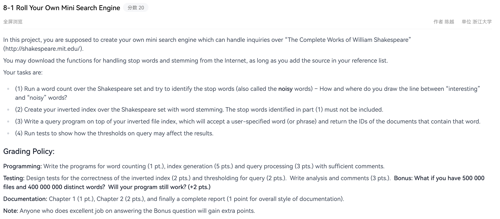

# pr1：8-1 Roll Your Own Mini Search Engine

题目描述



（原始题面见 [`image.png`](image.png)。）

## 目录用途

本目录是 ADS 课程 project 1「自己写一个迷你搜索引擎」的实现。目标是对「莎士比亚全集」
建带词干化的倒排索引，支持按词 / 短语查询并返回文档 ID，并分析查询阈值对结果的影响。

题面要求四件事，本实现对应关系如下（评分细则里的三个程序合成**两个源文件**：`index_gen.c` 建索引、
`query.c` 查询；词干算法 `stem.c` / `stem.h` 是外部引用，不算在内）：

| 题面 | 分值 | 实现 | 产物 |
| --- | --- | --- | --- |
| (1) 词频统计、识别 stop words，并说明"interesting / noisy 的线画在哪" | 1 pt. | `index_gen` 的 pass 1（`wc_scan` + `wc_stoplist`） | `stoplist.txt`、`--count-only` 的词频报告 |
| (2) 带词干化、且**不含 stop words** 的倒排索引 | 5 pts. | `index_gen` 的 pass 2（跳过 stoplist 后建索引并落盘） | `index.bin` |
| (3) 查询程序（读索引文件，按词或短语返回文档 ID） | 3 pts. | `query`（单词 / 多词 AND / 短语） | `output.txt` |
| (4) 阈值对结果的影响 | Testing 2 pts. | `query --tau=...` + `code/tests/sweep.py` | 阈值敏感性表（见 `documentation.md`） |

设计说明、文件格式规范、阈值准则的完整推导见 [`code/README.md`](code/README.md)；
完整报告见 [`documentation.md`](documentation.md)。

## 主要文件

源码与测试都在 [`code/`](code/) 子目录，下表链接已按这个结构写好。

| 文件 | 职责 |
| --- | --- |
| [`code/index.h`](code/index.h) | **共享索引模块（单头文件库）**：公共类型（`DocTable` / `Position` / `Posting` / `inverted_index`）、接口、**`index.bin` 格式规范**，以及全部实现（`static inline`；`index_gen.c` 与 `query.c` 各 `#include` 一次） |
| [`code/index_gen.c`](code/index_gen.c) | Part 1（统计 + θ 阈值 → stoplist）+ Part 2（建索引 + 落盘）+ 切词，含 `main` |
| [`code/query.c`](code/query.c) | Part 3（单词 / AND / 短语查询）+ Part 4（查询阈值 τ），含 `main` |
| [`code/stem.c`](code/stem.c) / [`code/stem.h`](code/stem.h) | 词干模块：Porter 算法 `stem()` + 转小写封装 `stemword()` |
| [`code/tests/`](code/tests/README.md) | 端到端测试、合成语料生成器、独立对拍脚本、θ/τ 实验脚本 |
| [`code/README.md`](code/README.md) | 代码目录说明：设计取舍、文件格式、SPIMI / Bonus 方案、测试记录 |
| [`documentation.md`](documentation.md) | 完整报告（题目分析、方法、实验、验证、Bonus 讨论） |
| [`image.png`](image.png) | 题面截图 |

交付的源文件只有两个：`index_gen.c`（建索引）与 `query.c`（查询），两者共用的索引模块
（内存索引的构造 / 插入 / 查找 + `index_save()` / `index_load()` + `index.bin` 格式规范）
**整体放在头文件 `code/index.h` 里**，函数全是 `static inline`，两个程序各 `#include` 一次即可 ——
既有"格式只定义一处、不可能建的时候一套读的时候另一套"的好处，又不必再有一个 `index_io.c`
（见 `code/README.md` 第 2 节）。

原先独立成程序的 `tokenize`（切词）也已并入 `index_gen.c`：`index_gen` 直接吃原始文本
（每个输入文件 = 一篇文档），不再需要 `file.txt` 这个中间产物，既少一个可执行文件，
也不会再出现"改了语料忘了重跑 `./tokenize`"的陈旧输入。历史沿革见 `code/README.md` 第 13 节。

## 构建与运行

```bash
cd code

# Part 1 + Part 2 + 切词：统计 -> stoplist.txt -> 建索引 -> index.bin
gcc -std=c99 -Wall -Wextra -o index_gen index_gen.c stem.c -lm
./index_gen corpus/*.txt        # 每个文件 = 一篇文档，doc_id 按命令行顺序 0,1,2...
./index_gen --theta=0.4 corpus/*.txt    # 换阈值
./index_gen --count-only corpus/*.txt   # 只跑 Part 1：打印词频报告 + 写 stoplist.txt，不建索引
./index_gen --dump-tokens=file.txt corpus/*.txt   # 顺便写出三元组流（测试对拍用，见下）
./index_gen - < doc.txt         # 用 - 表示从 stdin 读一篇文档

# Part 3 + Part 4：查询
gcc -std=c99 -Wall -Wextra -o query query.c stem.c -lm
./query run                    # 单词：打印 df/N、tf 和全部命中位置
./query run zebra              # 多个参数 = AND（交集）
./query "to be or not to be"   # 单个参数含空白 = 短语（位置必须连续）
./query --tau=0.2 run          # 开查询阈值 τ
./query                        # 不给参数则读 test.txt，每行一个查询
```

`index_gen` 只接受语料文件路径（不认目录、不做递归）；`query` 则只用**当前工作目录**下的相对路径
（`index.bin` / `stoplist.txt` / `test.txt` / `output.txt`），不认路径参数。`cd code` 之后按上面的
命令跑，产物就落在同一个目录。
若还没有 `index.bin`，`./query` 会提示先跑 `./index_gen`；若 `index.bin` 损坏或版本不符，
`./query` 会拒绝加载并报错（不会带着半个索引继续查）。

θ 的三种给法：改 `index_gen.c` 里的 `STOPWORD_THETA` 宏、编译时 `-DSTOPWORD_THETA=0.4`、
运行时 `--theta=0.4`。宏只是默认值，运行时参数优先级最高。

测试与实验（在临时目录里编译 + 跑完整流程，不污染 `code/`）：

```bash
cd code/tests
sh run_tests.sh                  # 21 项端到端测试，默认工作目录 /tmp/pr1-test
python3 sweep.py /tmp/pr1-test    # θ / τ 敏感性实验，输出 Markdown 表
```

## 数据流

```
原始文本 ──index_gen(pass 1)──> stoplist.txt（Part 1，同时也就是第 1 问的证据）
        └─index_gen(pass 2)──> index.bin ──query──> output.txt
                                      ↑              ↑
                              （- -dump-tokens 只是调试产物）  test.txt
```

## 输入输出约定

### `file.txt`：可选的调试产物（`index_gen --dump-tokens` 写）

**正常流程不产生这个文件**：`index_gen` 直接读原始文本。加 `--dump-tokens[=文件名]` 才会在 pass 1
顺手把切词结果写出来（默认 `file.txt`），供测试脚本做独立对拍，格式与旧版一致 —— 每行一条三元组：

```
<word> <doc_id> <pos>
run 0 1
runs 1 5
```

- `word`：转小写后的词形（**不含**词干化）。程序内部统一调 `stemword()`（转小写 + Porter），
  所以 `run` / `runs` / `running` / `RUNS` 会并入同一个词干 `run`。
- `doc_id`：文档 ID，非负整数。**不要求连续，也不要求按顺序出现**，「有哪些文档」由程序自己记录
  （升序去重的文档表，供 `df/N` 的 N 使用）。
- `pos`：该词在文档内的位置，非负整数。去重键是 `(词干, doc_id, pos)`。
- `doc_id` / `pos` 为负的行会被跳过并计入统计；**格式不符的行会截断读取**（`fscanf` 的固有行为，
  要容忍脏输入得改成按行读）。
- `--dump-tokens` 里写的是**未词干化**的词形（`runs` / `RUNS` 归一成 `runs`），与建索引时实际入库的词干不是一回事。
- 正常运行在 **stderr** 打印两遍扫描的统计。

### `index.bin`：索引文件（`index_gen` 写、`query` 读）

二进制格式，完整规范写在 [`code/index.h`](code/index.h) 顶部注释里（读写两侧都以那份注释为准）。要点：

```
头部 64 B：魔数 "PR1IDX"+两个 '\0'、u32 版本(=1)、u32 头部长度(=64)、
           u64 文档数、u64 词条数、u64 位置条目总数、u64 docs/terms/postings 三段偏移
docs 段：     文档数 × u32（doc_id 升序去重，给 df/N 提供 N）
terms 段：    词条数 × { u32 df、u32 tf、u64 postings 偏移、u16 词干长度、词干字节 }
              按词干升序排列
postings 段： 每个词条一段，LEB128 编码：
              [doc 增量][该文档的位置数][位置增量 × 位置数] 重复 df 次
```

- 定长整数一律**小端**、宽度固定，所以不依赖编译器 / 结构体对齐；不 dump 结构体本身。
- 位置用**增量 + LEB128** 变长编码：相邻 doc 间隔、同一文档内相邻 pos 间隔通常都是 1 字节。
- 词典里存 `df` / `tf` 和 postings 偏移，是为了让 `query` 不必重算，并能在加载时交叉校验：
  解出来的组数必须等于 `df`、位置数必须等于 `tf`、所有词条合计必须等于头部总数、
  文件末尾不能有多余字节，任何一项不符都判为损坏。
- 词条按词干升序，同一份语料跑两次得到**逐字节相同**的 `index.bin`（可复现、可 diff）。
- 已知局限（v1 没有校验和）：改坏一两个字节但结构仍自洽的文件会被照常接受，见 `code/README.md` 第 5 节。

### `stoplist.txt`：Part 1 的产物（`index_gen` 写、`query` 读作提示）

```
# stoplist: theta=0.500  N=40  V=7124  terms=422
# 由 index_gen 生成（Part 1）。仅供报告与解释使用，查询正确性只取决于 index.bin
# term cf df df/N
run 9241 40 1.0000
walk 4509 40 1.0000
...
```

第一行是表头（θ / N / V / 停用词条数），其后每行 `词干 cf df df/N`，按 df 降序。

**它只用于报告和解释**：`query` 用它把 `Not found: the` 变成
`Not found: the (stop word: df=40/40 = 1.0000 > theta=0.5000, removed from the index in part 1)`。
索引里到底有什么，完全由 `index.bin` 决定；删掉 `stoplist.txt` 查询结果不变，只是提示变简单。

### `test.txt`：查询输入（`query` 程序读）

每行一个查询：单个词 = 单词查询；多个词（空白分隔）= AND；
以 `phrase: ` 开头 = 短语查询，例如 `phrase: king queen sword crown ghost`。空行忽略。

### `output.txt`：查询结果（`query` 程序写）

每次运行都会**覆盖**。每个查询一段，以 `# query N: ...` 开头：

```
# query 1: wevafi
Found: wevafi  (df=18/40 = 0.450, tf=27)
Doc ID: 2, Position: 1147
Doc ID: 4, Position: 3231

# query 2: zolkim vireth qandel brusett nomin
Found: zolkim  (df=2/40 = 0.050, tf=2)
Found: vireth  (df=2/40 = 0.050, tf=2)
Found: qandel  (df=2/40 = 0.050, tf=2)
Found: brusett  (df=2/40 = 0.050, tf=2)
Found: nomin  (df=2/40 = 0.050, tf=2)
Phrase [zolkim vireth qandel brusett nomin]: 2 match(es) in 2 document(s)
Doc ID: 0, Positions: 10
Doc ID: 3, Positions: 10

# query 3: wevafi zebra
Found: wevafi  (df=18/40 = 0.450, tf=27)
Not found: zebra
AND [wevafi zebra]: 0 document(s)

# query 4: be
Not found: be  (stop word: df=40/40 = 1.0000 > theta=0.5000, removed from the index in part 1)

# query 5: wevafi      （与 query 1 同一个词，但这次带 --tau=0.2）
Too common: wevafi  (df=18/40 = 0.450, tf=27, tau=0.200 -> 18 documents, result list suppressed)
```

- `df` = 命中该词干的**文档数**；`N` = 文档总数；`df/N` 正是题面第 4 问阈值要用的量。
- `tf` = 位置条目总数（总出现次数）。位置按 `(doc_id, pos)` 升序输出。
- 短语输出的是**起始位置**（`Positions: 5 9` 表示 5..6 与 9..10 两处连续命中）。

## 实测

合成语料（40 篇 × 4000 词 = 160,000 词，由 `code/tests/gen_corpus.py` 确定性生成；
换成真实莎士比亚全集只需把命令行里的语料文件换成莎士比亚的文本，其余流程不变）：

| 项 | 数值 |
| --- | --- |
| 三元组条数 | 161,892 |
| 文档数 N | 40 |
| 不同词干数 V | 7,124 |
| θ = 0.5 时的停用词 | 422 条（df/N > 0.5） |
| 索引词条数 / 位置条目数 | 6,702 / 29,296（保留 18.1% 的位置条目） |
| `index.bin` 体积 | 263.8 KB |
| `index_gen` 耗时（两遍扫描 + 两次建索引 + 落盘） | 约 0.79 s |
| `query` 耗时（加载 + 一次查询） | 约 0.02 s |

θ 与 τ 的敏感性表见 `documentation.md` 第 5 节（由 `code/tests/sweep.py` 生成）。

## 注意事项

- 仓库根目录的 `stmr.c` / `stmr.h` 是算法上游对照，**不要**和 `stem.c` 一起编译（`stem` 符号会重复定义）。
- `stemword()` **原地改写**缓冲区，不要传字符串字面量或 `const char *`。
- 单独用 `stem()` 时：调用前要自己统一大小写（它只对小写字母序列有效），调用后要自己补 `'\0'`；
  `stem()` 内部使用文件级静态变量，不可重入、非线程安全。
- **Porter 词干化不幂等**，所以切词层（`index_gen.c` 的 `tokenize_document()`）绝不词干化：
  `stemword()` 全流程只做两次（建索引时一次、查询时一次），否则索引与查询两侧对不上
  （实测 604 个词里有 11 个二次切会变）。
- 停用词被剔除后，**含停用词的短语查不到**（`"to be or not to be"` 必然返回 0 篇）——这是
  Part 2 的必然副作用，报告里要写明；能做的补救是查询侧给出"这些词是停用词"的提示。
- 查询阈值 τ 只有落在 `(0, θ]` 内才有意义：`df/N > θ` 的词在 Part 2 就已经不在索引里了，
  查询侧只会报 `Not found`。
- 改 `index.bin` 格式时，规范注释与 `index_save()` / `index_load()` 都在 `index.h` 一个文件里，
  改完重新跑一次 `./index_gen` 即可；但因为读写两侧现在是**各自编译进去的两份副本**，
  改完**必须重跑 `code/tests/run_tests.sh`**（往返 `cmp` + 独立对拍是唯一的结构性守卫）。
  当前 `index_load()` 要求 `version == 1` 且 `header_size == 64`，动头部任何一处都算破坏性改动。
- 语料（莎士比亚全集）尚未下载：来源 `shakespeare.mit.edu`，下载后
  `./index_gen <每个剧一个文件>` 即可复现整条流程；当前仓库里 `code/test.txt` 仍是空文件
  （查询输入）；`code/file.txt` 已删除（它只是 `--dump-tokens` 的调试产物，正常流程不产生任何中间文件）。
