# 1 .Prerequisite

## challenge1

- 1.4个 shell 命令的用法介绍以及在 Linux 环境下的实操截图(wsl中的)

- 1. `cd` – 切换目录
  - *作用*：改变当前工作目录（Change Directory）。  
  - *语法*：`cd [目录路径]`  
  - *示例*：
   

- 2. `tree` – 以树形结构显示目录内容
  - *作用*：递归列出目录下的所有文件和子目录，并生成树形结构（需要额外安装）。
  - *语法*：`tree [选项] [目录]`  
  - *示例*：
   
- 3. `ls` – 列出目录内容
  - *作用*：显示指定目录（或当前目录）下的文件和子目录。 
  - *语法*：`ls [选项] [文件/目录]`  
  - *示例*：
   
- 4. `grep` – 文本搜索过滤器
  - *作用*：使用正则表达式搜索文本内容，输出匹配的行（Global Regular Expression Print）。
  - *语法*：`grep [选项] 模式 [文件...]` 
  - *示例*：

- 2.在本机中通过 ssh 远程连接到你的 Linux 环境
  - 

- 3.完成 SadServers 上的题目 "Saint John": what is writing to this log file?
- *操作* ：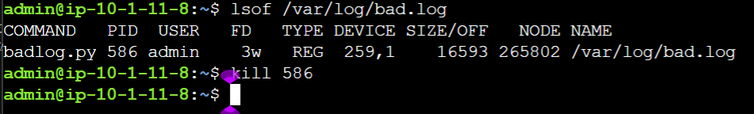
- *结果*： 

## challenge 2
- 1.解释其功能
- 这段代码实现了一个简单的字符串大小写转换功能，具体流程如下：
- 1. 获取用户输入
   `data = input("give me your string: ")`  
   在终端输出提示信息 `give me your string:`，等待用户输入一个字符串，并将输入内容保存到变量 `data` 中。
- 2. 输出原字符串长度
   `print("length of string:", len(data))`  
   使用 `len()` 函数计算 `data` 的长度（字符个数），并打印出来。
- 3. 备份原始字符串 
   `data_old = data`  
   将原字符串赋值给 `data_old`（虽然此变量后续未被使用，可能是作者预留或调试用的）。
- 4. 初始化新字符串  
   `data_new = ""`  
   创建一个空字符串，用于存放转换后的结果。
- 5. 遍历每个字符并转换大小写  
   ```python
   for d in data:
       if d in 'abcdefghijklmnopqrstuvwxyz':
           data_new += chr(ord(d) - 32)
       elif d in 'ABCDEFGHIJKLMNOPQRSTUVWXYZ':
           data_new += chr(ord(d) + 32)
       else:
           data_new += d
   ```
   - 对于原始字符串中的每一个字符 `d`：
     - 如果 `d` 是小写字母（a-z），则将其转换为对应的大写字母。  
       转换方法：`ord(d)` 获取字符的 ASCII 码（小写字母 a=97, z=122），减去 32 得到对应大写字母的 ASCII 码（A=65, Z=90），再用 `chr()` 转换回字符。
     - 如果 `d` 是大写字母（A-Z），则将其转换为小写字母（ASCII 码加 32）。
     - 如果 `d` 既不是大写也不是小写字母（如数字、标点、空格等），则保持不变。
   - 将转换后的字符追加到 `data_new` 字符串末尾。
- 6. 输出转换后的字符串  
   `print("now your string:", data_new)`  
   打印最终的大小写反转结果。

运行结果：
- 2.校巴上 calculator 这道编程题
- 1. 截图
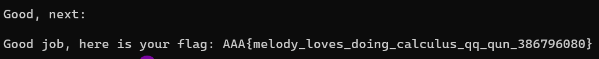
- 2. flag
- AAA{melody_loves_doing_calculus_qq_qun_386796080}

## challenge 3

- 1.根据代码逐条分析：

- 1. **第 138 行**：`xor dh, dh` → dh 与自己异或，结果为 **0x00**。

- 2. **第 141 行**：前面 `mov dx, 0xffff`，然后 `not dx` → 取反得 **0x0000**，所以 dl = **0x00**。

- 3. **第 161 行**：`mov di, bp`，而前面 `mov bp, dx`，dx 已经是 0x0000，所以 di = **0x0000**。

- 4. **第 178 行**（实际是 `mov ah, 0x0e` 那一行，位于打印 't' 之前）：执行前 `mov al, 't'` 使 al = 0x74，然后 `mov ah, 0x0e` 使 ah = 0x0e，所以 ax = **0x0e74**。

- 5. **第 208 行**（`print_string` 循环中的 `mov ah, 0x0e`）：第三次执行时，正在打印字符串 `"acOS..."` 的第三个字符。第一个 'a'，第二个 'c'，第三个 'O'（ASCII 0x4f），所以 ax = **0x0e4f**。

- 6. **第 224 行**（`mov dl, 15`）：前面 `mov dh, 3`，所以 dh = 0x03，dl = 0x0f，dx = **0x030f**。

- 2.最终 Flag

按顺序拼接：`00_00_0000_0e74_0e4f_030f`

```
ACTF{We1com3_7o_R3_00_00_0000_0e74_0e4f_030f}
```

---
# 2. Web

## challenge 1
- 1.过程
- 1. 打开开发者工具，找到源代码
   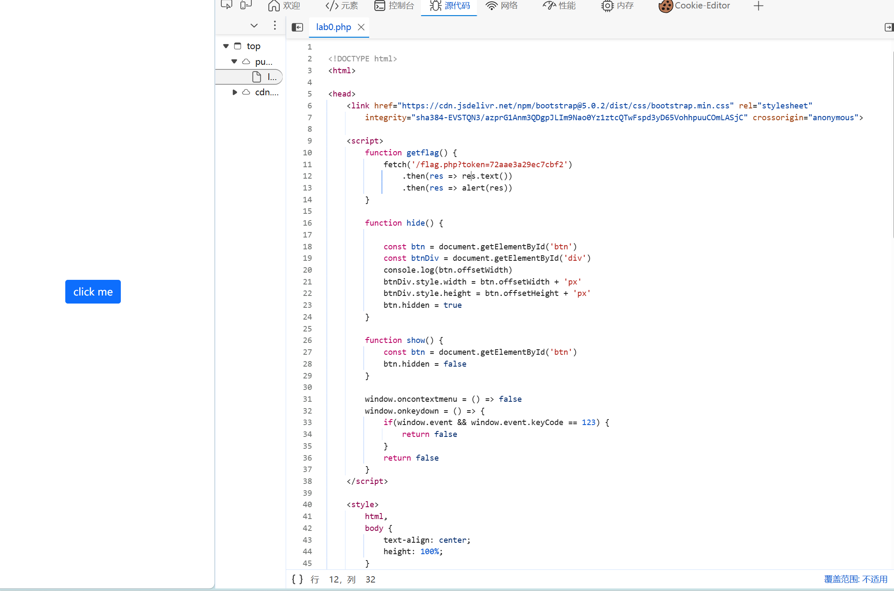
   这里我们发现有一个getflag函数，我们调用它。
- 2. 调用fetch寻找flag
   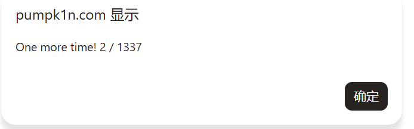
   发现要调用1337次，所以我们需要设计一个调用多次的函数；
- 3. 尝试使用代码自动点击完成
   token是一次性的。
   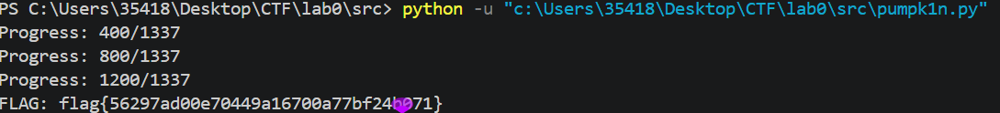
- 2.结果
- flag{56297ad00e70449a16700a77bf24b071}
## challenge 2
- 1.过程
- 1.  判断合法输入
   输入1：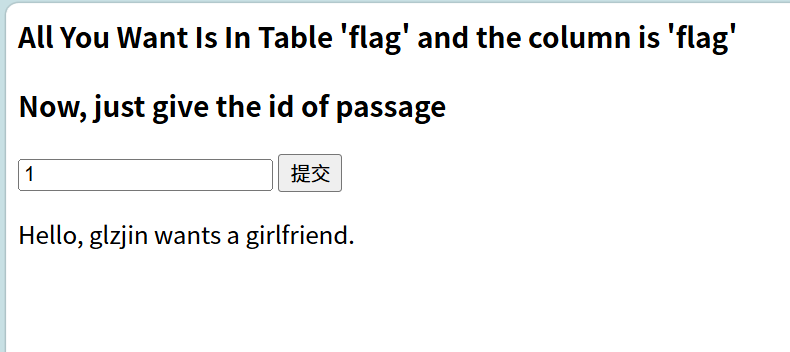
   输入2：
   输入3
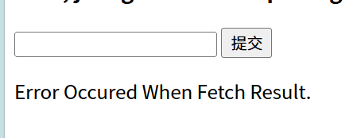
- 2. 判断WAF拦截
   - `1 or 2`：`SQL Injection Checked.`
   - `1 and 1`:`SQL Injection Checked.`
   - `1^1`:`Error Occured When Fetch Result.`
   `^`是合法的
- 3. 判断flag
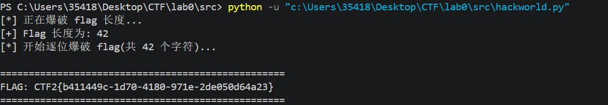
   `0^(length(select(flag)from(flag))=i)`:42时 输出为`Hello, glzjin wants a girlfriend.`,故length为42；
   接下来使用异或一个一个试出来
- 2.结果
- flag：` CTF2{b411449c-1d70-4180-971e-2de050d64a23}`。
---
# 3.Pwn

## challenge 1

### bug1：fread 整数下溢
位置：get_heart_beat() 第 2 次 fread 调用
原因：当 tmp->size < 16（如 size=0/1/15），tmp->size - sizeof(struct hbpkt) 产生无符号整数下溢（0 - 16 = 0xFFFFFFF0），导致 fread 尝试从 stdin 读取近 4GB 数据
后果：程序卡死/超时（PoC 验证：size=0/15/1 均 TIMEOUT）
### bug2：strlen() 越界读取
位置：get_heart_beat() 中计算 real_size
原因：strlen(tmp->data) 用于二进制数据——若 data 不含 \0，会沿栈一直扫描到越界
后果：real_size 计算错误 → malloc 不足 → memcpy 堆溢出 → 可能 segfault
### bug3：err 未初始化
位置：reply_heart_beat() 返回值
原因：当 pkt->size == 0，err 未被赋值，返回未定义值
后果：main() 中 if(err) 行为不可预测——可能误释放或泄露内存
### bug4：written 未初始化
位置：同上
原因：pkt->size == 0 时 written 未赋值，比较 written != pkt->size 为 UB
后果：未定义行为，可能错误进入 err 分支
### bug5：成功路径内存泄漏
位置：main() 中正常返回分支
原因：reply_heart_beat() 成功后未 free(p)
后果：每次成功交互泄漏一块堆内存
### bug6：fwrite 输出不完整
位置：reply_heart_beat()
原因：fwrite(pkt, 1, pkt->size, stdout) 输出的是堆中数据，但 get_heart_beat() 拷贝长度来自 strlen（Bug #2），若 real_size < tmp->size，数据被截断
### bug7：size 字段边界检查不完整
位置：get_heart_beat() 中 if (tmp->size > 0x1000)
原因：只检查了上界（size > 4096 拒绝），未检查下界（size < 16）。size ∈ [1,15] 或 size = 0 均可绕过检查，进入后续的危险代码路径
后果：触发 Bug #1（整数下溢）和 Bug #3/#4（err/written 未初始化）

## challenge 2
### 崩溃 1：stack-buffer-overflow（bug2 — strlen 越界）
触发条件：data 填满 4096 字节 buffer，且无 `\0`
触发结果：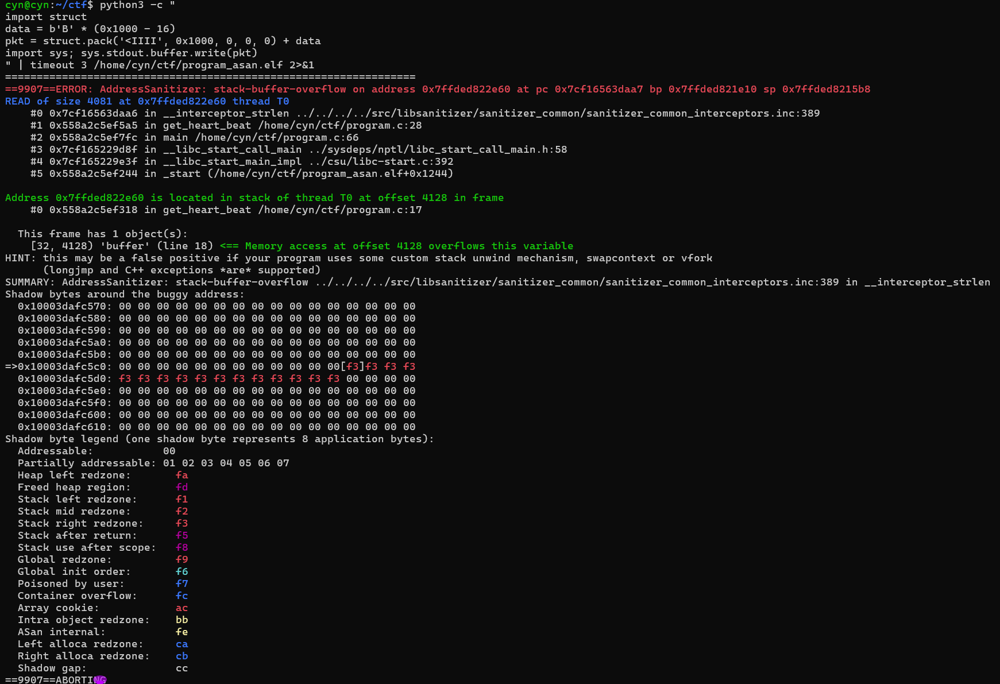    
结论：strlen(tmp->data) 从` buffer[16] `一路扫描到 `buffer[4128)`，超出 buffer 范围（4096 字节），触发栈缓冲区溢出，程序被 ASan 终止。

### 崩溃 2：heap-buffer-overflow（bug6— fwrite 输出越界，由bug2间接导致）
触发条件：正常包`（data="hello\0"，size=22）`
触发结果：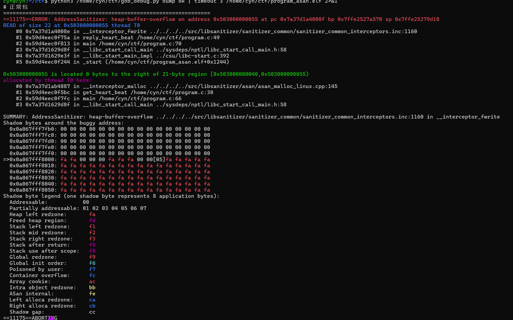  
结论：`real_size = sizeof(header) + strlen("hello\0") = 16 + 5 = 21`，但 `fwrite(pkt, 1, pkt->size=22, stdout) `按 22 字节写出，多读了 1 字节堆外数据，触发堆缓冲区溢出，程序被 ASan 终止。

### 通过 AddressSanitizer 检测，原始程序在以下两种情况下均发生内存错误并 ABORT：

栈溢出（program.c:28）：`strlen(dp->data) `对无` \0 `终止的 data 越界读取，超出栈缓冲区边界；
堆溢出（program.c:49）：`strlen `计算错误导致 `malloc` 分配不足，`fwrite `读取堆外内存。


---
# 4.Reverse
- 1.步骤
- 1. 使用file查询文件性质
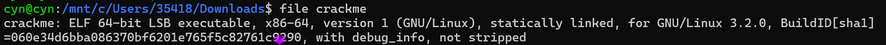
我们得到
- statically linked（静态链接）
- not stripped（未去除符号）
- with debug_info（带调试信息）
- 2. 提取关键字符串
- 数字：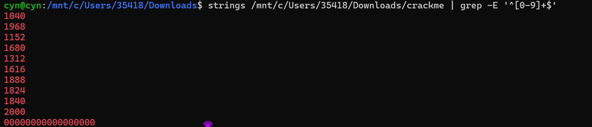
- 3. 查看程序具有哪些函数
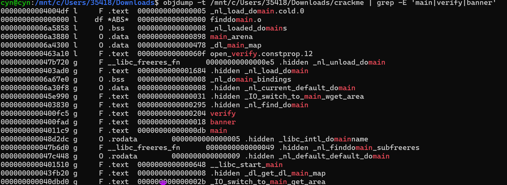
- main
- verify
- banner
- 4. 查看函数的逻辑
通过分析，我们确定这是一个密码哈希检验程序，输出由输入左移4位得到，所以我们接下来将寻找原输入
- 5. 查看原始数据
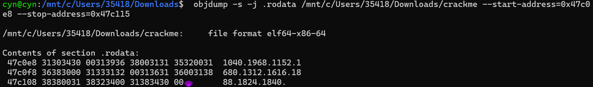
我们得到对应关系
47c0e8：1040；   
47c0ed：1968；
47c0f2：1152；
47c0f7：1680；
47c0fc：1312；
47c101：1616；
47c106：1888；
47c110: 1824；
47c115: 1840；
根据veify引用顺序
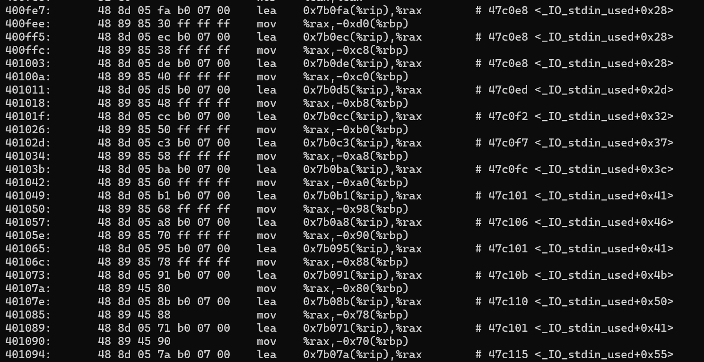
对这串数字进行复位并\[ i/16 \]得到：
1040 ÷ 16 = 65  → A
1040 ÷ 16 = 65  → A
1040 ÷ 16 = 65  → A
1968 ÷ 16 = 123 → {
1152 ÷ 16 = 72  → H
1680 ÷ 16 = 105 → i
1312 ÷ 16 = 82  → R
1616 ÷ 16 = 101 → e
1888 ÷ 16 = 118 → v
1616 ÷ 16 = 114 → e
1824 ÷ 16 = 114 → r
1840 ÷ 16 = 115 → s
1616 ÷ 16 = 65  → e
2000 ÷ 16 = 125 → }
- 2.flag ：`AAA{HiReverse}`

---
# 5.Misc

## challenge 1
选择magic，depth：3，直接得到结果：AAA{wELc0m3_t0_Ctf_5umMEr_c0UrsE_2026}
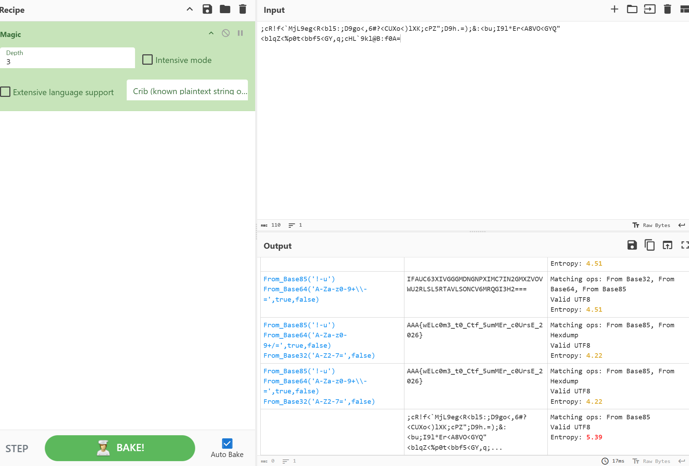

## challenge 2
- 1.过程
- 1. efixtool查看结果
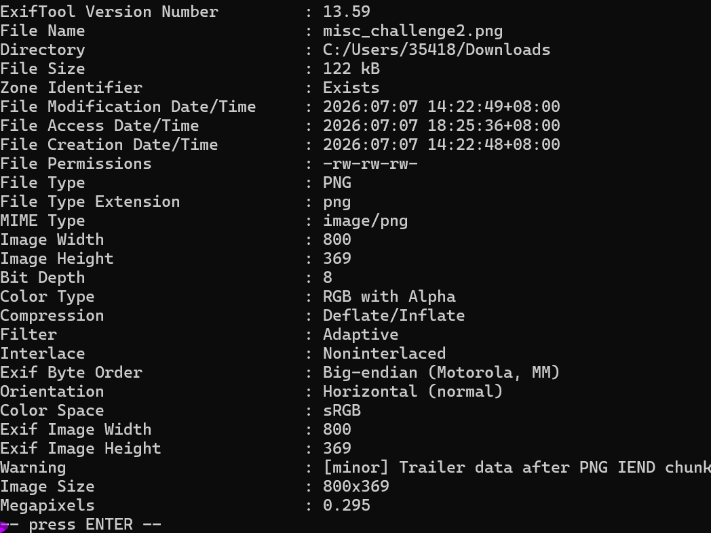我们注意到尾部有warning;
- 2. zsteg查看尾部信息
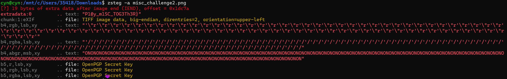
我们得到了第二部分`P1@y_m1SC_TOG3Th3R}`;
- 3. 位平面可视化，我们将每个通道的最低有效位提取出来，映射成黑白像素。
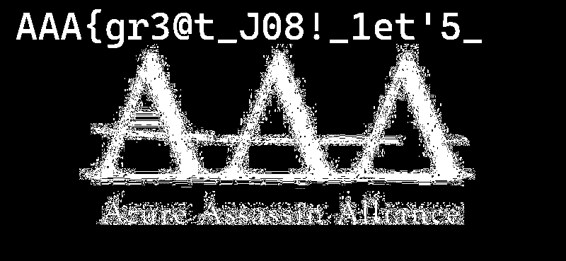
- 2.结果
- flag：`AAA{gr3@t_J08!_1et'5_P1@y_m1SC_TOG3Th3R}`
---
# 6.Crypto

## challenge 1
### 问题1：Quadratic Residues
- 1.问题：
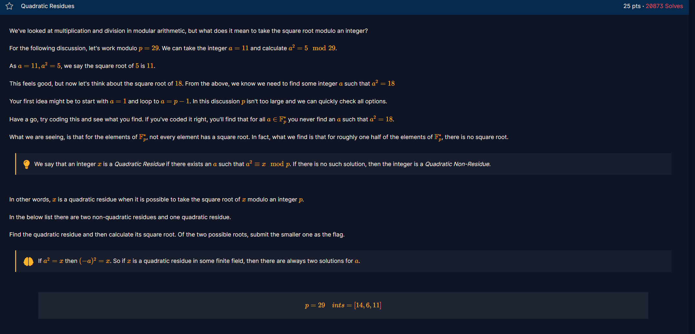
- 2.步骤：
给定  
\[p=29,\quad \text{ints}=[14,6,11]\]
逐个检查：
- \(14\)：模 \(29\) 的平方剩余集合中不包含 \(14\)，所以不是。
- \(6\)：因为  
  \[8^2=64 \equiv 6 \pmod{29}\]
  所以 \(6\) 是二次剩余。
- \(11\)：模 \(29\) 的平方剩余集合中不包含 \(11\)，所以不是。
因此二次剩余是 **6**。
它的两个平方根是 \(8\) 和 \(-8 \equiv 21 \pmod{29}\)，较小的根是：
\[\boxed{8}\]
所以 flag 为 **8**。
### 问题2：Legendre Symbol
- 1.问题

- 2.步骤
- 1. 费马小定理（Fermat's Little Theorem）
若 \(p\) 是素数，且整数 \(a\) 不被 \(p\) 整除，则：
\[a^{p-1} \equiv 1 \pmod p\]
- 2. 针对 \(p \equiv 3 \pmod 4\) 的快速开根公式
题目给的 \(p\) 满足 \(p \equiv 3 \pmod 4\)。
设我们要解：
\[r^2 \equiv a \pmod p\]
因为 \(p+1\) 能被 4 整除，我们构造：
\[r = a^{(p+1)/4} \pmod p\]
验证一下：
\[r^2 = a^{(p+1)/2} = a^{(p-1)/2 + 1} = a \cdot a^{(p-1)/2}\]
由于 \(a\) 是二次剩余，根据 \(a^{(p-1)/2} \equiv 1\)，所以：
\[r^2 \equiv a \pmod p\]
成立。
两个根分别是 \(r\) 和 \(p - r\)，题目要求较大的那个。
- 3. 解题代码
因为数字大到不可思议，所以我们完成一段python脚本，它会自动找出唯一的二次剩余并输出较大的平方根（即 flag）。
- 3.答案
93291799125366706806545638475797430512104976066103610269938025709952247020061090804870186195285998727680200979853848718589126765742550855954805290253592144209552123062161458584575060939481368210688629862036958857604707468372384278049741369153506182660264876115428251983455344219194133033177700490981696141526

### 问题3：Modular Square Root
- 1.问题
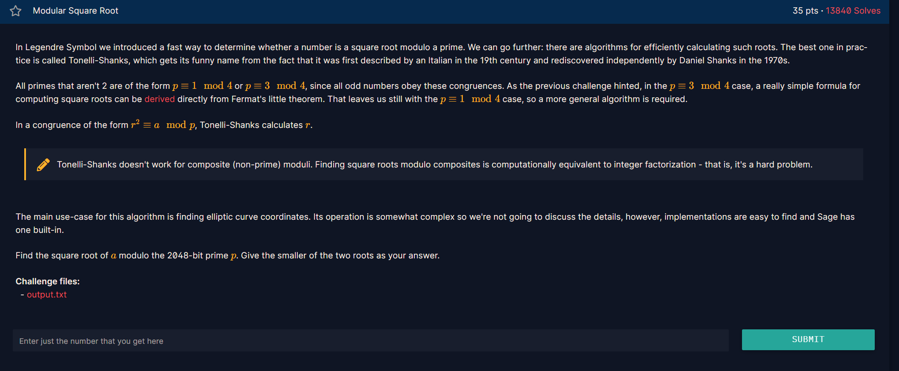
- 2.步骤
- 1. Tonelli‑Shanks 算法（适用于 `p ≡ 1 mod 4`）  
   - 将 `p-1` 分解为 `Q * 2^S`，其中 `Q` 为奇数。  
   - 寻找一个非二次剩余 `z`（即 `pow(z, (p-1)//2, p) == p-1`）。  
   - 初始化：  
     ```
     c = pow(z, Q, p)
     r = pow(a, (Q+1)//2, p)
     t = pow(a, Q, p)
     m = S
     ```
   - 循环直到 `t == 1`：  
     - 找到最小的 `i`（`1 ≤ i < m`）使得 `pow(t, 2**i, p) == 1`。  
     - 令 `b = pow(c, 2**(m-i-1), p)`  
     - 更新：  
       ```
       r = r * b % p
       t = t * b * b % p
       c = b * b % p
       m = i
       ```
   - 最终 `r` 即为一个平方根，另一个是 `p - r`。
- 2. 取较小者  
   最终答案 = `min(r, p - r)`。

- 3. Python实现
我们通过一段python代码得出答案
- 3.答案
2362339307683048638327773298580489298932137505520500388338271052053734747862351779647314176817953359071871560041125289919247146074907151612762640868199621186559522068338032600991311882224016021222672243139362180461232646732465848840425458257930887856583379600967761738596782877851318489355679822813155123045705285112099448146426755110160002515592418850432103641815811071548456284263507805589445073657565381850521367969675699760755310784623577076440037747681760302434924932113640061738777601194622244192758024180853916244427254065441962557282572849162772740798989647948645207349737457445440405057156897508368531939120

### 问题4：Chinese Remainder Theorem
- 1.问题
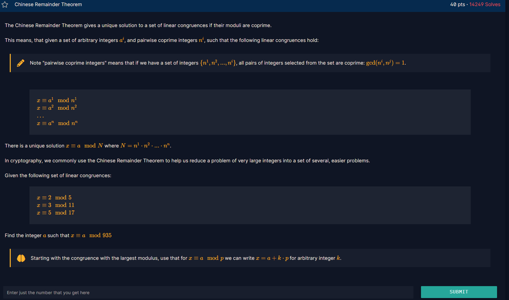
- 2.步骤
- 1. 从最大模数 17 开始：
由 \(x \equiv 5 \pmod{17}\)，可设  
\[x = 5 + 17k\]

- 2. 代入第二个同余 \(x \equiv 3 \pmod{11}\)：
\[5 + 17k \equiv 3 \pmod{11}\]
因为 \(17 \equiv 6 \pmod{11}\)，所以  
\[5 + 6k \equiv 3 \pmod{11} \implies 6k \equiv -2 \equiv 9 \pmod{11}\]
\(6\) 模 \(11\) 的逆元是 \(2\)（因为 \(6 \times 2 = 12 \equiv 1\)），因此  
\[k \equiv 9 \times 2 = 18 \equiv 7 \pmod{11}\]
所以 \(k = 7 + 11m\)，代入得  
\[x = 5 + 17(7 + 11m) = 124 + 187m\]

- 3. 代入第一个同余 \(x \equiv 2 \pmod 5\)：
\[124 + 187m \equiv 2 \pmod 5\]
因为 \(124 \equiv 4 \pmod 5\)，\(187 \equiv 2 \pmod 5\)，所以  
\[4 + 2m \equiv 2 \pmod 5 \implies 2m \equiv -2 \equiv 3 \pmod 5\]
\(2\) 模 \(5\) 的逆元是 \(3\)，因此  
\[m \equiv 3 \times 3 = 9 \equiv 4 \pmod 5\]
所以 \(m = 4 + 5n\)，代入得  
\[x = 124 + 187(4 + 5n) = 124 + 748 + 935n = 872 + 935n\]
因此唯一解为  
\[x \equiv 872 \pmod{935}\]

### 问题5：Successive Powers
- 1.问题
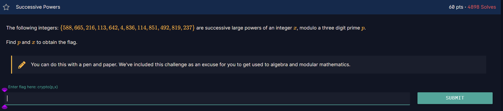
- 2.解答
因为相邻两项满足  
\[a_{i+1} \equiv x \cdot a_i \pmod p,\] 
所以对任意连续三项 \((a_i, a_{i+1}, a_{i+2})\)，都有  
\[a_i \cdot a_{i+2} \equiv a_{i+1}^2 \pmod p.\]
因此 \(p\) 必须整除所有形如  
\[D_i = a_i \cdot a_{i+2} - a_{i+1}^2\]  
的整数。计算这些 \(D_i\) 并取它们的最大公约数，得到：
\[\gcd(D_0, D_1, \dots, D_9) = 919.\]
由于 919 是一个三位素数，所以  
\[p = 919.\]
接下来求 \(x\)。由第一项和第二项的关系：  
\[588 \cdot x \equiv 665 \pmod{919}.\]  
计算 588 模 919 的逆元为 683，于是  
\[x \equiv 665 \cdot 683 \equiv 209 \pmod{919}.\]

验证后续几项，确认序列确实是由乘以 209 模 919 生成的。
- 3.最终答案：
\[\boxed{p = 919,\quad x = 209}\]
## challenge 2
- 1.释义
  - 1. **p，q**：p和q是用来生成`n`的质数;
  - 2. **e,n**:  e和n是公钥，公开用来加密；
  - 3. **c**：c是密文；
  - 4. **m**: m是明文；
- 2.解题
  - 我们首先求出这个问题的$$\varphi(n)=(p-1)*(q-1)$$
  - 然后我们知道私钥d是e相对于$\varphi$的逆元
  - 我们写一段代码来实现这个功能
- 3.flag
-` AAA{Ace_Attorney_is_very_fun_Phoenix_Wright&Miles_Edgeworth}`
