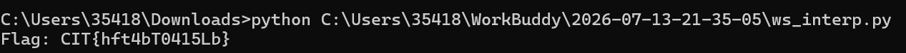
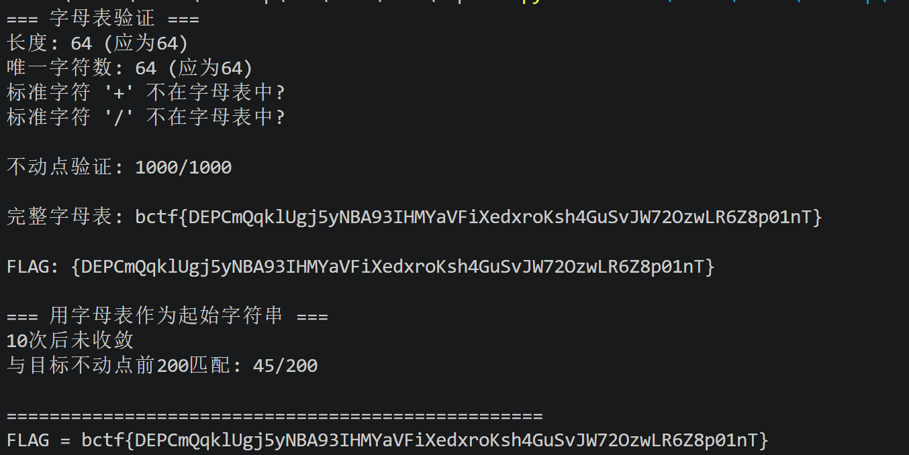
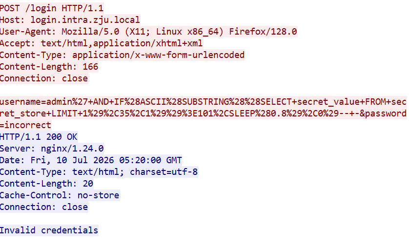
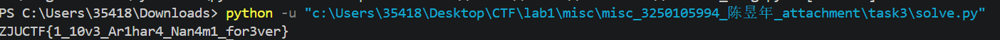
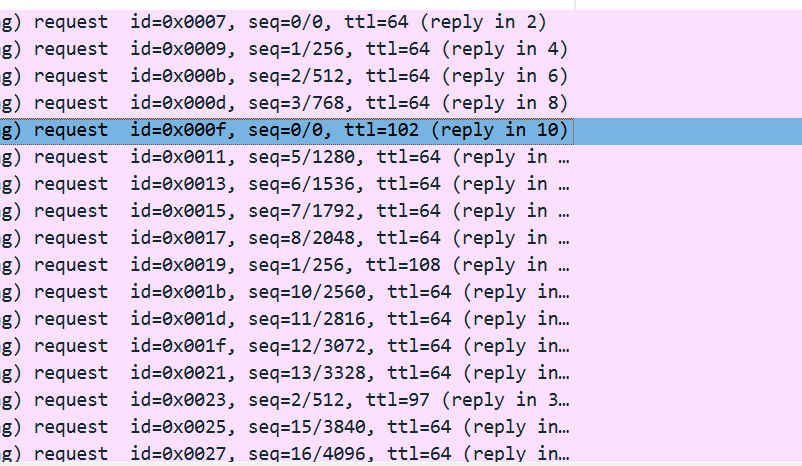

# Task 1:calculator
## 1. 编码识别过程

### 1.1 初步观察

打开 `calculator.lua`，可见前 1–78 行是一个正常的 Lua 四则运算计算器程序。文件末尾（第 119 行）有一条注释：

```lua
-- nope no flag here, keep looking :P
```

### 1.2 发现异常空白

文件第 80–113 行存在大量"看起来是空白"的行。在普通文本编辑器中它们不可见，但通过十六进制查看可以发现问题：

**识别命令：**

```bash
python -c "
data = open('calculator.lua','rb').read()
lines = data.split(b'\n')
for i, line in enumerate(lines[78:115], start=79):
    print(f'Line {i}: {repr(line)}')
"
```

**输出节选：**

```
Line 80: b'   \t    \t\t'
Line 81: b'\t'
Line 82: b'     \t  \t  \t'
Line 83: b'\t'
...
```

关键发现：
- 这些行**只包含空格 (`0x20`) 和制表符 (`0x09`)**，没有任何其他可见字符
- 第 80、82、84... 行是"数据行"（空格与制表符混合）
- 第 81、83、85... 行是单制表符（分隔行）
- 换行符 (`0x0A`) 也参与编码

### 1.3 判定为 Whitespace 语言

"仅用空格、制表符、换行三种字符编程"这一特征**唯一指向 Whitespace**——一种由 Edwin Brady 和 Chris Morris 于 2003 年创造的 esolang（深奥编程语言）。其指令体系完全由这三种字符的组合构成，任何非空白字符均被视为注释而被忽略

---

## 2. 解码过程

### 2.1 提取 Whitespace token 序列

**第一步**：从文件第 80 行开始，提取所有空白字符并映射为 S/T/L token 序列。

提取后的完整序列（共 267 个 token）：

```
SSSTSSSSTTLTLSSSSSTSSTSSTLTLSSSSSTSTSTSSLTLSSSSSTTTTSTTLTL
SSSSSTTSTSSSLTLSSSSSTTSSTTSLTLSSSSSTTTSTSSLTLSSSSSSTTSTSSL
TLSSSSSTTSSSTSLTLSSSSSTSTSTSSLTLSSSSSSTTSSSSLTLSSSSSSTTSTS
SLTLSSSSSSTTSSSTLTLSSSSSSTTSTSTLTLSSSSSTSSTTSSLTLSSSSSTTSS
STSLTLSSSSSTTTTTSTLTLSSLLLLLSSSSSSS
```

### 2.2 指令解析

整个程序由 17 组 `Push + OutputChar` 指令对组成，末尾以 `LLL`（End Program）终止：

```
[Push 'C'] [OutputChar]  →  输出 C
[Push 'I'] [OutputChar]  →  输出 I
[Push 'T'] [OutputChar]  →  输出 T
[Push '{'] [OutputChar]  →  输出 {
...                     →  ...
[Push '}'] [OutputChar]  →  输出 }
[End Program]
```

### 2.3 逐字符解码表

| 序号 | Token 序列 | 符号位 | 二进制数据 | 十进制 | ASCII 字符 |
|------|-----------|--------|-----------|--------|-----------|
| 1 | `SS S TSSSSTT L` | + | 1000011 | 67 | `C` |
| 2 | `SS S TSSTSST L` | + | 1001001 | 73 | `I` |
| 3 | `SS S TSTSTSS L` | + | 1010100 | 84 | `T` |
| 4 | `SS S TTTTSTT L` | + | 1111011 | 123 | `{` |
| 5 | `SS S TTSTSSS L` | + | 1101000 | 104 | `h` |
| 6 | `SS S TTSSTTS L` | + | 1100110 | 102 | `f` |
| 7 | `SS S TTTSTSS L` | + | 1110100 | 116 | `t` |
| 8 | `SS S STTSTSS L` | + | 0110100 | 52 | `4` |
| 9 | `SS S TTSSSTS L` | + | 1100010 | 98 | `b` |
| 10 | `SS S TSTSTSS L` | + | 1010100 | 84 | `T` |
| 11 | `SS S STTSSSS L` | + | 0110000 | 48 | `0` |
| 12 | `SS S STTSTSS L` | + | 0110100 | 52 | `4` |
| 13 | `SS S STTSSST L` | + | 0110001 | 49 | `1` |
| 14 | `SS S STTSTST L` | + | 0110101 | 53 | `5` |
| 15 | `SS S TSSTTSS L` | + | 1001100 | 76 | `L` |
| 16 | `SS S TTSSSTS L` | + | 1100010 | 98 | `b` |
| 17 | `SS S TTTTTST L` | + | 1111101 | 125 | `}` |

> 注意：每个 Push 指令后紧跟一个 `TLSS`（Output Character）指令，将刚压入的 ASCII 码弹出并输出为字符。

---

## 3. 解码脚本说明

### 3.1 脚本文件

| 文件 | 路径 |
|------|------|
| Whitespace 解释器 | `ws_interp.py` |

### 3.2 脚本结构

脚本分为三个主要模块：

#### 模块一：Token 提取（第 1–23 行）

```python
data = open('calculator.lua', 'rb').read()
```

- 以二进制模式读取文件
- 扫描到第 79 个换行符后，从第 80 行开始提取
- 将 `0x20`→`S`、`0x09`→`T`、`0x0A`→`L`，其余字节忽略
- 拼接为完整 token 字符串 `seq`

#### 模块二：数字/标签读取器（第 32–51 行）

```python
def read_number():
    # 读取符号位（S=正, T=负）
    # 逐位读取二进制（S=0, T=1），遇到 L 结束
    # 返回十进制整数
```

- `read_number()`：按 Whitespace 数字编码规则解析，返回带符号整数
- `read_label()`：解析跳转标签（本题未实际使用）

#### 模块三：指令解释器主循环（第 54–211 行）

实现完整的 Whitespace 虚拟机，我们仅使用三种指令：

| 指令前缀 | 类别 | 
|----------|------|
| `S` | 堆栈操作（Push/Dup/Swap/Drop） | 
| `TL` | I/O（Output Char/Number） |
| `L` | 流控制（Mark/Call/Jump/End） | 

主循环通过逐字符匹配指令前缀，分派到对应处理逻辑。输出字符时将 ASCII 值通过 `chr()` 转换并收集到 `output` 列表。

## 4.得到flag


---

# Task 2:fixpoint
## 1.题目分析

该题目定义了一个自定义 Base64 字母表，其中 48 个字符被 `?` 替代。程序对输入字符串反复编码（自定义 Base64），检查是否收敛到一个给定的不动点。题目中已经包含了不动点，所以我们只需要根据不动点得出映射关系即可。

## 2.解题思路

### 2.1恢复完整字母表

字母表中共 64 个字符，已知 16 个：`bctf{FiXedp01nT}`，48 个未知。

关键洞察：不动点满足 `encode(s) ≈ s`，即 `translate(base64(s_bytes))` 的前缀等于 `s`。

取不动点的前 750 字节进行标准 Base64 编码，得到 1000 个标准字符。由于 `translate(base64[:1000]) = fixed_point[:1000]`，我们可以建立一一对应关系，填满所有 64 个位置。

### 2.2验证

- 字母表 64 个字符全部唯一 
- encode(fixed_point) 前 1000 字符完全匹配 
- 任意起始字符串最终都收敛到同一不动点 

## FLAG

```
bctf{DEPCmQqklUgj5yNBA93IHMYaVFiXedxroKsh4GuSvJW72OzwLR6Z8p01nT}
```


----
# Task 3:slow login
## 1.过程
### 1.1 查看 HTTP Stream
我们任意追逐一个数据流，得到以下结果：

翻译URL：
```javascript
username=admin' AND IF(
    ASCII(SUBSTRING((SELECT secret_value FROM secret_store LIMIT 1), 35, 1))
    > 101,
    SLEEP(0.8),
    0
)--+&password=incorrect
```
含义：
- 1.提取 secret_value 的第 35 个字符
- 2.判断其 ASCII 值是否 > 101
- 3.如果为真 → SLEEP(0.8)（响应会变慢 ~800ms）
- 4.如果为假 → 0（响应很快 ~30ms）
第 35 个字符是 e，ASCII = 101。响应时间不足800ms，假。
我们认识到这是一个sql问题，所以我们搜索响应为真的请求，来获得flag。
### 1.2 攻击原理
批量提取后我们发现，每条请求和响应都是`incorrect`,所以我们使用二分搜索来确定ASCLL值。

| 步骤 | 说明 |
|------|------|
| **第一阶段** | 确定 secret 长度（LENGTH 探测） |
| **第二阶段** | 逐字符二分搜索 ASCII 值 |

这里我们以得出长度的过程举例。

```
LENGTH > 32? RTT=833ms => SLEEP (TRUE: 长度 > 32)
LENGTH > 48? RTT=33ms  => FALSE (长度 ≤ 48)
LENGTH > 40? RTT=46ms  => FALSE (长度 ≤ 40)
LENGTH > 36? RTT=791ms => SLEEP (TRUE: 长度 > 36)
LENGTH > 38? RTT=60ms  => FALSE (长度 ≤ 38)
LENGTH > 37? RTT=32ms  => FALSE (长度 ≤ 37)
```

**结论：长度 = 37**

### 1.3 攻击过程

我们完成了一个python脚本，用来提取数据流，并二分搜索，判断具体的值。


### 1.4 Display Filter（显示过滤器）汇总

| 过滤器 | 作用 | 结果 |
|--------|------|------|
| `http` | 只看 HTTP 层流量 | 过滤掉 TCP 握手挥手等噪音 |
| `http.request.method == POST` | 只看 POST 请求（注入 payload） | 258 条 POST /login |
| `http.request.method == GET` | 只看 GET 请求 | 1 条 GET /（初始页面） |
| `http.response.code == 200` | 只看 200 响应 | 与请求配对 |
| `ip.src == 10.13.37.23` | 只看客户端发出的包 | 1350 个包 |
| `ip.dst == 10.13.37.80` | 只看发往服务器的包 | 1350 个包 |
| `http contains "SLEEP"` | 搜索包含 SLEEP 关键字的数据 | 定位 SQL 注入 payload |
| `http contains "SUBSTRING"` | 搜索包含 SUBSTRING 的 payload | 定位字符提取请求 |
| `http.request.method == POST and http contains "SLEEP"` | POST + 含 SLEEP | 精确定位盲注请求 |
| `tcp.stream eq 5` | 只看第 5 个 TCP 流 | 逐流分析，每个流 = 一次登录 |
| `tcp.port == 41000` | 只看某个客户端端口 | 定位单次连接 |

### 1.5 请求与响应的关联方式
一条 TCP 连接 = 一次登录尝试

## 2.flag
ZJUCTF{1_10v3_Ar1har4_Nan4m1_for3ver}

---
# Task 4:live and let die

## 1.过程

### 1.1分析文件
我们打开lld.pcap，查看协议分级，发现均为ICMP。由
``` bash
icmp.type == 8   // Echo Request（ping 请求）
icmp.type == 0   // Echo Reply（ping 应答）
```
接下来我们对各项数据进行分析

| 检查项 |结果|
|---|---|
| ICMP Data（载荷） | 220 个包的 Data 完全相同，都是标准 ping 填充数据 |
| ICMP Identifier | 从 7 开始正常递增 |
| ICMP Sequence Number | 从 0 开始正常递增 |
| IP Identifier | 正常递增 | 
| 源/目的 IP | 固定不变，没有异常 |

所有"正常会藏东西的地方"查了一圈，全是正常的。那剩下还能藏数据的字段就只有 **IP 头的 TTL** 了。
当然，受限于庞大的数据流我们并没有准确的查看每一个包的内容，但是大体上是这样的。

我们发现请求端的ttl每隔几个都会有不正常的变化。下图是请求端的数据`icmp.type==8`



即**4个64带一个不同数字**。

### 1.2得出异常ttl数字
`102, 108, 97, 103, 123, 116, 116, 108, 95, 116, 101, 108, 108, 115, 95, 97, 95, 116, 97, 108, 101, 125`
然后这就是一个解码的问题，我们将102视为f就可以得到表，然后解码得到flag。

## 2.flag
`flag{ttl_tells_a_tale}`