# ZJU:CTF的ID：nothing793
---

# rev_begin

## 0. 程序概览与目标

`rev_begin` 是一个 C++ 控制台程序（使用 C++20 `<ranges>`）。它：

- 提示 `Please enter the flag:`，读取一行输入；
- 检查长度 **必须 == 26**（否则打印 `Length Wrong!`）；
- 内置一个 **26 字节**的 `target[]` 硬编码密文；
- 用 `std::views::iota(0, 26)` 生成下标序列，对每个字符用一个 **lambda `encrypt`** 做变换后与 `target[i]` 比较；
- 全部相等才 `Correct!`。

单字节加密（与后续 gdb / IDA 观察一致）：

```c
unsigned char encrypt(unsigned char a, unsigned i) {
    unsigned char c = a ^ 0x42;     // ① 异或 0x42
    c = c + (unsigned char)i;       // ② 加下标 i
    c = ~c;                         // ③ 按位取反
    c = c ^ (unsigned char)((i*7) & 0xFF); // ④ 异或 (i*7)
    return c;
}
```


---

## 1. 使用 g++ 的编译流程（预处理 → 汇编 → 目标文件 → 链接）
- 1.预处理（宏展开） 
-  `g++ -std=c++20 -E rev_begin.cpp -o rev_gcc.i` ,头文件与宏全部展开，得到纯 C++ 文本 
 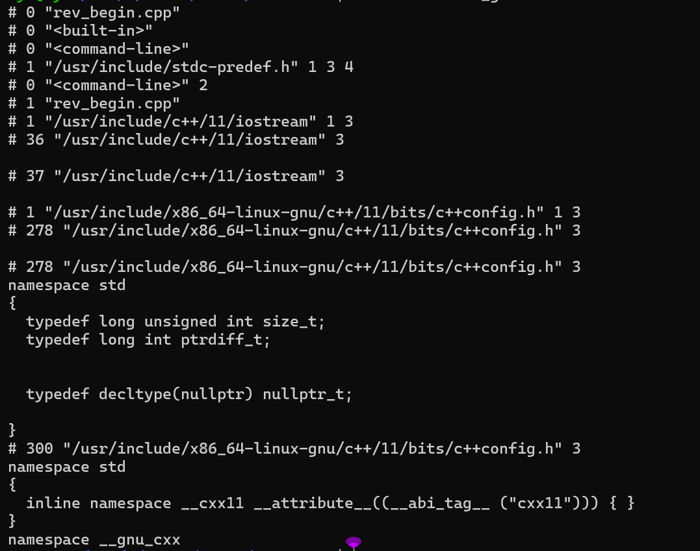
- 2.编译为汇编  
-  `g++ -std=c++20 -O2 -S rev_begin.cpp -o rev_gcc.s` , 生成 AT&T 语法汇编
 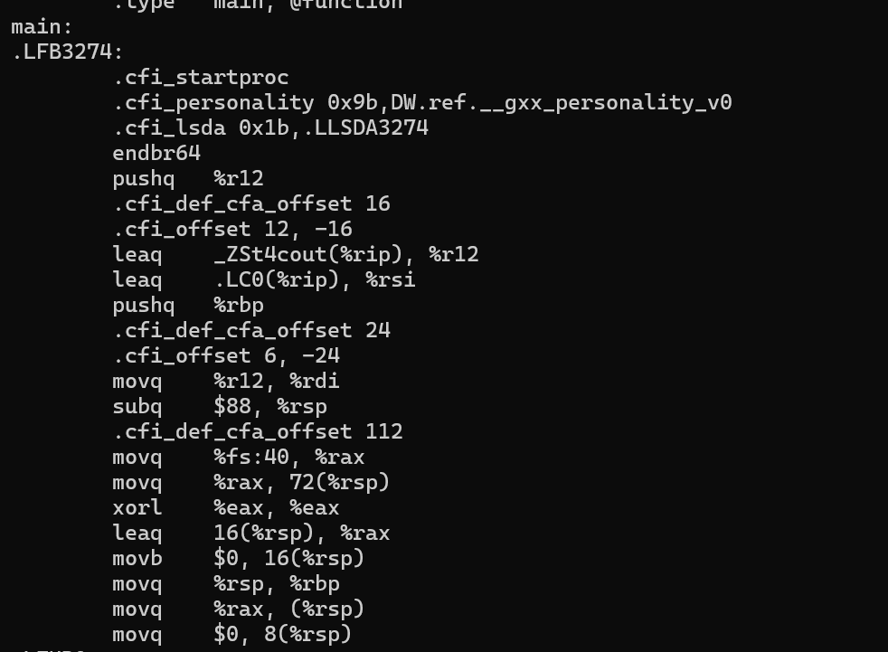
- 3.汇编为目标文件（不链接） 
- `g++ -std=c++20 -O2 -c rev_begin.cpp -o rev_gcc.o` , 生成可重定位目标文件 `ELF ... relocatable` 
   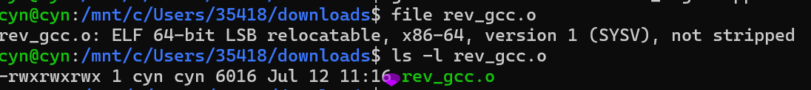
- 4.链接生成可执行并运行 
-  `g++ -std=c++20 -O2 rev_gcc.o -o rev_gcc` 然后 `./rev_gcc` , 链接标准库得到可执行文件，手动输入字符串测试 
  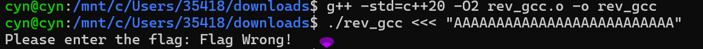

---

## 2. 使用 clang++ 的编译流程（LLVM IR 文本 → Bitcode → 可执行）
- 1.LLVM IR（文本）
- `clang++ -std=c++20 -O2 -S -emit-llvm rev_begin.cpp -o rev_clang.ll` , 人类可读的 LLVM 中间表示（`.ll`） 
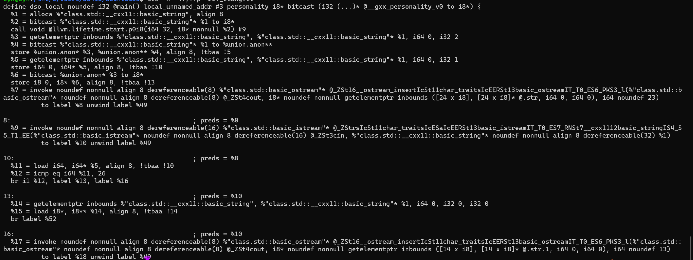
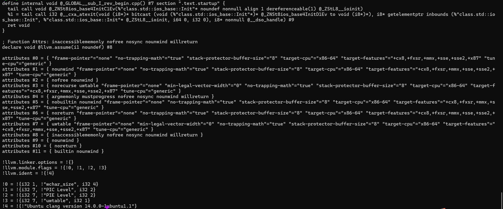
- 2.LLVM Bitcode（二进制） 
-  `clang++ -std=c++20 -O2 -c -emit-llvm rev_begin.cpp -o rev_clang.bc` 二进制 LLVM 位码（`file` 显示为 `LLVM IR bitcode`）
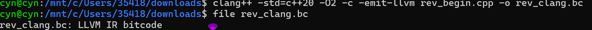
- 3.生成可执行并运行 
-  `clang++ -std=c++20 -O2 rev_begin.cpp -o rev_clang` 然后 `./rev_clang` , 与 gcc 版本行为应一致 
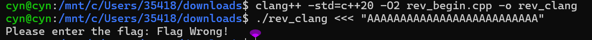


---

## 3. 逆推 flag（静态：objdump 定位 → 推导公式）

### 第1步：从 objdump 反汇编中定位关键函数
`objdump -d -M intel rev_gcc_dbg | grep -A 120 "<main>:"`,拿到了 200+ 行汇编。
线索1：字符串引用
```r
22f1: lea    rax, [rip+0xd0d]    # "Please enter the flag:"
```
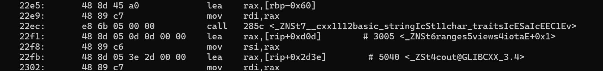     

### 第2步：找到长度检查
```r
232c: cmp    rax, 0x1a            # 比较 rax 和 26
2335: je     236c                 # 等于26就跳走（继续执行）
                                  # 否则走下面...
2337: lea    rax, [rip+0xcdf]    # "Length Wrong!"`
```
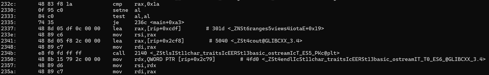
    推理：比较 26 → 不相等就打印 "Length Wrong" → 这是 if (len != 26)。

### 第3步：找到 target 数组——关键突破！ 
```r
236c: movabs rax, 0xeaefaaf7d6f4fcfc
2376: movabs rdx, 0x12b28e93ccb6f0ef
2388: movabs rax, 0xd926e942fc9e0cbb
2396: mov    WORD PTR [rbp-0x28], 0x8db
```

一个巨大的 hex 常量被塞进栈里。
因为是 x86 小端序，0xeaefaaf7d6f4fcfc 在内存中实际是:`FC FC F4 D6 F7 AA EF EA`
这正是 8 个字节。三组 8 字节 + 一组 2 字节 = 26 字节，刚好和上面的长度 26 对应！
推理：这是一个 26 字节的硬编码数组，存储在 [rbp-0x40] 到 [rbp-0x28]。在验证逻辑里，它被用来和什么做比较。

### 第4步：找到循环体

``` r
23a7: mov    DWORD PTR [rbp-0x7c], 0x0   # 起点 = 0
23a0: mov    DWORD PTR [rbp-0x78], 0x1a  # 终点 = 26
```
   
然后看到一个 jne 跳回循环头:
```r
246e: jne    23f4                  # 跳回循环体
```      
推理：`for (i=0; i<26; i++)`

### 第5步：分析循环体——数据流追踪
循环体里，注意到每一轮都做了同样的事：
```r
2408: movzx  eax, BYTE PTR [rbp+rax*1-0x40]   # 从 target 位置取一个字节
240d: movzx  ebx, al                           # 存到 ebx

2420: call   <string::operator[]>              # 从 input 取一个字节
2425: movzx  eax, BYTE PTR [rax]               # 存到 eax

242f: mov    edx, DWORD PTR [rbp-0x74]         # 取 i
2437: mov    ecx, edx                           # i → 第3参数
243b: mov    edx, ebx                           # target[i] → 第2参数
2439: mov    esi, eax                           # input[i] → 第1参数
```
 推理：这里在准备函数调用参数——input[i]、target[i]、i 以及某个指针被传入一个函数。

### 第6步：进入加密函数

```r    
677b: xor    eax, 0x42                          # ① input[i] ^ 0x42
6784: add    BYTE PTR [rbp-0x1], al             # ② + i
6787: not    BYTE PTR [rbp-0x1]                 # ③ ~ (取反)
679c: xor    eax, edx                           # ④ ^ (i*7)  [edx = i*7]
67b0: cmp    al, BYTE PTR [rbp-0x20]            # ⑤ 结果 == target[i] ?
```     

每一步都在 gdb 里验证了中间值，最终拼出完整公式：
```c
    c = a ^ 0x42;
    c = c + i;
    c = ~c;
    c = c ^ ((i * 7) & 0xFF);
```    
### 第7步：发现 i*7 的编译优化

```r       
6791: shl    eax, 0x3      # eax = i << 3 = i*8
6794: sub    eax, edx      # eax = i*8 - i = i*7
```

### 第8步: 根据函数逻辑完成逆向
```py
target=bytes([0xFC,0xFC,0xF4,0xD6,0xF7,0xAA,0xEF,0xEA,0xEF,0xF0,0xB6,0xCC,0x93,0x8E,0xB2,0x12,0xBB,0x0C,0x9E,0xFC,0x42,0xE9,0x26,0xD9,0xDB,0x08])
flag = ''
for i, t in enumerate(target):
    c = (~(t ^ ((i * 7) & 0xFF))) & 0xFF
    c = (c - i) & 0xFF
    c = c ^ 0x42
    flag += chr(c)
print(flag)ssss
```
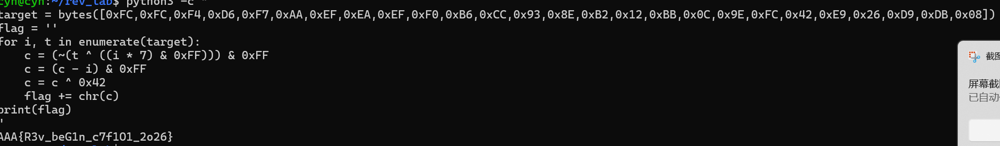

### Flag
`AAA{R3v_beG1n_c7f1O1_2o26}`

---

## 4. 静态分析：gcc 与 clang 对 `std::views::iota` 和 lambda 的实现差异

### 4.1 两种编译器如何处理 `std::views::iota`

`std::views::iota(0, 26)` 在源码层是一个**头文件内联**的 `iota_view<int,int>`。两种编译器的处理**在语义与最终代码上高度一致**，差别主要在符号命名：

- **Clang（LLVM IR, -O0）**：把 `iota` 实例化为 `iota_view<int,int>`，`for` 循环在 IR 里表现为对一连串 ranges 迭代器方法的**真实函数调用**：

  ```llvm
  %16 = call i32 @_ZNKSt6ranges9iota_viewIiiE5beginEv(...)   ; begin()
  %19 = call i32 @_ZNKSt6ranges9iota_viewIiiE3endEv(...)      ; end()
  %73 = call i1  @_ZNSt6ranges9iota_viewIiiE9_Iterator...eq(...) ; operator==
  %78 = call i32 @_ZNKSt6ranges9iota_viewIiiE9_IteratordeEv(...) ; operator*
  %93 = call ... @_ZNSt6ranges9iota_viewIiiE9_IteratorppEv(...)  ; operator++
  ```

- **Clang反汇编对循环的处理**
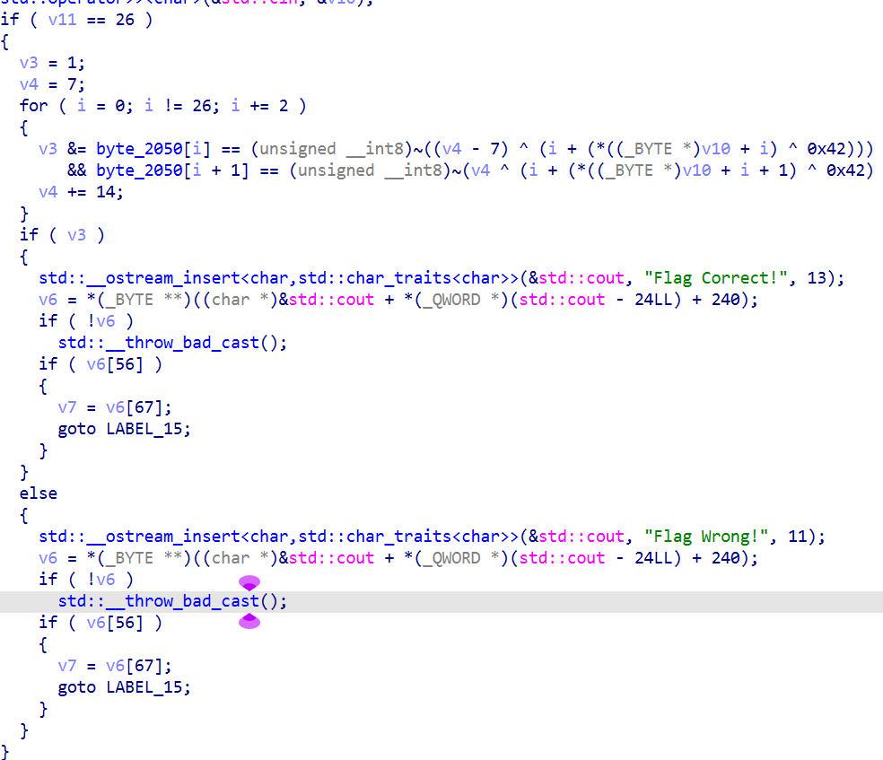
- **GCC（汇编, -O0）**：同样生成 `iota_view` 的 `begin/end/operator*/operator++/operator==` 调用（见下方 `foo` 主循环的反汇编）。
- **GCC反汇编对循环的处理**
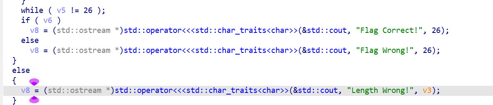

- **优化后（-O2）两者殊途同归**：range 适配器的全部包装都会被内联，最终都塌缩成一个**普通整数归纳循环**（`i` 从 0 到 25）。我在 -O2 的 `demo_clang.ll` 里看到的是一个干净的 `phi i32 [0, ...]` 循环，GCC 的 `-O2` 汇编里也是等价循环——这也是为什么你在 `rev_gcc_dbg` 的 `objdump` 里看到的是 `for (i=0; i<26; i++)` 这种朴素循环，而不是一堆 `iota_view` 调用。

 >**结论**：`std::views::iota` 在 gcc/clang 下**没有本质实现差异**，都是头文件模板实例化 + 优化期内联成整数循环；IDA 里两者主循环结构应基本相同。

### 4.2 两种编译器如何实现 lambda 表达式

lambda `encrypt` 在两种编译器里都被实现为一个**闭包类型（匿名结构体）+ `operator()`**，在 `-O0` 下都生成一个**独立函数**；**差异在名字修饰（mangling）**与 `-O0` 下个别运算的写法：

- **Clang（LLVM IR）**：闭包名为 `class.anon` / `$_0`，成员函数 mangled 为
  `@_ZZ3fooRSt6vectorIiSaIiEEENK3$_0clEii`（即 `foo()::$_0::operator()(int,int) const`）。调用时把闭包对象作为**第一个隐含参数**传入：
  ```llvm
  %86 = call i32 @"_ZZ3foo...NK3$_0clEii"(ptr %4, i32 %31, i32 %32)
  ```
  其函数体清晰还原了 4 步加密（`xor 66` / `add` / `xor -1`(即 `~`) / `mul 7` 后 `xor`）：
  ```llvm
  define internal i32 @"_ZZ3foo...NK3$_0clEii"(ptr %0, i32 %1, i32 %2) {
    %9  = load i32, ptr %5
    %10 = xor i32 %9, 66          ; c = a ^ 0x42
    %13 = add nsw i32 %11, %12    ; c = c + i
    %15 = xor i32 %14, -1         ; c = ~c
    %18 = mul nsw i32 %17, 7      ; i*7
    %19 = xor i32 %16, %18        ; c = c ^ (i*7)
    ret i32 %20
  }
  ```

- **GCC（汇编, -O0）**：闭包成员函数 mangled 为
  `_ZZ3fooRSt6vectorIiSaIiEEENKUliiE_clEii`（注意 `U` = unnamed closure，与 clang 的 `$_0` 不同）。其函数体：
  ```asm
  _ZZ3fooRSt6vectorIiSaIiEEENKUliiE_clEii:
      movl    -28(%rbp), %eax
      xorl    $66, %eax          ; c = a ^ 0x42
      movl    %eax, -4(%rbp)
      movl    -32(%rbp), %eax
      addl    %eax, -4(%rbp)     ; c = c + i
      notl    -4(%rbp)           ; c = ~c
      movl    -32(%rbp), %edx
      movl    %edx, %eax
      sall    $3, %eax           ; i*8
      subl    %edx, %eax         ; i*8 - i = i*7
      xorl    %eax, -4(%rbp)     ; c = c ^ (i*7)
      ret
  ```
  **值得注意的小差异**：`-O0` 下 GCC 把 `i*7` 算成 `sall $3` + `subl`（即 `i*8 - i`），而 Clang 直接 `mul i32 %17, 7`。这与你在 `rev_gcc_dbg` 第 7 步看到的 `shl 0x3` / `sub` 优化完全一致。

> **结论**：lambda 在 gcc/clang 下**都落地为「匿名闭包结构体的 `operator()` 成员函数」**，调用时把闭包对象作为 `this` 首参传入；**主要区别是名字修饰**（`NKUliiE` vs `NK3$_0`）和 `-O0` 下个别算术的写法（GCC 爱用 `lea/sal+sub` 代替乘法）。`-O2` 后两者通常都会把 lambda **内联进主循环**，IDA 里根本看不到独立的 `encrypt` 符号。


---

## 5. 动态调试（gdb）

### 流程
### 1.开始调试
```bash
# 1) 用带调试信息的版本（或 -O0）便于按行号/源码变量下断点
g++ -std=c++20 -O0 -g rev_begin.cpp -o rev_gcc_dbg
# 2) 启动
gdb ./rev_gcc_dbg
# 3) 在 main  处下断点
(gdb) b main                 # 或 b <源文件>:<行号>，例如 b demo.cpp:23 进入 encrypt
# 4) 运行
(gdb) run
```
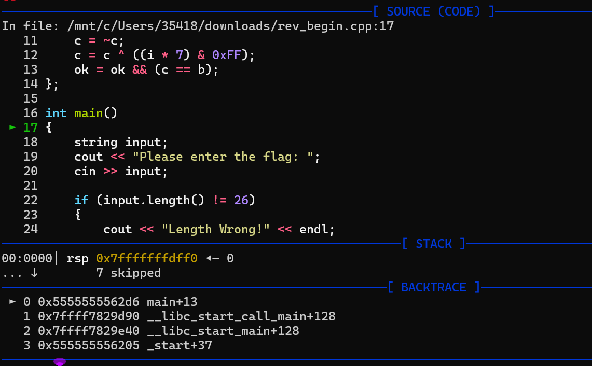

### 2.输入26个A
```bash
(gdb) run <<< "AAAAAAAAAAAAAAAAAAAAAAAAAA"   # 26 个 A
# 6) 单步 / 步过 / 继续
(gdb) n        # next：步过函数
(gdb) s        # step：步入函数（进 encrypt）
(gdb) c        # continue：跑到下一个断点
# 7) 观察变量与内存
(gdb) p/x c    # 打印 c 的十六进制
(gdb) p i      # 打印下标
(gdb) x/8xb &target   # 以十六进制字节查看 target 数组前 8 字节
(gdb) info reg        # 查看所有寄存器
(gdb) info break      # 查看断点列表
```
- 输入：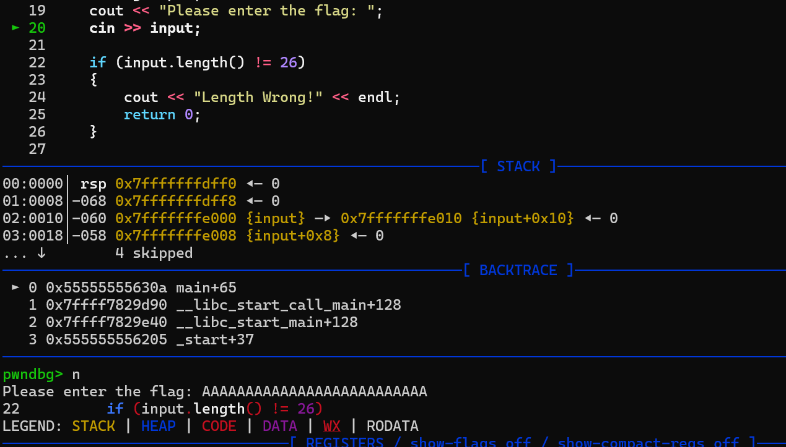
- `xor eax, 0x42eax` 
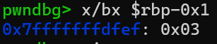
从 0x41 变成 0x030x41 ^ 0x42 = 0x03
- `add [rbp-0x1], alc `
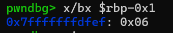
从 0x03 变成 0x060x03 + 3 = 0x06（i=3时）
`not BYTE PTR [rbp-0x1]c` 
- 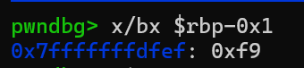
从 0x06 变成 0xf9~0x06 = 0xf9
- `xor eax, edxc `
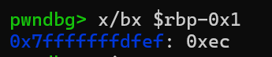
从 0xf9 变成 0xec0xf9 ^ 0x15 = 0xec（3*7=0x15）
- `cmp al, [rbp-0x20]`
比较 0xec 和 0xd6不相等 → ZF=0
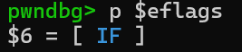

### 输入正确Flag.
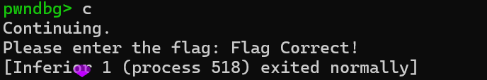


---

# rev_again

## 1.脱壳
我们直接用IDA时发现发生错误`Can't find translation for relative virtual address 00007000, continue`，所以我们对它先进行脱壳；

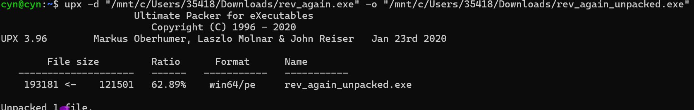
---
## 2.IDA分析
- 1.反编译程序
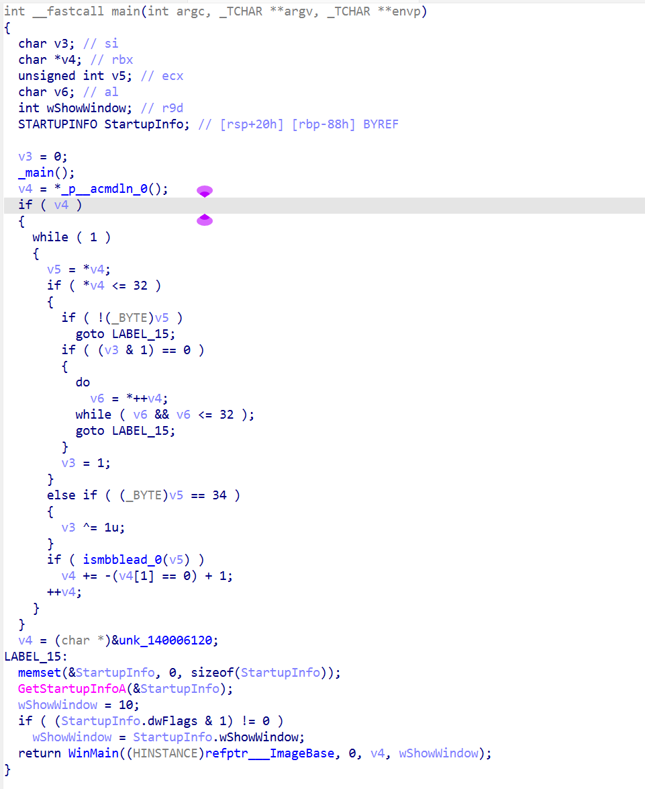
发现`main` 最终调用了` WinMain`，我们打开`WinMain`
-  2.分析程序
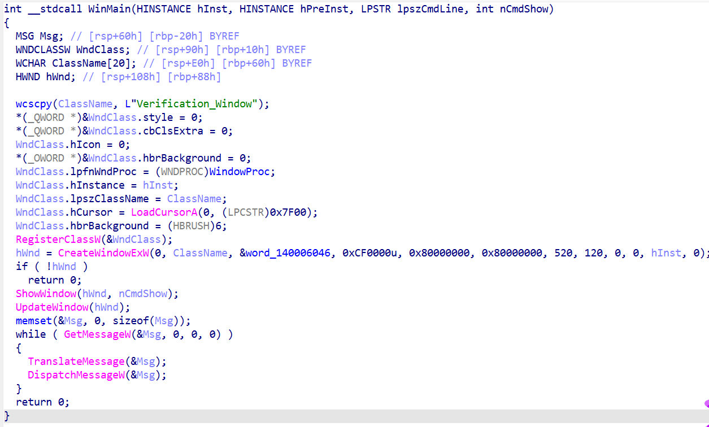
这是一个` Windows GUI` 程序！窗口消息处理函数是 `WindowProc` — 这就是核心逻辑所在
知道`encrypt_data`,发现内置密文`C_8_0`
`C_8_0 `的数据：
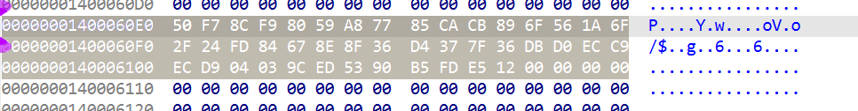
- 3.加密逻辑：`cipher_init`和`cipher_crypt`
init :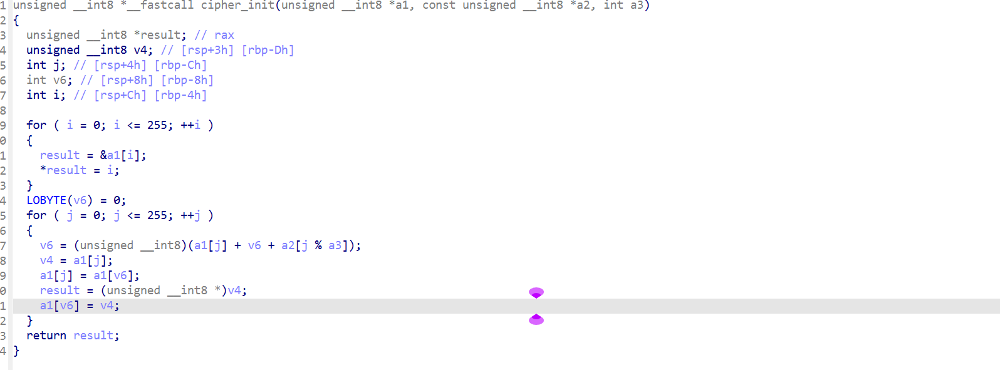
crypt: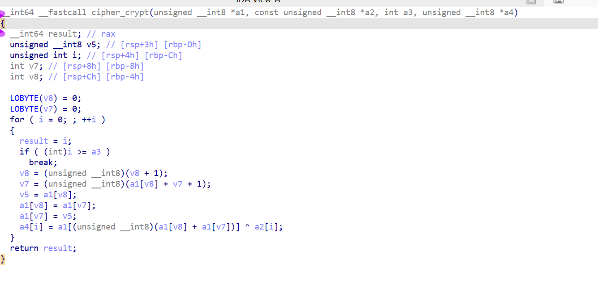
- 4.解密
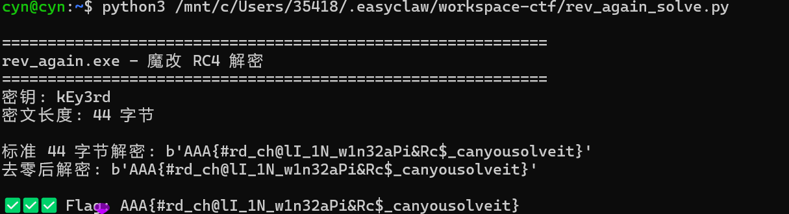
---
## Flag
`AAA{#rd_ch@lI_1N_w1n32aPi&Rc$_canyousolveit}`

---

# rev_more

## 1.反汇编
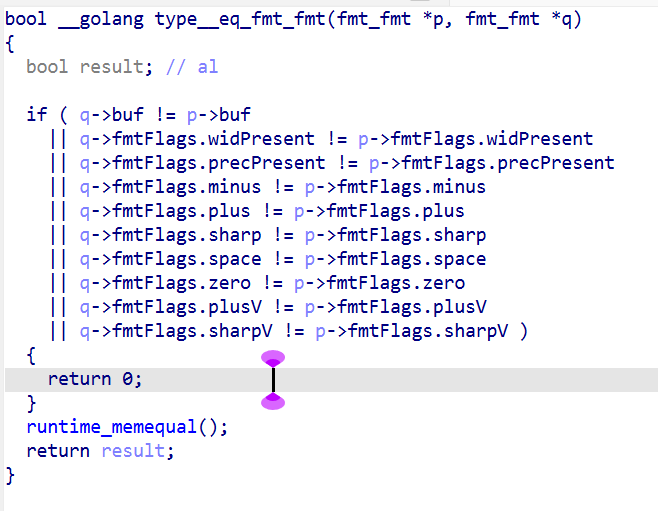
发现这个程序使用`Go`语言编译的。我们找到`main.main`,分析它

---
## 2.程序的作用
### 整体分析

读取 flag.txt → 生成16字节随机数 → 打印随机数的hex → 
→ XTEA加密flag → 打印密文的hex   

---
### 第一步：读取文件
```c
v53.str = (uint8 *)"flag.txt"; // 读取 flag.txt
v53.len = 8;
File = os_ReadFile(v53);      // 检查错误...

```

程序读取 flag.txt 文件的内容。如果读取失败或文件长度不是 8 的倍数（len & 7 != 0），就报错退出。
这说明 flag 的内容长度必须是 8 字节的整数倍。

---
### 第二步：生成随机密钥
```c    
v63.array = (uint8 *)&b;
v63.len = 16;
v63.cap = 16;
v50 = crypto_rand_Read(v63);     // 生成16字节随机数 → 存入 b

```
调用 crypto_rand_Read 生成 16 字节 的随机密钥，存到变量 b 中。

---
### 第三步：打印随机密钥的 hex
```c
// 将 b 的每个字节转成2个hex字符，存到 ptr 中
while (v0 < 16) {
    ptr[v1]   = a0123456789abcd[b[v0] >> 4];   // 高4位
    ptr[v1+1] = a0123456789abcd[b[v0] & 0xF];   // 低4位
    v0++; v1 += 2;
}
// 打印32字符的hex字符串
fmt_Fprintln(os_Stdout, ptr的字符串);
```

把 16 字节随机数转换为 32 字符的 hex 字符串 打印出来。这是给你看的密钥！a0123456789abcd 就是 hex 字符表 0123456789abcdef。


---


### 第四步：字节序转换 
```c
          for (i = 0; i < 4; ++i) {
    *((_DWORD *)&v36 + i) = _byteswap_ulong(*((_DWORD *)&b.array + i));
}
```

把 16 字节随机密钥 b 当作 4 个 uint32，每个都做 大端序转换（_byteswap_ulong = htonl），结果存到 v36 — 这是 XTEA 的密钥！
v36 就是 128-bit (4×32-bit) XTEA 加密密钥。

---

### 第五步：XTEA 加密 flag 
```c
    while (v6 > v9) {
    // 从 flag 数据中读取 8 字节（作为2个uint32），大端序转换
    b.cap = PAIR(_byteswap_ulong(flag[v9+4]), _byteswap_ulong(flag[v9]));

    v15 = b.cap_low;       // v0 (第一个32位)
    cap_high = b.cap_high; // v1 (第二个32位)

    v17 = 0;
    v18 = 0;
    while (v17 < 111) {     // 111 轮！
        // XTEA 加密轮
        v15 += (cap_high + ((16*cap_high) ^ (cap_high>>5))) ^ (v18 + key[v18 & 3]);
        v18 += 1246986025;  // delta = 0x4A531AA9  ← 注意这里！
        cap_high += (v15 + ((16*v15) ^ (v15>>5))) ^ (v18 + key[((v18>>11) & 3)]);
        v17++;
    }
    // 结果转大端存回
    // 打印密文hex
}
```    
---
## 3.解密      

密钥是随机的，所以我们先运行一次，看看结果 

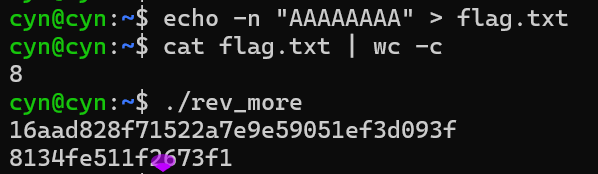

输入`AAAAAAAA`,加密后`8134fe511f2673f1`
验证我们的分析是正确的，然后我们链接docker得到输入，解出flag。

---
## 4.Flag
`AAA{xT3@&G0_r3v_1sHarD!} `
