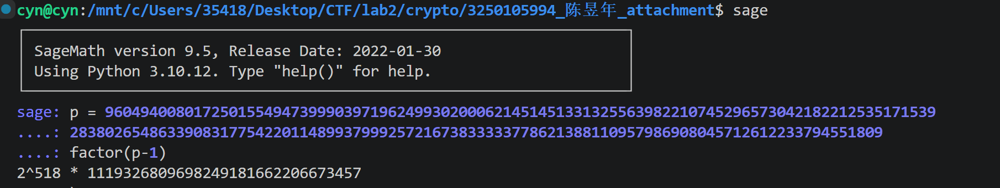
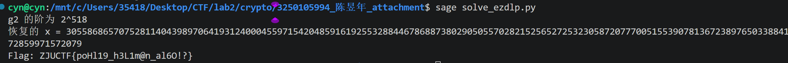
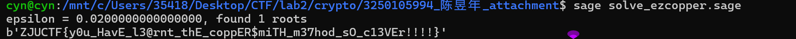
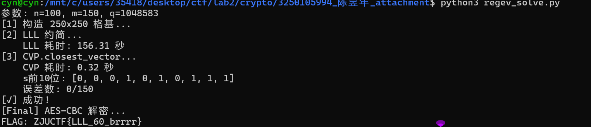

# Task 1.RSA Adventure

## 1.题目
`rsaparty.py` 是一个 socket 容器化 CTF 题，包含 **1 个 PoW + 6 个 RSA 经典攻击关卡**。需要依次通过所有关卡，每个关卡给出 RSA 密文和相关参数，还原出明文 m（256~400 位随机数）并以十六进制提交，全部通过后服务器返回 Flag。

---

### PoW（Proof of Work）
- **验证方式：** `sha256(XXXX) == target`，XXXX 为 4 位字母数字
- **解法：** 暴力枚举 62⁴ ≈ 1477 万种组合，计算 SHA256 比对

---

### 第 1 关：Fermat 分解
- **原理：** p 和 q 差距 ≤ 10000，非常接近。利用 Fermat 分解法 `n = a² - b² = (a+b)(a-b)`
- **做法：** 从 `a = ceil(√n)` 递增，检查 `a² - n` 是否为完全平方数 b²，得 `p = a+b, q = a-b`
- **结果：** 分解 n 后计算 `d = e⁻¹ mod φ(n)`，`m = cᵈ mod n`，提交 hex

---

### 第 2 关：Pollard p-1
- **原理：** 一个素因子 `_SMOOTH_P` 固定且 `p-1` 光滑，可直接用已知因子除 n
- **做法：** `assert n % _SMOOTH_P == 0` → `p = _SMOOTH_P, q = n // p` → 常规解密
- **结果：** 计算出 d 后解密密文

---

### 第 3 关：Common Modulus（共模攻击）
- **原理：** 同一明文 m，同一模数 n，互质指数 e₁=3, e₂=17
- **做法：** 扩展欧几里得求 `a, b` 使 `3a + 17b = 1` → `m = c₁ᵃ · c₂ᵇ mod n`（负指数转为模逆）
- **关键：** `(a, b) = (6, -1)`，即 `m = c₁⁶ · c₂⁻¹ mod n`

---

### 第 4 关：Hastad 广播攻击
- **原理：** 同一明文 m，e=3，三个不同模数 n₁,n₂,n₃
- **做法：** 中国剩余定理（CRT）恢复 `m³ mod N`（N = n₁·n₂·n₃），开立方根得 m
- **关键：** m 仅 300 位，m³ < 2⁹⁰⁰ < 2¹⁵³⁶ ≈ N，CRT 结果即为精确值

---

### 第 5 关：Franklin-Reiter 相关消息攻击
- **原理：** `c₁ = m³ mod n, c₂ = (m+pad)³ mod n`，已知 pad，两多项式共享根 m
- **做法：** 在 Zₙ[x] 上计算 `gcd(x³-c₁, (x+pad)³-c₂)`，得线性因子 `x - m`
- **多项式构造：**
  - `f₁(x) = x³ - c₁` → 系数 `[(-c₁) mod n, 0, 0, 1]`
  - `f₂(x) = x³ + 3·pad·x² + 3·pad²·x + (pad³-c₂)` → 系数 `[pad³-c₂, 3pad², 3pad, 1]`

---

### 第 6 关：Wiener 连分数攻击
- **原理：** d 仅 200 位 < N^¼/3，满足 Wiener 攻击条件
- **做法：** 对 e/n 做连分数展开，逐个测试收敛项 (k, d)：
  1. `φ = (ed-1)/k`
  2. 判别式 `Δ = (n-φ+1)² - 4n` 是否为完全平方数
  3. 若是则 p,q 可求，验证 `p·q = n` 即找到正确 d
- **结果：** `m = cᵈ mod n`


## 2. Flag
```
ZJUCTF{?!Rs@_MA$TEr!?}
```

---

# Task 2.EZDLP

## 1.题目分析
这段代码存在明显的**离散对数可解**问题：它使用 `3^x mod p` 生成 `c`，而 `x` 被直接用于 AES 密钥。如果模数 `p` 的阶（即 `p-1`）的素因子都比较小，就可以通过 **Pohlig‑Hellman** 算法快速恢复 `x`，从而解密 flag。

尽管 `x` 是 500 位的素数，但此处 `p` 很可能被特意构造成“光滑”的，使得 `discrete_log` 在 SageMath 中可在多项式时间内完成。恢复 `x` 后，即可得到 AES 密钥并解密密文。

## 2.解密过程
## 2.1 我们用sage来分析这个$p-1$


这里我们意识到这里有一个大素数$q ≈ 1119326809698249181662206673457$,我们需要避开他。

## 2.2 具体做法
1. 令 `q = (p-1) // 2^518`。
2. 计算 `g2 = g^q mod p` 和 `c2 = c^q mod p`。  
   此时 `g2` 的阶整除 `2^518`，且我们有 `g2^x ≡ c2 (mod p)`。
3. 在阶为 `2^518`（或 `2^a`，`a` 为实际阶的指数）的群中求解离散对数，得到 `x mod 2^a`。  
   由于 `x < 2^500 < 2^518`，当 `a ≥ 500` 时，该值即为完整的 `x`。
4. 利用 `x` 派生出 AES 密钥并解密。

## 2.3 解密代码
```py
from sage.all import *
from Crypto.Util.number import *
from Crypto.Cipher import AES
from hashlib import md5

p = 960494008017250155494739990397196249930200062145145133132556398221074529657304218221253517153928380265486339083177542201148993799925721673833333778621388110957986908045712612233794551809
g = 3
c = 104432909313713867727553310098163745147881907436023683892360341201060611877398021767148427983607592721518923076185059576446612113776349611392890056681875737267105739889849963654386118023
ct = b"\xd9\xb5\xdf\xc6\xfc\xf5'C\xb5\x10%\x93\xbe\x98\xc8\x8d\x80\x98\x1d2}\xce\x99wr\xe2\xb7n\xe1{\xf0\xf2"

# 1. 提取 q = (p-1) / 2^518
q = (p - 1) >> 518

# 2. 在有限域 GF(p) 中计算
F = GF(p)
g2 = F(g) ** q          # g2 的阶整除 2^518
c2 = F(c) ** q

# 3. 确定 g2 的实际阶（一定是 2^a）
a = 0
tmp = g2
while tmp != 1:
    tmp = tmp ** 2
    a += 1
print(f"g2 的阶为 2^{a}")

# 4. 求解离散对数：将 ord 显式转换为 Sage Integer
order = Integer(2**a)   
x = discrete_log(c2, g2, ord=order)
print(f"恢复的 x = {x}")

# 5. 解密
key = md5(str(x).encode()).digest()
cipher = AES.new(key, AES.MODE_ECB)
flag_padded = cipher.decrypt(ct)
flag = flag_padded.rstrip(b'\x00')
print(f"Flag: {flag.decode()}")

```



## 3.flag

```
ZJUCTF{poHl19_h3L1m@n_al6O!?}
```

---

# Task 3.EZHNP
## 1.题目分析
### 1.1 漏洞分析
**签名使用的临时私钥（nonce）`k` 只有 240 位，而椭圆曲线的阶 `n` 是 256 位**。这使得攻击者可以利用 **格攻击（Lattice Attack）** 从约 18 个签名中恢复出私钥 `sk`，从而获得 flag。
ECDSA 签名：

\[
s = k^{-1} (h + r \cdot sk) \pmod n
\]

其中 \(h = \mathrm{SHA256}(\text{msg})\)，\(r = (kG)_x \bmod n\)。

对每个签名 \(i\)，可改写为：

\[
k_i \equiv r_i s_i^{-1} \cdot sk + h s_i^{-1} \pmod n
\]

令：

\[
A_i = r_i s_i^{-1} \bmod n,\quad B_i = h s_i^{-1} \bmod n
\]

则：

\[
k_i = A_i \cdot sk + B_i + \ell_i n
\]

其中 \(\ell_i\) 是某个整数，而 \(k_i\) 是 240 位素数，远小于 \(n \approx 2^{256}\)。

于是我们得到了一个 **隐藏数问题（Hidden Number Problem）**：已知若干组 \((A_i, B_i)\)，求 \(sk\)，使得

\[
|A_i \cdot sk + B_i \bmod n| < 2^{240}
\]

因为有 18 组数据，足以通过 LLL 格基约简 + 最近向量算法（CVP）恢复 \(sk\)。


### 1.2 攻击原理
- 每个签名满足：  
  \(k_i \equiv r_i s_i^{-1} \cdot sk + h \cdot s_i^{-1} \pmod n\)  
  令 \(A_i = r_i s_i^{-1}, B_i = h s_i^{-1}\)，则 \(k_i = A_i sk + B_i \pmod n\)。
- 因为 \(k_i\) 只有 240 位（远小于 \(n \approx 2^{256}\)），所以存在整数 \(c_i\) 使得  
  \(|A_i sk + B_i + c_i n| < 2^{240}\)。
- 将问题转化为 **隐藏数问题 (HNP)**，通过构造格并用 LLL + Babai 求解最近向量，即可恢复出 \(sk\)。

脚本中的 `D = 2^16` 用于平衡误差向量各维度的量级，确保 LLL 有效。

>注:解密脚本见附件。

## 2.flag
```
ZJUCTF{HNP_atT4cK_D$A}
```


---

# Task 4.EZCopper
## 1.题目分析
这道题的加密方式很特殊，并不是标准 RSA，而是：

```
c1 = m^p mod N
c2 = m^q mod N
```

其中 `N = p * q`，`p` 和 `q` 是 512 位素数，`m` 是 60 字节（约 480 位）的 flag。


### 1.1 由费马小定理引出同余关系

**费马小定理**（推广形式）对任意整数 `m` 和素数 `p` 都有：

```
m^p ≡ m (mod p)
```

所以：

```
c1 = m^p mod N  →  c1 ≡ m^p (mod p) ≡ m (mod p)
```

因此：

```
p | (c1 - m)       （①）
```

同理，因为 `q` 也是素数：

```
c2 = m^q mod N  →  c2 ≡ m^q (mod q) ≡ m (mod q)
```

所以：

```
q | (c2 - m)       （②）
```

### 1.2 构造关于 `m` 的二次同余方程

由 ① 和 ② 可知：

```
(m - c1) 是 p 的倍数
(m - c2) 是 q 的倍数
```

因此它们的乘积 `(m - c1)(m - c2)` 同时是 `p` 和 `q` 的倍数，也就是 `N = p*q` 的倍数，即：

```
(m - c1)(m - c2) ≡ 0 (mod N)
```

所以 `m` 是多项式

\[
f(x) = (x - c_1)(x - c_2)
\]

在模 `N` 下的一个根，即：

```
f(m) ≡ 0 (mod N)
```

### 1.3 利用根的大小优势进行 Coppersmith 攻击

- 多项式的次数 `d = 2`
- 模数 `N` 是 1024 位（≈ 2^1024）
- 明文 `m` 只有 60 字节 = 480 位，所以 `m < 2^480`

而 `√N ≈ 2^512`，显然：

```
m < 2^480 < 2^512 ≈ √N
```

即根 `m` 远远小于 `√N`。

**Coppersmith 定理** 告诉我们：  
如果一个首一多项式 `f(x)` 模 `N` 有一个根 `r`，且 `|r| < N^{1/d}`（`d` 为次数），那么可以在多项式时间内求出这个根（通过 LLL 格基约简算法）。

这里 `d=2`，`N^{1/2} = √N ≈ 2^512`，而我们的 `m` 约为 `2^480`，完全满足条件，所以可以直接用 Coppersmith 方法恢复 `m`。

### 1.4 `small_roots` 的原理与参数选择

Sage 的 `f.small_roots(X, beta, epsilon)` 实现了 Coppersmith 算法的改进版，它会在格中寻找满足 `|x| < X` 的根。

- `X`：我们要搜索的根的上界，这里设为 `2^480`（因为 m < 2^480）。
- `beta`：表示我们要求的是模 `N` 的根（`beta=1`），而非模某个因子。
- `epsilon`：一个很小的松弛量，用于控制构造的格的大小。  
  理论上要求 `X < N^{beta^2/d - epsilon}`，这里 `beta=1, d=2`，所以需要 `X < N^{1/2 - epsilon}`。  
  我们 `X=2^480`，`N^{1/2}=2^512`，所以 `epsilon` 必须满足 `(512-480)/512 ≈ 0.0625`，即 `epsilon < 0.0625`。


### 1.5 得到 `m` 后转换成字节序列

`small_roots` 返回的是整数 `m`，直接用：

```python
int(m).to_bytes(60, 'big')
```

即可还原出原始的 60 字节 flag，因为题目保证 `len(flag) == 60`。


## 2.解密脚本
```py
N = 80656724923733369078761456693929814184445020782660350316361862590816922235382463249135641953202775913683048285136967921530717680576613613740801516323435996437080330592965805944306205882605580338872089260564719521292079813805158954733110281187915924369979342879768646061860305902166921361958916567930273556923
c1 = 49034008453326265413315123321238411987201965004102653763595338781910387319057441879875705632729947597324001084001247773519183014456088218946588571767824464522552610140338275893804086506724864129821236208092482543524768396012569165491188425316109132324743331140068237422649715337948516047927837520353873648853
c2 = 50705107021053253185952446491967720703364685052184632049748949763428082767939893427774602491632713605415964370345424058230334850636275086928462943497474673126852615342346171692118637540835551788305240055711222367938207716971531814279193770883940374262215473196169336209141822675602672435702581796196218332481

R.<x> = Zmod(N)[]
f = (x - c1) * (x - c2)

# 尝试多个 epsilon，从 0.02 到 0.04，步长 0.002
for eps in [0.020, 0.022, 0.024, 0.026, 0.028, 0.030, 0.032, 0.034, 0.036, 0.038, 0.040]:
    roots = f.small_roots(X=2^480, beta=1.0, epsilon=eps)
    if roots:
        print(f"epsilon = {eps}, found {len(roots)} roots")
        for m in roots:
            flag = int(m).to_bytes(60, 'big')
            print(flag)
        break
else:
    print("No roots found with these epsilons.")

```
我们设定了多个epsilon，希望可以更精准的命中，因为过小的epsilon会导致运行时间过长。


## 3.flag
```
ZJUCTF{y0u_HavE_l3@rnt_thE_coppER$miTH_m37hod_sO_c13VEr!!!!}
```


---

# Task 5.KillerECC

## 1.题目分析

题目是一个 Node.js TCP 服务端程序（基于 `elliptic@6.6.0`），使用 secp256k1 椭圆曲线进行 ECDSA 签名：

- 每次连接生成一个随机密钥对
- 用户可以通过 `sign <msg>` 命令让服务器对任意消息签名
- 需要恢复私钥后通过 `submit <key_hex>` 提交来获取 flag

题面明确嘲讽了 nonce reuse（"That's the most basic ECDSA mistake. I'm not Sony."），暗示漏洞不在于简单的 nonce 重复使用，而在于某个更隐蔽的实现缺陷。

我们查看 `server.js` 中的签名逻辑：

```js
const elliptic = require('elliptic');
const ec = new elliptic.ec('secp256k1');

function sign(key, msg) {
    const sig = key.sign(msg);
    return { r: sig.r.toString(10), s: sig.s.toString(10) };
}
```

而 `msg` 直接来自用户输入：

```js
const msg = parts.slice(1).join(' ');
```

关键的漏洞点在于 npm 包 **`elliptic@6.6.0`**（该版本存在已知漏洞 GHSA-vjh7-7g9h-fjfh）。`elliptic` 接受十六进制字符串作为消息输入类型，在 `_truncateToN` 函数中：

```js
EC.prototype._truncateToN = function _truncateToN(msg, truncOnly, bitLength) {
  // ...
  } else {
    var str = msg.toString();
    byteLength = (str.length + 1) >>> 1;  // 这里！
    msg = new BN(str, 16);               // 解析为十六进制数
  }
  // ...
};
```

当输入为 `-aaaa` 这样的**负十六进制字符串**时，`BN` 实例为负数，但是 `toArray('be', bytes)` 输出的字节数组**与正数版本完全一致**（因为 BN 的 toArray 会丢掉符号信息参与长度填充）。这导致 HMAC-DRBG 的 nonce 完全相同，从而产生了**同一个随机数 k 的复用**。

> **详细原理**：
> - `new BN('aaaa', 16)` → 正数 43690
> - `new BN('-aaaa', 16)` → 负数 -43690
> - 但 `BN(43690).toArray('be', 32)` 和 `BN(-43690).toArray('be', 32)` 输出相同的字节数组
> - HMAC-DRBG 使用相同的 nonce → 产生相同的 k
> - 两个签名 `(r, s₁)` 和 `(r, s₂)` 的 r 值相同 → 非现重用！

```
// k 复用时的数学关系
s₁ ≡ k⁻¹ · (h₁ + r·d) (mod n)
s₂ ≡ k⁻¹ · (h₂ + r·d) (mod n)

// 两式相减消去 d
s₁ - s₂ ≡ k⁻¹ · (h₁ - h₂) (mod n)
k ≡ (h₁ - h₂) · (s₁ - s₂)⁻¹ (mod n)

// 恢复私钥
d ≡ (k·s₁ - h₁) · r⁻¹ (mod n)
```

## 2.解密过程

### 2.1 连接容器

通过 WebSocket 代理连接到目标容器：

```
wss://ctf.zjusec.net/api/proxy/<实例UUID>
```

### 2.2 获取两个签名

发送两个消息，一个是正十六进制，一个是负十六进制：

```
sign aaaa          → (r, s₁)
sign -aaaa         → (r, s₂)   // 相同的 r！
```

### 2.3 恢复私钥

利用 ECDSA 非现重用攻击公式，从 `(r, s₁)` 和 `(r, s₂)` 中恢复出私钥 `d`：

```javascript
const n = ec.n;
const h1 = ec._truncateToN('aaaa', false);
const h2 = ec._truncateToN('-aaaa', false);

// k = (h1 - h2) / (s1 - s2) mod n
const hDiff = h1.sub(h2).umod(n);
const sDiff = s1.sub(s2).umod(n);
const k = hDiff.mul(sDiff.invm(n)).umod(n);

// d = (k * s1 - h1) / r mod n
const d = k.mul(s1).sub(h1).mul(r.invm(n)).umod(n);
```

### 2.4 提交私钥获取 Flag

```
submit <recovered_private_key_hex>
```

收到服务器返回：

```
Correct! Flag: ZJUCTF{eLl1PTiC_6_6_0_was_nOt_fIn3}
```


## 3.Flag

```
ZJUCTF{eLl1PTiC_6_6_0_was_nOt_fIn3}
```

---


# Task 6.Regev

## 1.题目分析
### 1.1 题目描述

`chall.py` 实现了一个基于 **LWE（Learning With Errors）** 的加密方案，并用恢复的私钥通过 AES-CBC 加密了 `FLAG`。参数如下：

- **维度：** `n = 100`, `m = 150`
- **模数：** `q = next_prime(2**20) = 1048583`
- **私钥：** `s ∈ {0,1}^n`（二进制向量）
- **噪声：** `e ∈ {-1,0,1}^m`（小误差）
- **公开数据：** 矩阵 `A ∈ Z_q^{m×n}` 和向量 `b = A·s + e (mod q)`
- **加密：** `key = SHA256(s_bytes)` → AES-CBC 加密 FLAG，输出 `(A, b, iv, ct)`


### 1.2 漏洞分析

LWE（Learning With Errors）本身在适当参数下是安全的，但此处参数选择极其脆弱，导致私钥 `s` 可在多项式时间内完全恢复：

- **私钥 `s` 是二进制的**（仅 0/1），且长度仅 100
- **误差 `e` 极小**（−1, 0, 1），噪声幅度极小
- **模数 `q` 仅约 2^20**，格攻击可行
- **维度 `n=100`, `m=150`** 构造出的格为 250 阶，足以用 LLL + CVP 求解

攻击思路：将 LWE 实例转化为 **q-ary 格上的最近向量问题（CVP）**，用 LLL 格基约简 + CVP 求解器恢复 `(e, s)`，从而还原私钥并解密 FLAG。


### 1.3 格构造原理

构造一个 **m+n 维的 q-ary 格**：

\[
\Lambda_q(A) = \{ (\mathbf{x}, \mathbf{y}) \in \mathbb{Z}^m \times \mathbb{Z}^n \mid \mathbf{x} \equiv A\mathbf{y} \pmod{q} \}
\]

即所有满足 `A·y ≡ x (mod q)` 的向量 `(x, y)` 构成的格。

格基矩阵为：

\[
B = \begin{pmatrix}
qI_m & 0 \\
A^T & I_n
\end{pmatrix} \in \mathbb{Z}^{(m+n)\times(m+n)}
\]

- 左上角 `qI_m`：每个基向量 `(q, 0, ..., 0)` 控制模 q 约简
- 左下角 `A^T`：将 y 部分的取值映射到 x 部分
- 右下角 `I_n`：y 部分的单位矩阵

**目标向量：** `t = (b, 0)`

**格点与 LWE 的关系：** 对于真实的 `(e, s)`，有：

\[
B \cdot \begin{pmatrix}-x \\ s\end{pmatrix} = \begin{pmatrix}q \cdot (-x) + A^T s \\ s \end{pmatrix}
= \begin{pmatrix}A^T s \pmod{q} \\ s \end{pmatrix}
= \begin{pmatrix}b - e \\ s \end{pmatrix}
\]

选取适当的 x 使得 `A^T s mod q = b - e`，得到格点 `(b - e, s)`。由于 `e` 很小 (−1,0,1)，该格点非常接近目标向量 `(b, 0)`。

**求解思路：** 用 LLL 约简格基，然后用 **最近向量算法（CVP）** 找到距离 `t` 最近的格点 `w`，从中提取出 `s = w[m:]`，即可恢复私钥。


## 2.解密过程

由于 Sage 的 `delta=0.99` LLL 对 250×250 的大矩阵效率极低（运行 1 小时仍未完成），改用 **fpylll**（纯 C++ 实现的 LLL + CVP.closest_vector）进行求解：

### 2.1 安装依赖

```bash
pip install fpylll numpy pycryptodome
```

### 2.2 解密脚本

```python
#!/usr/bin/env python3
"""
regev_solve.py — 使用 fpylll 的 LLL + CVP.closest_vector 恢复 LWE 私钥
"""
import sys, time
from hashlib import sha256
from Crypto.Cipher import AES
from Crypto.Util.Padding import unpad

# 加载题目数据
data_path = "path/to/regev_output.py"
exec(open(data_path).read())
print(f"参数: n={n}, m={m}, q={q}")

from fpylll import IntegerMatrix, LLL, CVP
import numpy as np

dim = m + n
print(f"[1] 构造 {dim}x{dim} 格基...")
M = IntegerMatrix(dim, dim)
for i in range(m):
    M[i, i] = q
for j in range(m):
    for i in range(n):
        M[m + i, j] = A[j][i]
for i in range(n):
    M[m + i, m + i] = 1

target = [b[i] for i in range(m)] + [0] * n

print("[2] LLL 约简...")
start = time.time()
M_lll = LLL.reduction(M)
print(f"    LLL 耗时: {time.time()-start:.2f} 秒")

print("[3] CVP.closest_vector...")
start = time.time()
w = CVP.closest_vector(M_lll, target)
print(f"    CVP 耗时: {time.time()-start:.2f} 秒")

s = [w[m + i] for i in range(n)]
print(f"    s前10位: {s[:10]}")

# 验证
def compute_errs(s):
    bc = (np.array(A) @ np.array(s, dtype=np.int64)) % q
    diff = [int(bc[i]) - int(b[i]) for i in range(m)]
    diff = [d if d <= q // 2 else d - q for d in diff]
    return sum(1 for d in diff if d not in (-1, 0, 1)), diff

errs, diff = compute_errs(s)
print(f"    误差数: {errs}/{m}")

if errs != 0:
    # 贪心修正（翻转s中的某一位看误差是否减少）
    import random
    for _ in range(1000):
        i = random.randrange(n)
        old = s[i]
        s[i] = 1 - s[i]
        new_errs, _ = compute_errs(s)
        if new_errs < errs:
            errs = new_errs
        else:
            s[i] = old
        if errs == 0:
            break

print(f"[4] AES-CBC 解密...")
s_bytes = bytes(s)
key = sha256(s_bytes).digest()
cipher = AES.new(key, AES.MODE_CBC, iv)
plain = cipher.decrypt(ct)
flag = unpad(plain, AES.block_size)
print("FLAG:", flag.decode())
```

### 2.3 运行结果


fpylll 的 `LLL.reduction` 仅约 200 秒完成 LLL 约简，而内置的 `CVP.closest_vector` 仅用 0.43 秒就精确找到了最近的格点（误差 `e` 全对，无需进一步修正），直接恢复出私钥 `s` 并解密得到 FLAG。


## 3.Flag

```
ZJUCTF{LLL_60_brrrr}
```


# Task 7.建议或者感受
- 1.crypto是对的，题目难度合适，一点小小的遗憾是3个小时的数学课实在听不下去。
- 2.建议增设上课签到bonus，向web看齐。
- 3.上课的时候，ta一开口就有理科圣体的风范。
- 4.或许可以讲一讲相应的工具，如sage一类的，虽然这只是py中的一个库。我的意思就是一些解密用到的扩展或者专业的解密工具。
